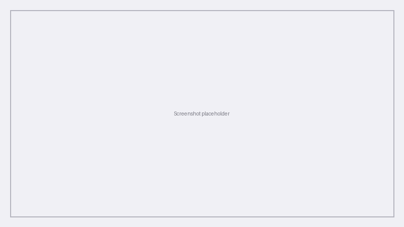

# Institution Detail — Overview and Tabs

When you open an institution from the **Institutions** list (CS administrators) or navigate to your own institution via the top bar menu, you land on the **Institution detail** page. This hub organises everything about one organisation — experiences, users, content library, reporting, and settings — into a set of tabs.

---

## Tab overview

| Tab | Purpose |
|-----|---------|
| **Overview** | Key stats and recent activity at a glance |
| **Experiences** | All programs at the institution, plus data deletion records |
| **Users** | Institution-wide user directory and management |
| **Library** | Shared templates and reusable content |
| **Reporting** | Institution-level reports and exports |
| **Settings** | Name, branding, feature flags, LTI, and AI keys |

Click a tab to switch context. Your selected tab is remembered as you navigate within the institution.

---

## Overview tab

The **Overview** tab is the default landing view. It answers "how is this institution doing right now?" without opening individual experiences.

### Key stats

The Overview tab displays headline metrics such as:

- **Active experiences** — programs currently in Live status
- **Total enrolments** — cumulative enrolment count across all experiences
- **Active learners** — learners who have engaged recently

These numbers help CS administrators prepare for check-ins and spot accounts that may need proactive support.

### Recent activity log

Below the stats, a **recent activity log** lists significant events — new experiences created, bulk enrolments, settings changes, and administrator actions. Each entry includes a timestamp and short description.

!!! tip "Use the activity log during support calls"
    When a customer reports "something changed yesterday," the activity log is often the fastest way to see what happened and who performed the action.

For a dedicated audit view with full filtering, see [Audit Log of Admin Activity](../../help-articles/institution-set-up/audit-log-of-admin-activity.md).

---

## Experiences tab

The **Experiences** tab lists every program belonging to the institution — Draft, Live, and Inactive — in a table or card layout similar to the institution-level Experiences page coordinators use.

From here CS administrators can:

- Open any experience for troubleshooting
- Review status and learner counts across the portfolio
- Access experience-level settings without switching customer context

### Data Deletion Records sub-tab

Within the Experiences tab, switch to the **Data Deletion Records** sub-tab to view the **GDPR deletion audit trail** for the institution. Every automated or manual deletion action is logged with:

- Timestamp
- Requester (user or system)
- Scope (which experience and which users were affected)

See [Data Deletion and GDPR](data-deletion.md) for how to request and review deletions.

---

## Users tab

The **Users** tab shows **all users** registered at the institution — learners, mentors, coordinators, and administrators — in one searchable directory.

| Capability | Description |
|------------|-------------|
| **Filter by role** | Narrow the list to administrators, coordinators, learners, etc. |
| **Open user profile** | Click a row to view enrolments, activity, and account details |
| **Send magic link** | Trigger a login email for users who cannot access their account |
| **Deactivate** | Disable an account while retaining data for audit purposes |

!!! warning "Deactivating a user removes their login access"
    Deactivated users cannot log in but their submissions and reviews remain in the system. Use [Data Deletion](data-deletion.md) if you need to permanently erase personal data under GDPR.

Institution administrators use the same Users tab (via the institution menu) to manage their own staff and participants.

---

## Library tab

The **Library** tab stores **shared templates and reusable content** at the institution level — program templates, assessment banks, and media that coordinators can pull into new experiences.

CS administrators can review what an institution has saved, help customers standardise across faculties, and troubleshoot missing template assets.

---

## Reporting tab

The **Reporting** tab provides **institution-level reporting and exports** — enrolment summaries, completion rates, skills growth aggregates, and CSV downloads that span multiple experiences.

Use this tab when you need a portfolio view rather than metrics for a single program. Experience-specific reports remain under **Deliver → Reports** when an experience is selected.

---

## Settings tab

The **Settings** tab consolidates institution-wide configuration:

| Area | Examples |
|------|----------|
| **General** | Institution name |
| **Branding** | Logo, primary colour — see [Branding](branding.md) |
| **Feature flags** | Enable or disable platform capabilities for the institution |
| **LTI registrations** | LMS platform connections — see [Integrations](integrations.md) |
| **AI API keys** | Institution-owned keys for GPT-4o, Claude, and other models used in AI feedback |

Changes here affect **every experience** at the institution unless overridden at experience level.

!!! note "Feature flags are CS-admin controlled"
    Some flags are only editable by Practera CS staff. Institution administrators see a subset of settings relevant to their role.

---

## Related guides

- [Institutions List](index.md) — find and create institutions (CS admin)
- [Branding Your Institution](branding.md) — logo and colours
- [LTI and Integrations](integrations.md) — LMS setup
- [Data Deletion and GDPR](data-deletion.md) — compliance workflows
- [Understanding User Roles](../../help-articles/institution-set-up/understanding-user-roles.md) — role definitions

---

*Last updated: August 2026*
