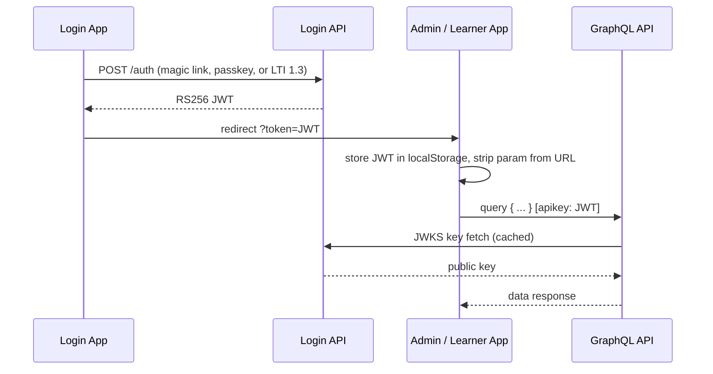
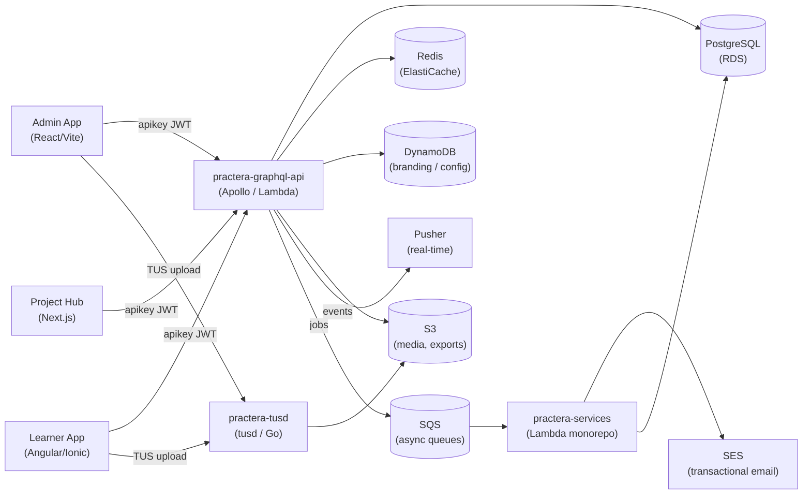

<!-- status: living -->

# System Architecture

## Overview

Practera is a multi-repository platform deployed on AWS, built around a central GraphQL API (Apollo Server on Lambda + API Gateway v2) backed by PostgreSQL, Redis, and DynamoDB. Three frontend applications consume it: an admin SPA (React 19/Vite), a learner SPA (Angular/Ionic), and an industry project portal (Next.js). Authentication is centralised via a dedicated login service that issues RS256-signed JWTs, consumed by all applications and validated by the GraphQL API. Real-time features are delivered via Pusher, and file uploads are handled through a dedicated TUS-protocol service (tusd) that streams directly to S3.

---

## Repository Map

| Repo | Stack | Role |
|------|-------|------|
| `practera-login-app` | React SPA | Login / SSO entry point for all user types |
| `practera-login-api` | Node.js Lambda (Express) | JWT issuance, LTI 1.3, magic links, passkeys |
| `practera-admin-app` | React 19 + Vite | Coordinator/admin SPA (replaces legacy PHP admin) |
| `practera-app` | Angular 19 + Ionic | Learner-facing mobile/web SPA |
| `practera-project-hub` | Next.js 16 + Prisma | Industry project sourcing and brief management portal |
| `practera-graphql-api` | Node.js Lambda + Apollo Server 4 | Primary GraphQL API; Pothos schema builder |
| `practera-services` | Lambda monorepo (Turborepo) | Background services: SQS consumers, email, AI, comms |
| `practera-tusd` | tusd server (Go) | TUS resumable upload service → S3 |
| `practera-admin` | CakePHP 2.x monolith | Legacy admin backend (being superseded by `admin-app`) |
| `practera-docs` | MkDocs Material | This documentation site |

---

## Authentication Flow

All user sessions originate in `practera-login-app`. Depending on the entry point, the user authenticates via email magic link, passkey (WebAuthn), or LTI 1.3 institutional SSO. In every case, `practera-login-api` issues an RS256-signed JWT, and the browser is redirected to the target application with the token appended as a `?token=JWT` query parameter. The destination application stores the token in `localStorage`, removes the query parameter, and includes the token as an `apikey` header on every GraphQL request. The GraphQL API validates the token by fetching the public key from the JWKS endpoint (cached after first fetch) and extracts role and institution context from the payload.

**JWT payload highlights:**

- `user_id`, `user_uuid`, `email`, `role` (e.g. `participant`, `admin`, `cs_admin`)
- `institution_id`, `institution_uuid`
- Optional: `experience_id`, `timeline_id`, `roleId` (custom experience role)
- CS admin role elevation is applied automatically for `cs_admin` payloads
- Query complexity limit: **≤ 1 000**; depth limit: **≤ 12**

---

## Data Flow

The diagram below shows how client applications interact with the GraphQL API and its backing data stores, as well as the async paths through `practera-services`.

| Data Store | Primary Use |
|------------|-------------|
| PostgreSQL | All relational data: users, experiences, assessments, submissions, teams |
| Redis | Hot-query cache; session metadata |
| DynamoDB | Institution branding configuration; LTI platform registrations |
| S3 | Uploaded media, experience export/import packages, certificate PDFs |
| Pusher | Real-time chat and notification delivery to browser clients |
| SES | Transactional email via `practera-services` (54+ templates) |
| SQS | Async decoupling: enrolments, email queues, AI jobs, ops workers |

---

## Deployment Topology

| Component | Deployment Target | Notes |
|-----------|-------------------|-------|
| `practera-graphql-api` | AWS Lambda + API Gateway v2 | Deployed via SST; regional per environment |
| `practera-login-api` | AWS Lambda + API Gateway | Deployed via Serverless Framework |
| `practera-admin-app` | CloudFront + S3 | Static SPA; served from `admin.practera.com` |
| `practera-login-app` | CloudFront + S3 | Static SPA; served from `login.practera.com` |
| `practera-app` | CloudFront + S3 | Static SPA; served from `app.practera.com` |
| `practera-project-hub` | SST (serverless Next.js via OpenNext) | Lambda + CloudFront; `hub.practera.com` |
| `practera-services` | AWS Lambda (per-service functions) | SQS-triggered; deployed via Serverless Framework |
| `practera-tusd` | EC2 / ECS | Dedicated long-running TUS server |
| PostgreSQL | Amazon RDS | Multi-AZ in production |
| Redis | Amazon ElastiCache | Single-node dev; cluster in production |

DNS is managed via Route 53 with wildcard `*.practera.com` pointing to regional CloudFront distributions or API Gateway custom domain names.

---

## Integration Points

| Integration | Protocol | Direction | Purpose |
|-------------|----------|-----------|---------|
| Pusher | WebSocket | `graphql-api` → clients | Real-time chat and notification delivery |
| TUS / S3 | HTTP (TUS protocol) | client → `tusd` → S3 | Resumable media and file uploads |
| LTI 1.3 | OAuth 2.0 + OIDC | institution IdP → `login-api` | Institutional single sign-on via Canvas, Moodle, Blackboard |
| Legacy CakePHP | iframe + JWT | `admin-app` → `practera-admin` | Legacy admin screens embedded during migration |
| OpenAI / Claude | REST | `graphql-api` + `project-hub` | AI expert chat, project brief intake, feedback generation |
| AWS SES | AWS SDK | `practera-services` | Transactional email dispatch |
| AWS SQS | AWS SDK | `graphql-api` → `services` | Async job queuing: enrolments, email, deletion, ops |
| Jira + OpenAI | REST | `practera-docs` scripts | Automated release notes generation |

---

## Security

- **JWT validation:** All tokens are RS256-signed; the GraphQL API fetches the public key from the JWKS endpoint on first use and caches it. Token forgery is not possible without the private key held exclusively by `login-api`.
- **Query protection:** GraphQL handler enforces a complexity limit of **1 000** and a depth limit of **12** on every request.
- **RBAC:** All authorisation checks go through `requirePermission(context, 'permission.name')` in `src/auth/permissions.ts`. Inline role string comparisons are prohibited.
- **Custom experience roles:** Stored in `experience_roles` table; `roleId` in the JWT payload resolves to a `permissions` JSONB array at request time.
- **Content visibility:** `target_roles` JSONB column on assessments, activities, and milestones replaces the legacy visibility bitmask.
- **Secrets management:** All credentials are stored in AWS Secrets Manager or SSM Parameter Store and injected as environment variables at runtime. No secrets are committed to version control.
- **Security headers:** All Lambda responses include `Content-Security-Policy`, `Strict-Transport-Security`, `X-Frame-Options`, and `X-Content-Type-Options` headers.
- **Superuser bypass:** `sysadmin`, `cs_admin`, `inst_admin`, and `system` roles pass all permission checks without a database lookup.
