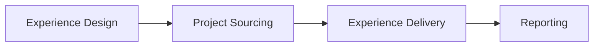

<!-- status: living -->

# Practera Platform — Functional Specification

Practera is an end-to-end platform for work-based and career-connected learning design and delivery, supporting fully online and blended experiences. It spans the full lifecycle from programme authorship through to industry project sourcing, learner delivery, and impact reporting. Each stage is implemented across purpose-built applications that share a unified authentication layer.

## Value Chain

---

## 1. Experience Design

Instructional designers (authors) use our AI-powered authoring tools to design programme structures before learners are enrolled. This stage covers setting learning objectives, skills development goals,scaffolding the experience structure, authoring content and assessments, setting up schedules, configuring automated workflows and selecting/customizing AI experts.

### Key Capabilities
- **Learning objectives** — Start from a description of the experience, then use AI to help define learning objectives, skills development goals, credentials (badges, certificates).
- **Experience structure design** — Organise the experience into groups of tasks for each of the key roles (learner, mentor, admin, etc.). Set up assessments, content, scheduled events, team tasks, and simulations, with drag-drop reorder, role-based visibility, and lock/reveal triggers. A mentor, for example, sees a different experience structure than a learner — each role gets exactly the scaffolding they need.
- **Customisation** — Give each experience its own identity so learners feel it belongs to their institution or programme. Set a custom brand (logo, colours, fonts), define the terminology that fits the context (e.g. rename "Milestones" to "Phases", create custom role names), and configure LTI 1.3 so learners can launch directly from their institution's LMS.
- **Content authoring** — Designers author rich, engaging materials without leaving the platform. Topics support full rich text (headings, embeds, images, code blocks) via TipTap. Assessments are built with a point-and-click question builder supporting multiple types: slider ratings, single/multi-choice, long text, file uploads, and team member selectors. A shared media library lets assets be reused across activities and experiences, reducing duplication.
- **Scheduling** — Blended experiences need face-to-face and virtual touchpoints coordinated across the cohort. Coordinators schedule recurring sessions and one-off events on a shared calendar, track attendance via QR check-in, run meeting polls to find times that work for everyone, and send targeted communications tied to session timing — all without leaving the platform.
- **Automation (ELSA)** — At scale, coordinators can't personally nudge every learner at exactly the right moment. ELSA (the automation engine) fires rule-based triggers based on learner progress, calendar dates, or specific actions — sending messages, unlocking content, or awarding credentials automatically. Designers define the rules once; ELSA handles execution across the entire cohort.
- **AI Experts** — Every experience can have its own AI-powered expert assistant, scoped to the programme's context and knowledge. Designers configure the expert's persona, upload domain knowledge files, test it against sample conversations, then publish proven experts to a shared library for reuse across other experiences. Experts are versioned so improvements can be rolled out without disrupting active cohorts.
- **Library** — Successful programme components shouldn't be rebuilt from scratch. The library stores proven experience templates, media assets, and AI experts at the institution or global level, making them available for reuse across any experience. Designers browse and import from the library, dramatically reducing the time to launch new programmes.
- **Go-live checklist** — Launching to live learners carries risk. The go-live checklist guides designers through a structured pre-launch review — confirming content is complete, settings are correct, enrolments are ready, and notifications are configured — before the experience goes live to the cohort.

### Systems

| Layer | System |
|-------|--------|
| Frontend | `practera-admin-app` (React 19 + Vite SPA) |
| API | `practera-graphql-api` |

### Detailed Specs

- [Admin App — Design specs](https://github.com/intersective/practera-admin-app/tree/main/specs/design/)
- [GraphQL API — Experience mutations](https://github.com/intersective/practera-graphql-api/tree/main/specs/mutations/experience.md)
- [GraphQL API — Content mutations](https://github.com/intersective/practera-graphql-api/tree/main/specs/mutations/content.md)
- [Developer Docs — Design stage detail](design/index.md)

---

## 2. Project Sourcing

The project sourcing stage enables institutions to build a pipeline of real-world industry projects. Administrators manage campaigns, clients submit briefs via an AI-guided intake flow, and learners apply for projects during defined windows.

### Key Capabilities

- **Campaign management** — create campaigns with project brief templates, set active windows, generate shareable intake URLs
- **AI-guided intake** — external client chatbot guided by templates; traditional form alternative; draft-on-first-capture; local storage resumption
- **Brief lifecycle** — `DRAFT → CLIENT_APPROVED → ADMIN_APPROVED → ARCHIVED`; admin edit requires client re-approval
- **Email notifications** — edit links sent to clients on submission; admin change notifications
- **Experience assignment** — assign approved briefs to Practera experiences via GraphQL API; auto-create experience records
- **Learner application** — apply for up to 5 projects with priorities (1–5) during admin-set application windows
- **Team creation** — Practera API integration for team formation

### Systems

| Layer | System |
|-------|--------|
| Frontend | `practera-project-hub` (Next.js 16 + Prisma + PostgreSQL) |
| Database | Own PostgreSQL database |
| API | `practera-graphql-api` (for experience/team operations) |

### Detailed Specs

- [Project Hub — Feature Spec](https://github.com/intersective/practera-project-hub/tree/main/specs/002-industry-project-web-platform/spec.md)
- [Project Hub — Data Model](https://github.com/intersective/practera-project-hub/tree/main/specs/002-industry-project-web-platform/data-model.md)
- [Project Hub — API Contracts](https://github.com/intersective/practera-project-hub/tree/main/specs/002-industry-project-web-platform/contracts/openapi.yaml)
- [Developer Docs — Sourcing stage detail](sourcing/index.md)

---

## 3. Experience Delivery

The delivery stage encompasses everything learners and coordinators interact with during an active programme — from the learner's activity tree and assessment submissions through to coordinator-side feedback pipelines, enrolment management, and real-time communications.

### Key Capabilities

- **Learner journey** — home dashboard, milestone/activity tree, topic content, assessment submission and review
- **Feedback pipeline (admin)** — submission tracking, reviewer assignment, 4-step pipeline (Submitted → Assigned → Reviewed → Acknowledged), AI quality scoring
- **Communication** — Pusher-backed chat (channels, DMs, announcements), scheduled messages, email notifications
- **Teams** — formation (manual/auto-assign), project briefs, team todos, workload balance
- **Events and meetings** — bookable events (capacity, QR attendance), video meetings, polls
- **Enrolment management (admin)** — bulk CSV import, invitation/reminder emails, per-learner report cards
- **Pulse checks** — learner wellbeing surveys with configurable question sequences
- **Badges, achievements, certificates** — credential definitions, xAPI criteria, certificate URL generation
- **Progress tracking** — milestone progress %, due dates, engagement metrics, skills growth

### Systems

| Layer | System |
|-------|--------|
| Learner frontend | `practera-app` (Angular 19 + Ionic — learner-facing SPA) |
| Admin frontend | `practera-admin-app` (React/Vite — coordinator/admin delivery tools) |
| API | `practera-graphql-api` |

### Detailed Specs

- [Admin App — Deliver specs](https://github.com/intersective/practera-admin-app/tree/main/specs/deliver/)
- [Learner App — specs](https://github.com/intersective/practera-app/tree/main/specs/) (bootstrapped Sept 2026; see [Alignment Status](alignment/index.md) for refinement backlog)
- [GraphQL API — Assessment mutations](https://github.com/intersective/practera-graphql-api/tree/main/specs/mutations/assessment.md)
- [GraphQL API — Enrolment mutations](https://github.com/intersective/practera-graphql-api/tree/main/specs/mutations/enrolment.md)
- [Developer Docs — Delivery stage detail](delivery/index.md)

---

## 4. Reporting

The reporting stage surfaces programme impact data for coordinators, programme managers, and institutional administrators. It spans configurable KPI dashboards, skills growth visualisations, custom report builders, and cohort-level exports.

### Key Capabilities

- **Configurable metrics and KPIs** — multi-source, multi-aggregation metric definitions; value history; answer distribution
- **Skills growth analysis** — grouped bar chart across pulse sequences; per-role breakdown
- **Custom report builder** — section-based editor, 5 chart types (area, bar, pie, data-table, KPI card), shareable preview
- **Feedback status matrix** — reviewer × assessment completion accountability view
- **Team 360 reports** — peer contribution rating analysis
- **Cohort reports** — aggregated learner progress; CSV/XLSX export
- **Audit log** — programme activity log viewer

### Systems

| Layer | System |
|-------|--------|
| Frontend | `practera-admin-app` (React/Vite) |
| API | `practera-graphql-api` |

### Detailed Specs

- [Admin App — Report specs](https://github.com/intersective/practera-admin-app/tree/main/specs/report/)
- [GraphQL API — Metrics queries](https://github.com/intersective/practera-graphql-api/tree/main/specs/queries/metric.md)
- [GraphQL API — Reports queries](https://github.com/intersective/practera-graphql-api/tree/main/specs/queries/reports.md)
- [Developer Docs — Reporting stage detail](reporting/index.md)

---

## Cross-System Integration

The platform integrates across systems via:

- **JWT auth** — `login-app` → `login-api` issues RS256 JWTs; all apps pass `apikey: JWT` header to `practera-graphql-api`
- **GraphQL API** — single backend for all frontend applications
- **Pusher** — real-time chat and notifications
- **TUS/S3** — large file uploads (media, assessment file answers)
- **LTI 1.3** — institutional SSO integration
- **Legacy CakePHP** — iframe-embedded legacy screens in `admin-app` (in migration)

See [System Architecture](architecture.md) for the full topology diagram and [Alignment Status](alignment/index.md) for current spec coverage.
