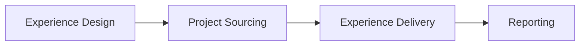

<!-- status: living -->

# Practera Platform — Functional Specification

Practera is an end-to-end platform for work-based and career-connected learning design and delivery, supporting fully online and blended experiences. It spans the full lifecycle from programme authorship through to industry project sourcing, learner delivery, and impact reporting. Each stage is implemented across purpose-built applications that share a unified authentication layer.

## Value Chain

---

## 1. Experience Design

A well-designed experience is the foundation everything else depends on. Instructional designers use Practera's AI-powered authoring environment to set learning objectives, scaffold the programme structure, author content and assessments, configure schedules and automation, and deploy AI expert assistants — before a single learner is enrolled.

### Key Capabilities
- **Learning objectives** — Start from a description of the experience, then use AI to help define learning objectives, skills development goals, credentials (badges, certificates).
- **Experience structure design** — Organise the experience into groups of tasks for each of the key roles (learner, mentor, admin, etc.). Set up assessments, content, scheduled events, team tasks, and simulations, with drag-drop reorder, role-based visibility, and lock/reveal triggers. A mentor, for example, sees a different experience structure than a learner — each role gets exactly the scaffolding they need.
- **Customisation** — Give each experience its own identity so learners feel it belongs to their institution or programme. Set a custom brand (logo, colours, fonts), define the terminology that fits the context (e.g. rename "Milestones" to "Phases", create custom role names), and configure LTI 1.3 so learners can launch directly from their institution's LMS.
- **Content authoring** — Designers author rich, engaging materials without leaving the platform. Topics support full rich text (headings, embeds, images, code blocks) via TipTap, as well as embedded video and audio. A shared media library lets assets be reused across activities and experiences, reducing duplication.
- **Interactive content & simulations** — Not all learning happens through reading or discussion. Practera supports H5P interactive content packages (quizzes, branching scenarios, drag-and-drop exercises) embedded directly in topic pages, and standalone simulation tasks for richer interactive scenarios. All activity on H5P and simulation tasks is tracked via xAPI, linking on- and off-platform learning events back to the learner's progress record and enabling institutions to meet xAPI-compliant reporting requirements.
- **Assessments & review design** — Practera's assessment engine is one of the platform's most powerful differentiators. Designers build assessments from a rich palette of question types: slider ratings, single/multi-choice, long text, file uploads, and team member selectors. Reviewer pools are configured per assessment — peer reviewers, subject-matter experts, or role-based pools — with the system handling assignment automatically at scale. Team 360 assessments capture peer contribution ratings from within the team, feeding directly into skills growth and cohort reporting. All assessment scores flow into the reporting and skills growth views, giving institutions a continuous, data-driven picture of learner capability.
- **Scheduling** — Blended experiences need face-to-face and virtual touchpoints coordinated across the cohort. Coordinators schedule recurring sessions and one-off events on a shared calendar, track attendance via QR check-in, run meeting polls to find times that work for everyone, and send targeted communications tied to session timing — all without leaving the platform.
- **Automation (ELSA)** — At scale, coordinators can't personally nudge every learner at exactly the right moment. ELSA (the automation engine) fires rule-based triggers based on learner progress, calendar dates, or specific actions — sending messages, unlocking content, or awarding credentials automatically. Designers define the rules once; ELSA handles execution across the entire cohort.
- **AI Experts** — Every experience can have one or more AI-powered expert assistants, scoped to the programme's context and knowledge. Designers configure the expert's persona, upload domain knowledge files, test it against sample conversations, then publish proven experts to a shared library for reuse across other experiences. Experts are versioned so improvements can be rolled out without disrupting active cohorts.
- **Library** — Successful programme components shouldn't be rebuilt from scratch. The library stores proven experience templates, media assets, and AI experts at the institution or global level, making them available for reuse across any experience. Designers browse and import from the library, dramatically reducing the time to launch new programmes.
- **Go-live checklist** — Launching to live learners carries risk. The go-live checklist guides designers through a structured pre-launch review — confirming content is complete, settings are correct, enrolments are ready, and notifications are configured — before the experience goes live to the cohort.

### Systems

| Layer | System |
|-------|--------|
| Frontend | `practera-admin-app` (React 19 + Vite SPA) |
| API | `practera-graphql-api` |

### Detailed Specs

- [Admin App — Design specs](https://github.com/intersective/practera-admin-app/tree/main/specs/design/)
- [GraphQL API — Experience mutations](https://github.com/intersective/practera-graphql-api/tree/main/specs/mutations/experience.md)
- [GraphQL API — Content mutations](https://github.com/intersective/practera-graphql-api/tree/main/specs/mutations/content.md)
- [Developer Docs — Design stage detail](design/index.md)

---

## 2. Project Sourcing

Sourcing high-quality real-world projects is one of the hardest operational challenges in work-based learning — most institutions rely on ad-hoc email chains, spreadsheets, and manual follow-up. Practera's project sourcing stage gives institutions a purpose-built pipeline: structured campaigns, AI-guided client intake, a governed approval workflow, and integrated assignment into learning experiences.

### Key Capabilities

- **Campaign management** — Coordinators need a structured way to invite industry partners and track which projects are available to learners in each experience. Campaigns give every sourcing drive its own identity: an active window, a set of project brief templates to guide submissions, and a unique shareable URL that can be sent to any number of industry contacts — no account required on their end.
- **AI-guided project brief intake** — The quality of a work-based learning experience depends heavily on the quality of the project brief. Practera's AI chatbot walks industry clients through producing a structured, complete brief using the programme's own templates as its guide — asking targeted follow-ups, validating completeness, and auto-saving progress so clients can return and pick up where they left off. A traditional form is available for clients who prefer it. Briefs are created as drafts the moment a client provides their name and email, so no work is ever lost.
- **Brief quality and approval workflow** — Not every submitted brief is ready for learners. The brief lifecycle (`DRAFT → CLIENT_APPROVED → ADMIN_APPROVED → ARCHIVED`) gives coordinators a clear quality gate: clients submit and approve their own briefs, coordinators review and approve for assignment, and any admin edit triggers a client re-approval cycle so changes are never made unilaterally. Coordinators can archive briefs that are no longer relevant without losing the history.
- **Experience assignment and application windows** — Once a brief is approved, coordinators assign it to one or more Practera learning experiences and set the window during which learners can apply. Application windows can be closed per brief if a project is already fully subscribed, giving coordinators fine-grained control without disrupting the rest of the cohort.
- **Learner project application** — Learners browse all projects available in their experience and apply for up to five, ranking their preferences from highest to lowest priority. This preference data gives coordinators and project providers everything they need to make considered matching decisions — and learners have skin in the game from day one.
- **Team formation** — Once matching decisions are made, coordinators create teams directly from the project hub, linking learners to their projects and populating the teams that the rest of the platform's delivery and reporting features will use.

### Systems

| Layer | System |
|-------|--------|
| Frontend | `practera-project-hub` (Next.js 16 + Prisma + PostgreSQL) |
| Database | Own PostgreSQL database |
| API | `practera-graphql-api` (for experience/team operations) |

### Detailed Specs

- [Project Hub — Feature Spec](https://github.com/intersective/practera-project-hub/tree/main/specs/002-industry-project-web-platform/spec.md)
- [Project Hub — Data Model](https://github.com/intersective/practera-project-hub/tree/main/specs/002-industry-project-web-platform/data-model.md)
- [Project Hub — API Contracts](https://github.com/intersective/practera-project-hub/tree/main/specs/002-industry-project-web-platform/contracts/openapi.yaml)
- [Developer Docs — Sourcing stage detail](sourcing/index.md)

---

## 3. Experience Delivery

The delivery stage is where the designed experience meets the live cohort. It spans everything learners interact with day-to-day — their activity tree, assessments, AI expert chat, and peer collaboration — and everything coordinators use to monitor, support, and intervene: feedback pipelines, communications, enrolment tools, and cohort dashboards.

### Key Capabilities

- **Learner journey** — The learner's experience is structured as a tree: top-level phases containing activities, each activity a curated set of tasks. The home dashboard surfaces current progress, upcoming due dates, pulse check prompts, and earned achievements at a glance. From there, learners navigate into activities to read topic content, submit assessments, attend events, collaborate on team tasks, or interact with an AI expert assistant — all within a single responsive app that works on mobile and desktop without reinstallation.
- **Feedback pipeline** — Managing feedback at scale is one of the hardest operational problems in work-based learning. Practera's feedback pipeline gives coordinators full visibility and control across a 4-step lifecycle: Submitted → Assigned → Reviewed → Acknowledged. Reviewers are assigned manually or via automated rules; coordinators can send reminders, reopen reviews, or reassign without touching the learner's submission. **Score moderation** lets coordinators override reviewer scores when quality or bias concerns arise, with the moderated score taking precedence in reporting. **AI quality scoring** automatically evaluates the quality of every review at submission time — flagging thin, off-topic, or low-effort feedback before it reaches the learner. **Reviewer performance tracking** aggregates helpfulness, timeliness, and AI quality scores per reviewer per assessment, giving coordinators data to coach or reassign underperforming reviewers. **Learner review ratings** close the loop: after receiving feedback, learners rate its helpfulness and add comments and tags, providing a bottom-up quality signal alongside the AI assessment. Together, these features make it possible to maintain high feedback quality across large, diverse cohorts.
- **Communication** — Maintaining a cohort without timely communication creates drop-off and disengagement. Practera's communication layer runs across three channels: real-time chat (Pusher-backed channels, DMs, and announcements, accessible to learners and coordinators alike), scheduled messages (time-targeted broadcasts tied to milestones or calendar events), and email notifications (automated and manual, triggered by the platform or sent directly by the coordinator). All three are managed from a single comms hub.
- **Teams** — Work-based learning is inherently collaborative. Coordinators form teams manually or auto-assign by cohort size, with the platform flagging unassigned learners. Each team has a shared project brief, a collaborative todo list visible to all members, and a workload balance view that helps coordinators spot teams where contribution is unevenly distributed.
- **Events and meetings** — Scheduled touchpoints keep blended cohorts on track. Learners book into events (workshops, webinars, mentoring sessions) directly from the app, with the platform enforcing capacity limits and sending reminders. Coordinators track attendance via QR check-in and run meeting polls to coordinate times across distributed teams. Video meeting links attach directly to event records so learners have a single source of truth for where to show up.
- **Enrolment management** — Cohort logistics shouldn't require spreadsheets. Coordinators manage all enrolments from a single paginated table: filter by role and progress, bulk-import via CSV, send invitation and reminder emails, unenroll or reset individual learners, and export the full cohort to CSV. Per-learner report cards give coordinators a milestone-level view of any individual's progress without leaving the admin interface.
- **Pulse checks** — Skills development is a process, not a moment. Pulse checks surface learner-reported progress on configurable skill dimensions at regular intervals throughout the experience, building a longitudinal picture of how each learner feels their capability is growing. The traffic light indicator on the learner's home page makes it obvious when a check-in is due, keeping response rates high without coordinator chasing.
- **Credentials and recognition** — Learners need to see their progress recognised in ways that matter beyond the platform. Practera awards badges and achievements when ELSA-defined criteria are met (completion milestones, assessment scores, peer ratings) and generates shareable certificate URLs backed by xAPI-linked credential definitions. Credentials earned in Practera can be verified by employers and linked to a learner's external portfolio.
- **Progress and engagement tracking** — Coordinators and learners both need visibility into where the cohort stands. Milestone completion percentages, due date timelines, and engagement metrics are available to learners in real time and to coordinators on their dashboard — giving both parties a shared reference point for check-ins and interventions before small problems become drop-off.

### Systems

| Layer | System |
|-------|--------|
| Learner frontend | `practera-app` (Angular 19 + Ionic — learner-facing SPA) |
| Admin frontend | `practera-admin-app` (React/Vite — coordinator/admin delivery tools) |
| API | `practera-graphql-api` |

### Detailed Specs

- [Admin App — Deliver specs](https://github.com/intersective/practera-admin-app/tree/main/specs/deliver/)
- [Learner App — specs](https://github.com/intersective/practera-app/tree/main/specs/) (bootstrapped Sept 2026; see [Alignment Status](alignment/index.md) for refinement backlog)
- [GraphQL API — Assessment mutations](https://github.com/intersective/practera-graphql-api/tree/main/specs/mutations/assessment.md)
- [GraphQL API — Enrolment mutations](https://github.com/intersective/practera-graphql-api/tree/main/specs/mutations/enrolment.md)
- [Developer Docs — Delivery stage detail](delivery/index.md)

---

## 4. Reporting

Demonstrating the impact of work-based learning is essential for institutional buy-in, industry partner retention, and programme improvement — but it is also one of the hardest things to do well. Practera's reporting stage turns the data generated across the other three value chain stages into actionable insights for coordinators, programme managers, institutional administrators, and industry partners.

### Key Capabilities

- **Configurable metrics and KPIs** — Every institution has different definitions of success. Coordinators define their own KPIs from any combination of data sources (assessment scores, submission rates, engagement events, pulse check responses), aggregation methods (mean, count, completion rate), and filter criteria (by role, cohort status, time window). Metric values update on-demand and are tracked over time, so coordinators can see whether the experience is improving across successive cohorts.
- **Skills growth** — Pulse check responses across a cohort tell a compelling story about capability development — but only when seen together over time. The skills growth view plots each learner's and the whole cohort's self-reported skill scores across the full sequence of pulse checks, broken down by role. Institutions can present this directly to industry partners and accreditation bodies as longitudinal evidence of programme impact.
- **Custom report builder** — Different stakeholders need different cuts of the data. The report builder lets coordinators and programme managers assemble bespoke reports from sections of charts (area, bar, pie, data table, KPI card), configure each chart's scope and filters, preview the result in a shareable read-only view, and distribute the link. Reports persist across cohort cycles and can be updated in place as new data comes in.
- **Feedback status matrix** — In large cohorts with multiple reviewers and assessment tasks, it is easy for reviews to fall through the cracks. The feedback status matrix shows every reviewer as a row and every moderated assessment as a column, with each cell colour-coded by completion status (Complete, Pending, Overdue, Unassigned). Coordinators identify at a glance which reviews are overdue, who is behind, and what interventions are needed — without digging through individual submissions.
- **Team 360 analysis** — Peer contribution ratings from Team 360 assessments are aggregated into a report showing how each team member's peers rated their contribution across the programme's rating dimensions. This data is invaluable for mentors and coordinators conducting end-of-programme debrief conversations, and for institutions seeking evidence of collaborative work skills development.
- **Cohort reports and exports** — Programme managers and institutional administrators need summary data for governance, accreditation, and continuous improvement. Cohort reports aggregate learner progress, completion rates, and engagement metrics at the experience level. All data exports to CSV or XLSX for further analysis in institutional reporting systems.
- **Audit log** — A complete activity log of programme events gives coordinators and CS staff a reliable audit trail for troubleshooting, compliance, and quality assurance — surfacing exactly what happened, when, and for whom.

### Systems

| Layer | System |
|-------|--------|
| Frontend | `practera-admin-app` (React/Vite) |
| API | `practera-graphql-api` |

### Detailed Specs

- [Admin App — Report specs](https://github.com/intersective/practera-admin-app/tree/main/specs/report/)
- [GraphQL API — Metrics queries](https://github.com/intersective/practera-graphql-api/tree/main/specs/queries/metric.md)
- [GraphQL API — Reports queries](https://github.com/intersective/practera-graphql-api/tree/main/specs/queries/reports.md)
- [Developer Docs — Reporting stage detail](reporting/index.md)

---

## Cross-System Integration

The platform integrates across systems via:

- **JWT auth** — `login-app` → `login-api` issues RS256 JWTs; all apps pass `apikey: JWT` header to `practera-graphql-api`
- **GraphQL API** — single backend for all frontend applications
- **Pusher** — real-time chat and notifications
- **TUS/S3** — large file uploads (media, assessment file answers)
- **LTI 1.3** — institutional SSO integration
- **Legacy CakePHP** — iframe-embedded legacy screens in `admin-app` (in migration)

See [System Architecture](architecture.md) for the full topology diagram and [Alignment Status](alignment/index.md) for current spec coverage.
