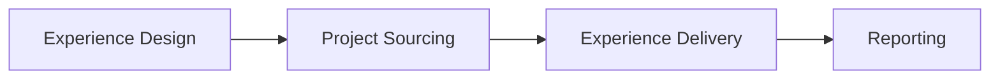

<!-- status: living -->

# Practera Platform — Functional Specification

Practera is an end-to-end platform for work-based and career-connected learning design and delivery, supporting fully online and blended experiences. It spans the full lifecycle from programme authorship through to industry project sourcing, learner delivery, and impact reporting. Each stage is implemented across purpose-built applications that share a common GraphQL API and authentication layer.

## Value Chain

---

## 1. Experience Design

Coordinators and administrators design programme structures before learners are enrolled. This stage covers everything from scaffolding the activity tree and authoring content through to configuring AI experts, custom roles, and LTI integrations.

### Key Capabilities

- **Programme structure design** — milestones, activities, tasks, assessments; drag-drop reorder; role-based visibility; lock/reveal triggers
- **Content authoring** — topics (rich text via TipTap), media library (TUS upload), assessment question builder
- **Scheduling** — event calendar (ProScheduler), QR-based attendance, meeting polls, comms integration
- **Automation (ELSA)** — rule-based triggers, credentials/badges, activity log
- **AI expert configuration** — scoped experts (experience/institution/global), versioning, testing, knowledge files, library publishing
- **Settings** — branding, taxonomy (configurable terminology), custom roles, LTI 1.3, AI model mappings
- **Library** — cross-experience templates, media, AI experts
- **Go-live checklist** — pre/post-launch validation

### Systems

| Layer | System |
|-------|--------|
| Frontend | `practera-admin-app` (React 19 + Vite SPA) |
| API | `practera-graphql-api` |

### Detailed Specs

- [Admin App — Design specs](https://github.com/intersective/practera-admin-app/tree/main/specs/design/)
- [GraphQL API — Experience mutations](https://github.com/intersective/practera-graphql-api/tree/main/specs/mutations/experience.md)
- [GraphQL API — Content mutations](https://github.com/intersective/practera-graphql-api/tree/main/specs/mutations/content.md)
- [Developer Docs — Design stage detail](design/index.md)

---

## 2. Project Sourcing

The project sourcing stage enables institutions to build a pipeline of real-world industry projects. Administrators manage campaigns, clients submit briefs via an AI-guided intake flow, and learners apply for projects during defined windows.

### Key Capabilities

- **Campaign management** — create campaigns with project brief templates, set active windows, generate shareable intake URLs
- **AI-guided intake** — external client chatbot guided by templates; traditional form alternative; draft-on-first-capture; local storage resumption
- **Brief lifecycle** — `DRAFT → CLIENT_APPROVED → ADMIN_APPROVED → ARCHIVED`; admin edit requires client re-approval
- **Email notifications** — edit links sent to clients on submission; admin change notifications
- **Experience assignment** — assign approved briefs to Practera experiences via GraphQL API; auto-create experience records
- **Learner application** — apply for up to 5 projects with priorities (1–5) during admin-set application windows
- **Team creation** — Practera API integration for team formation

### Systems

| Layer | System |
|-------|--------|
| Frontend | `practera-project-hub` (Next.js 16 + Prisma + PostgreSQL) |
| Database | Own PostgreSQL database |
| API | `practera-graphql-api` (for experience/team operations) |

### Detailed Specs

- [Project Hub — Feature Spec](https://github.com/intersective/practera-project-hub/tree/main/specs/002-industry-project-web-platform/spec.md)
- [Project Hub — Data Model](https://github.com/intersective/practera-project-hub/tree/main/specs/002-industry-project-web-platform/data-model.md)
- [Project Hub — API Contracts](https://github.com/intersective/practera-project-hub/tree/main/specs/002-industry-project-web-platform/contracts/openapi.yaml)
- [Developer Docs — Sourcing stage detail](sourcing/index.md)

---

## 3. Experience Delivery

The delivery stage encompasses everything learners and coordinators interact with during an active programme — from the learner's activity tree and assessment submissions through to coordinator-side feedback pipelines, enrolment management, and real-time communications.

### Key Capabilities

- **Learner journey** — home dashboard, milestone/activity tree, topic content, assessment submission and review
- **Feedback pipeline (admin)** — submission tracking, reviewer assignment, 4-step pipeline (Submitted → Assigned → Reviewed → Acknowledged), AI quality scoring
- **Communication** — Pusher-backed chat (channels, DMs, announcements), scheduled messages, email notifications
- **Teams** — formation (manual/auto-assign), project briefs, team todos, workload balance
- **Events and meetings** — bookable events (capacity, QR attendance), video meetings, polls
- **Enrolment management (admin)** — bulk CSV import, invitation/reminder emails, per-learner report cards
- **Pulse checks** — learner wellbeing surveys with configurable question sequences
- **Badges, achievements, certificates** — credential definitions, xAPI criteria, certificate URL generation
- **Progress tracking** — milestone progress %, due dates, engagement metrics, skills growth

### Systems

| Layer | System |
|-------|--------|
| Learner frontend | `practera-app` (Angular 19 + Ionic — learner-facing SPA) |
| Admin frontend | `practera-admin-app` (React/Vite — coordinator/admin delivery tools) |
| API | `practera-graphql-api` |

### Detailed Specs

- [Admin App — Deliver specs](https://github.com/intersective/practera-admin-app/tree/main/specs/deliver/)
- practera-app specs: **to be bootstrapped** — see [Alignment Status](alignment/index.md)
- [GraphQL API — Assessment mutations](https://github.com/intersective/practera-graphql-api/tree/main/specs/mutations/assessment.md)
- [GraphQL API — Enrolment mutations](https://github.com/intersective/practera-graphql-api/tree/main/specs/mutations/enrolment.md)
- [Developer Docs — Delivery stage detail](delivery/index.md)

---

## 4. Reporting

The reporting stage surfaces programme impact data for coordinators, programme managers, and institutional administrators. It spans configurable KPI dashboards, skills growth visualisations, custom report builders, and cohort-level exports.

### Key Capabilities

- **Configurable metrics and KPIs** — multi-source, multi-aggregation metric definitions; value history; answer distribution
- **Skills growth analysis** — grouped bar chart across pulse sequences; per-role breakdown
- **Custom report builder** — section-based editor, 5 chart types (area, bar, pie, data-table, KPI card), shareable preview
- **Feedback status matrix** — reviewer × assessment completion accountability view
- **Team 360 reports** — peer contribution rating analysis
- **Cohort reports** — aggregated learner progress; CSV/XLSX export
- **Audit log** — programme activity log viewer

### Systems

| Layer | System |
|-------|--------|
| Frontend | `practera-admin-app` (React/Vite) |
| API | `practera-graphql-api` |

### Detailed Specs

- [Admin App — Report specs](https://github.com/intersective/practera-admin-app/tree/main/specs/report/)
- [GraphQL API — Metrics queries](https://github.com/intersective/practera-graphql-api/tree/main/specs/queries/metric.md)
- [GraphQL API — Reports queries](https://github.com/intersective/practera-graphql-api/tree/main/specs/queries/reports.md)
- [Developer Docs — Reporting stage detail](reporting/index.md)

---

## Cross-System Integration

The platform integrates across systems via:

- **JWT auth** — `login-app` → `login-api` issues RS256 JWTs; all apps pass `apikey: JWT` header to `practera-graphql-api`
- **GraphQL API** — single backend for all frontend applications
- **Pusher** — real-time chat and notifications
- **TUS/S3** — large file uploads (media, assessment file answers)
- **LTI 1.3** — institutional SSO integration
- **Legacy CakePHP** — iframe-embedded legacy screens in `admin-app` (in migration)

See [System Architecture](architecture.md) for the full topology diagram and [Alignment Status](alignment/index.md) for current spec coverage.
