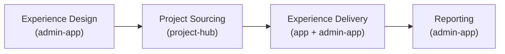

<!-- status: living -->

# Practera Value Chain

Practera's platform is organised around four value chain stages that together support the full lifecycle of work-based and career-connected learning — from programme design through to reporting and continuous improvement.

| Stage | Primary System | Key Users |
|-------|---------------|-----------|
| Experience Design | practera-admin-app | Coordinators, designers |
| Project Sourcing | practera-project-hub | Admins, industry clients, learners |
| Experience Delivery | practera-app + practera-admin-app | Learners, coordinators |
| Reporting | practera-admin-app | Coordinators, institution admins |

- [Experience Design](design/index.md)
- [Project Sourcing](sourcing/index.md)
- [Experience Delivery](delivery/index.md)
- [Reporting](reporting/index.md)
