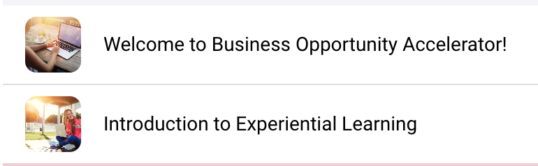
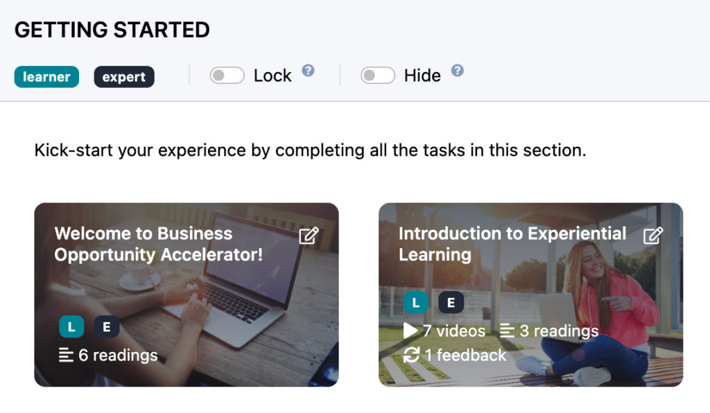
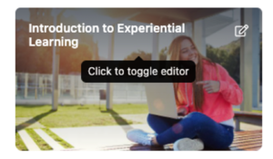
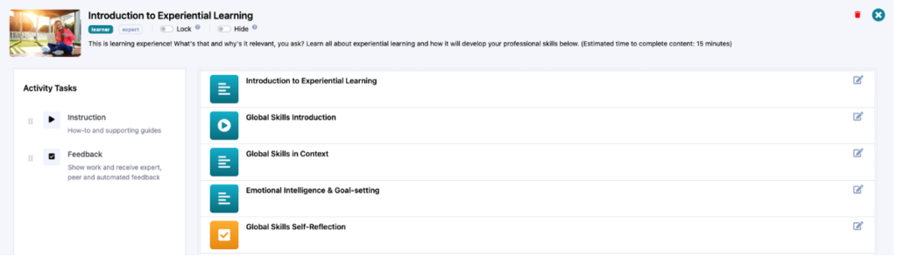
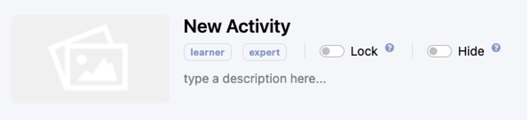
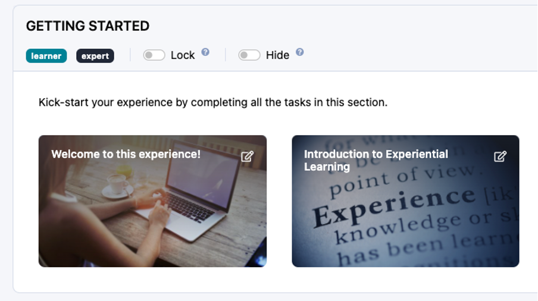

# Add Activity Images

Learn how to add images to your activities to improve the look and feel for learners and experts.

---

## Activity Images

These are the “cards” or images that display for your learners and experts on their interface. Your activities sit within activity groups. Inside each activity is your collection of instructions and assessments, so it’s great for learners and experts to have both a clear title and an image for what to expect!

From your authoring interface, you’ll see these activities within their activity groups like so:

### Changing Activity Images

In order to add or change the images for each activity, you need to toggle the activity editor by clicking on the activity title or edit icon:

Once you are on the activity editor page, you will see all the instructions and feedback for that activity. This is where you would come to add more instructions, feedback or to edit any of the instructions or feedback that exist in that activity:

In order to add or change the activity image, follow these simple steps:
  * Click on the existing image or click on the blank image placeholder:

  * The **Media Library** window will pop open for you.
  * Choose an image already in your media library or upload a new image.  
**Reminder:** The ideal dimensions for the activity images are 1024 x 576.
  * It will automatically save!

  * You will see the updated activity image from your **Design** page:

  * Learners and experts will see it from their interface as well

## What’s Next?

Now you know how to change the images on your activities to make the experience more visually appealing to learners and experts. Want to learn something else? Check out the rest of the **Becoming a Practera Power User Collection.**
[Becoming a Practera Power User Collection](index.md)
