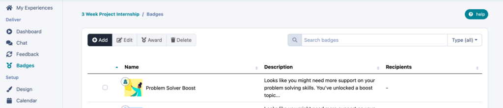
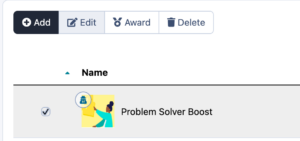
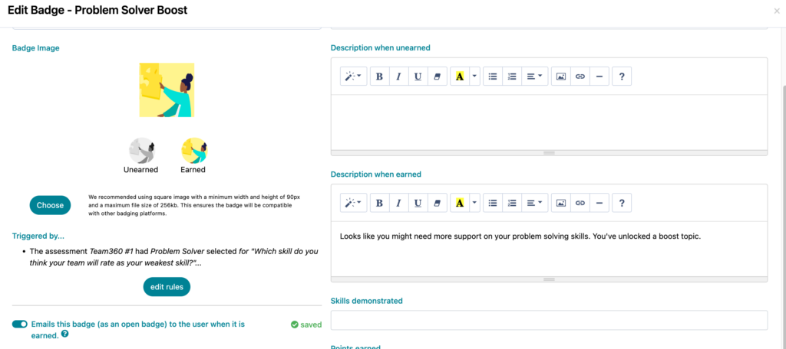
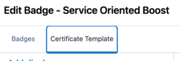
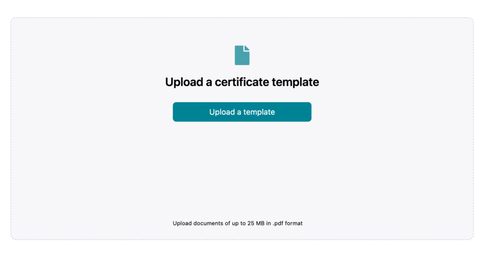
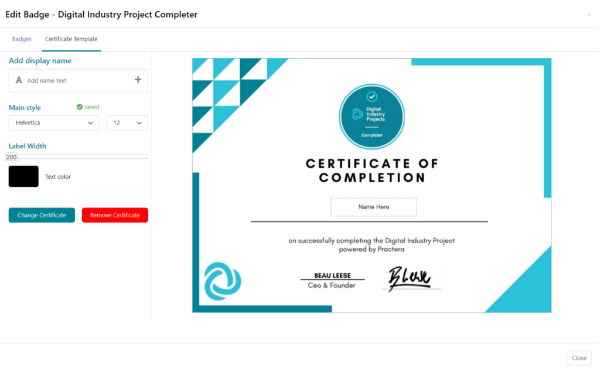
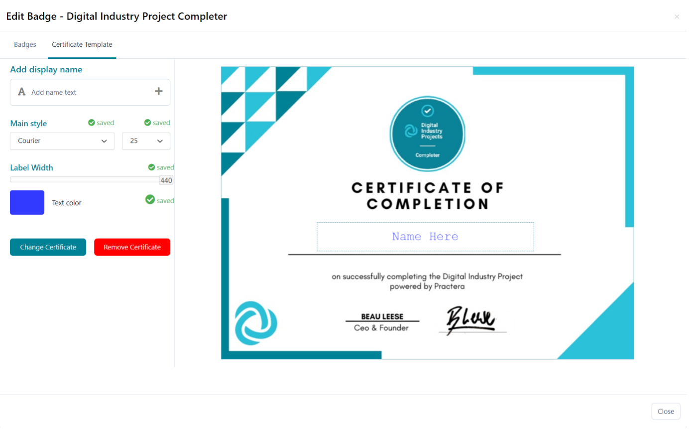
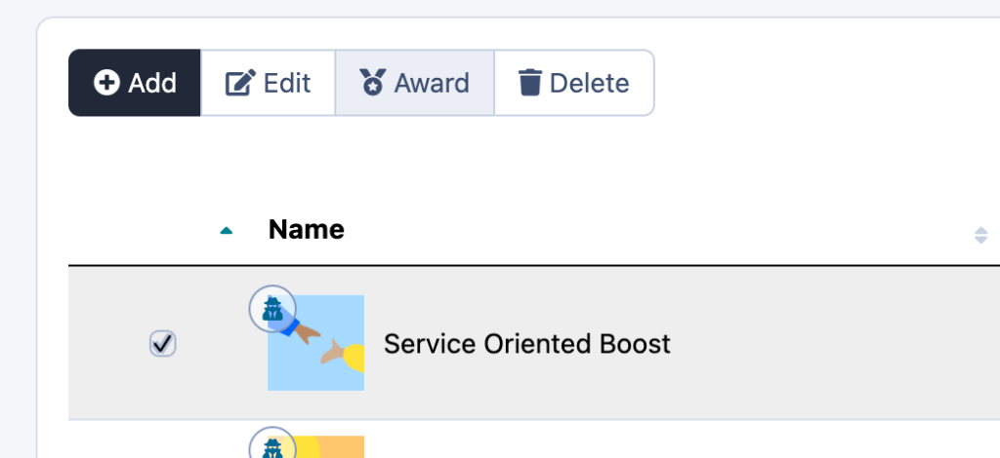
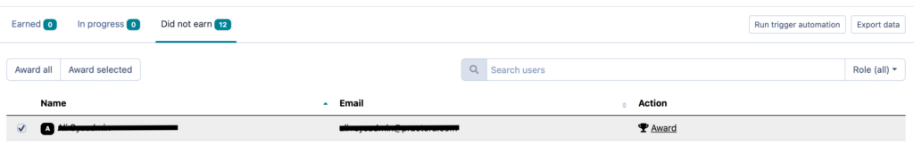

# Adding Certificates to Your Experience

A how-to regarding adding automated certificates to your Practera Experience
In Practera you have the capability to add certificates to your experiences, these can be earned by participants as they progress through your program or at the end. This is done through badge rules, resulting in the sending of an email with the badge and link to the certificate for the user.

---

## Where can I setup my Certificates?

### Navigate to the Badges Tab

The awarding of certificates is linked to the open badges, so setting up the certificate is conducted within the **Badges** tab on the Practera Dashboard.

### Select the Badge and Edit

This is done by selecting the checkbox next to the badge you wish to be associated with the certificate and clicking **Edit**.

### Setup Badge to Send Email when it is earned

For your certificate to be awarded to the student on the earning of the desired Badge, you must make it an Open Badge. This is done through switching on the **“Emails this badge (as an open badge) to the user when it is earned”** setting in the bottom left-hand corner. On this page you can also add the credential description that will be used in the participants Badge backpack in the “**Description when Earned** ” content box. Once completed, navigate to the “**Certificate Template** ” tab at the top left of the page.

### Setting up your Certificate

Now that we’ve navigated to the **Certificate Template** tab, it’s time to get editing.

### Uploading your Certificate Template

To setup your certificate you must first upload a PDF. This is conducted by clicking on the **Upload a Template** button near the centre of the design window.

This PDF must ideally be A4, less than 25mb in size, and be either portrait or landscape. Please ensure the template has blank space to position for the student full name, which will be automatically generated. Once uploaded, the certificate will display as follows:

### Configuring Your Certificate

Now that we’ve uploaded our desired template, it’s time to start configuring how the participants name will be populated onto the template. Currently, there are 4 aspects that you can edit on the certificate. Once these aspects have saved a green “Saved” notification will appear next the tool. The editable aspects are:
  * Location of Student name
  * Colour
  * Font
  * Label Width

## Time to Test the Certificate

Once all your changes have been confirmed and saved, it’s time to test your certificate. This can be done by navigating back to the **Badges** tab, checking the badge you just set the certificate to, and clicking **Award**.

Once you’re in the **Award** tab, navigate to the **Did not earn** tab, check the box next to a user you have access to the email of, and click either **Award** on the top or the right of the user. This will then send an email to that user that contains the certificate for you perusal.

### Once you’ve confirmed that everything is set up, you have now setup your certificate!

