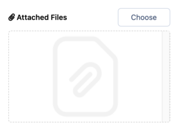
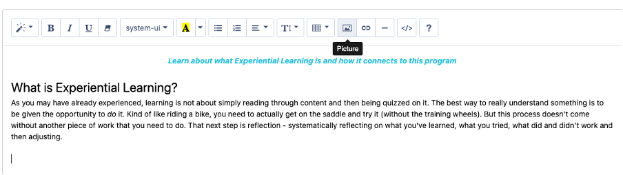
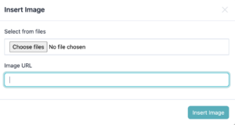

# Adding Media to Instructions

Learn how to add videos, images and attachments to the instructions in your experience.

---

## Adding Videos

When you are creating instructions for your learners, you might have a need to provide a video to support their understanding. You are able to either [upload a video](./adding-media-to-instructions/#1-toc-title) or to [link to a video ](./adding-media-to-instructions/#2-toc-title)streaming service outside of Practera such as YouTube or Vimeo. When you add a video to your instructions, it will display for learners and experts at the top of the page, above the text content.
### Uploading my own video

If you’d like to upload a video of your own, select **Choose** on the top right beside **Lead Video** :

You will then open up the Media Manager in which you can upload the video of your choice!
### Linking to a video

To use a video from a streaming platform, you will need to input the URL for the video in the text box below the lead video image:

When selecting a video from a streaming source, please ensure that it is publicly available (not a private video) and that you have the rights to use that video.

---

## Adding Attachments

There may be some additional information or documents that your learners or experts will need. Adding an attachment to the instructions is really quick and simple! Below **Lead Video** you will see **Attached Files**. Select **Choose** in order to open the media manager and upload or select the file you would like to attach:

You can attach more than one file and you can attach files of any kind!

---

## Inserting Images

When you’re writing instructions, you’ll more than likely find the need to add in imagery to support your words. Inserting an image to the instructions using the text editor allows you to add the image to any part of your instructions!
  * Move your cursor to where you would like to insert the image and select the **Picture** button from the text editor menu:

  * Next, you’ll see an upload option to either **Select from Files** or to provide an **Image URL.** Here you can upload a file from your computer or provide a link to an image that exists on the web.

Make sure you have permission to use share or use the image that you have selected.
  * Click **Insert Image**.
  * **NOTE:** You can also drag and drop an image from your machine to anywhere in your instructions!
  * You image is in! You can resize the image in the instructions by dragging and resizing from the bottom right corner of the image:

<https://practera.com/wp-content/uploads/2023/09/Feedback-Loop.mp4>
There you have it, you’ve got images in your instructions!

---

## What’s Next?

Now you know how to improve your instructions with added media. Next, learn how to add or change the images for your activities so that you can make your experience look fantastic for learners and experts.
[Adding Activity Images](./add-activity-images/)
Want to learn something else? Check out the rest of the [**Becoming a Practera Power User Collection.**](index.md)
