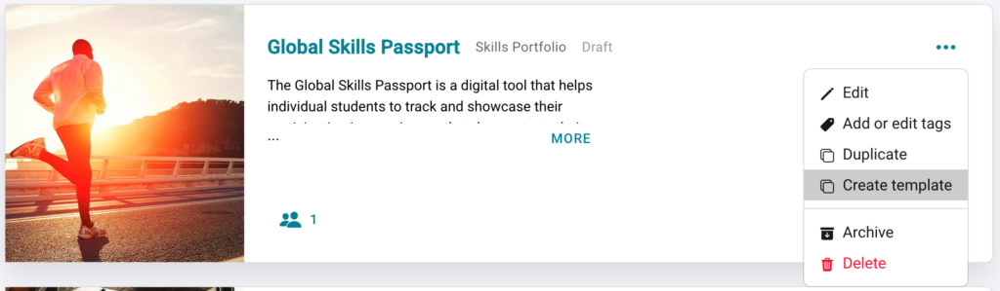
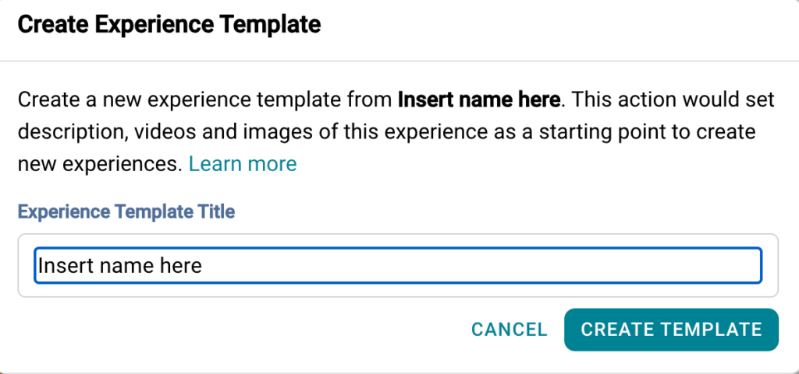
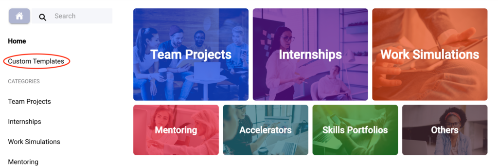
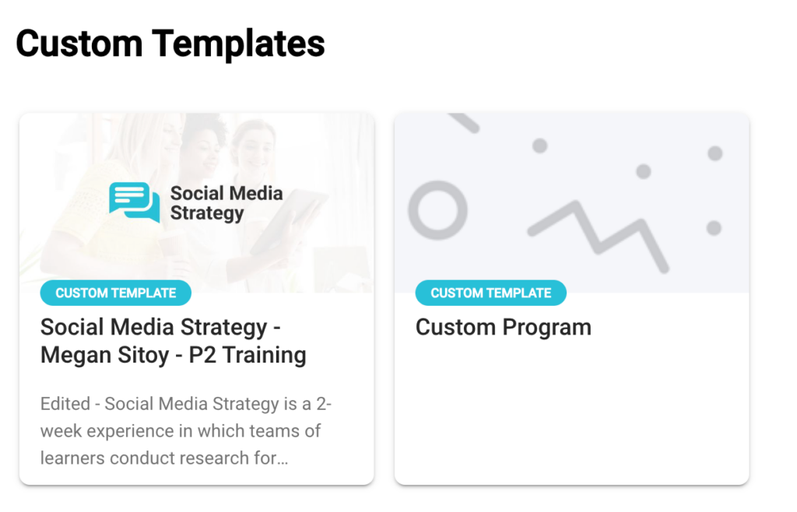

# Create Custom Templates

This article will provide information about how to create your own custom templates for your institution.

---

## What is a custom template?

As a Practera [Admin](../institution-set-up/understanding-user-roles/) you have access to all of our tried and tested templates in the template library. You will also notice that there is a category called “Custom Templates”. This is a curated category managed by your institutional/organisational administrators and may include experiences that you or your colleagues have created that are fit for purpose for your institution/organisation. Adding this experience as a custom template allows easy access to be able to replicate or clone the experience when needed.
This category is only available to administrators in your institution, not to the broader public. Connect with your organisational administrator if you would like to add an experience to the Custom Templates category for others to use.

---

## How do I create a custom template?

Once you have designed your experience you are able to add it to the custom template library. (Need help with designing the experience have a read of our [Practera Power](index.md) user collection)
**Step 1:** Go to the relevant experience tile
**Step 2:** Click on the 3 dots on the right hand side
**Step 3:** Select “Create template”

**Step 4:** Add the relevant experience name for the template and click create template

If you go to the template library home page, you will see a custom templates option. Your new custom template will appear in here for you to be able to re-use whenever you need.

## What’s Next?

Want more information on how to utilise Practera to get started on your Practera journey, have a look at these articles in our [Onboarding Collection.](../onboarding/index.md)
