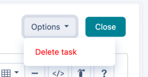
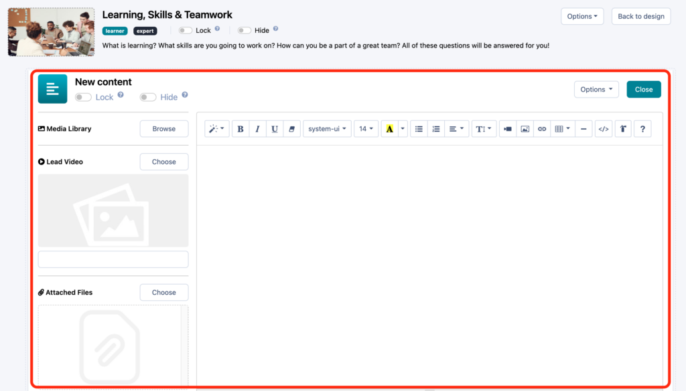

# Creating Instructions

Learn how to create supportive content for learners and experts.

---

## What are Instructions?

Instructions are a type of activity tasks that provide learners and experts with relevant content to enable their successful progression through the learning experience and support delivery and review of the experience submissions. For example, if the learners need to prepare a research report as one of the experience deliverables, they will be given instructions on suggested report structure and effective communication of their finding.
When creating instructions, the key point to keep in mind is that they play a supportive role in the learning experience, as learning will primarily happen through working on real-world challenges rather than consuming content. So, since instructions will serve as quick touchpoints, it is important to keep them engaging and concise.
### Accessing and Navigating Content Editor Page

Now that you are familiar with the function of instructions on Practera, let’s explore the content editor page, which you will be using to create new instructions from scratch or edit existing instructions.
If you need a reminder on how to get to the instructions content editor, have a look at the [Activity Tasks](./the-experience-designer-overview/#3-toc-title) section of the [Building Experience Structure](./the-experience-designer-overview/) article.

Once you have accessed the content editor, please note that it opens inside the larger activity editor page, so pay attention to ensure you are using the appropriate exit and delete buttons (click on options to delete the instruction).

The content editor page consists of three components:
  1. Title and visibility setting at the top
  2. Main text editor window on the right
  3. Supplementary media uploads on the left

Let’s now go through the actions you can perform in the editor to create and update instructions.
### Editing Instructions

This is a quick overview of what you can do to tailor your instructions for your experience:
  1. **Change instruction title** by clicking on it and typing
  2. **Set up locking and hiding**(please note that you cannot adjust learner/expert visibility preferences at the activity task level, which means that all instructions and assessments you create under a certain activity will follow the visibility settings for that activity)
  3. **Upload a video** that learners and experts will see above the rest of the content
  4. **Attach files** that will be readable and downloadable by learners and experts
  5. **Add and customise text, tables, images, and links** to be displayed as the main content
  6. **Delete instruction**
  7. **Go back to the activity editor screen** by clicking on the “close” button

## What’s Next?

Now you know how to create and edit instructions to support your learners and experts during their experience! Continue on your journey to becoming a Practera power user and find out how to configure different types of assessments in the next article.
[Configuring Assessments](../designing-feedback-loops/index.md)
Want to learn something else? Check out the rest of the [**Becoming a Practera Power User Collection.**](index.md)
