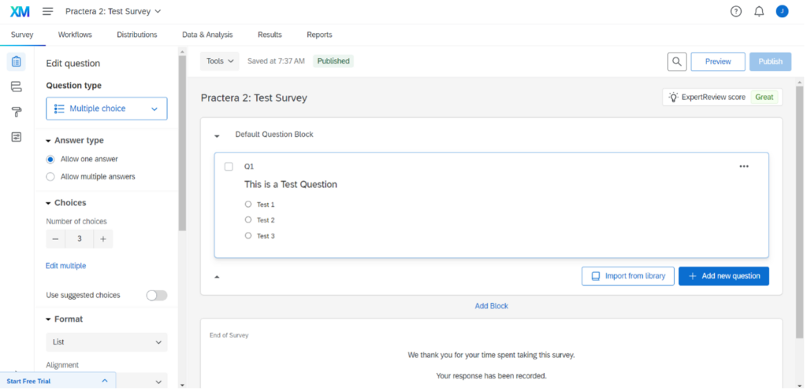
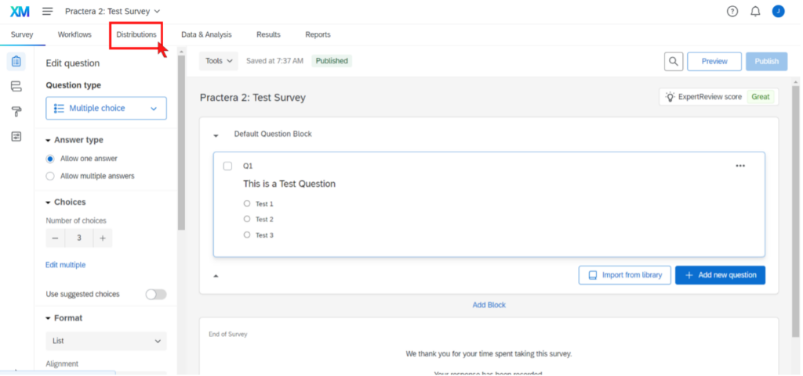
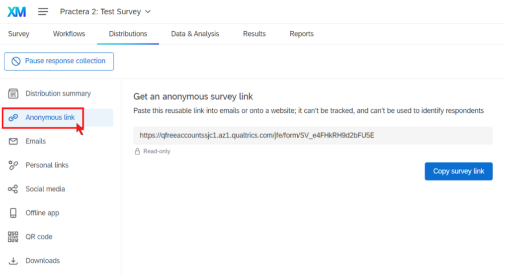
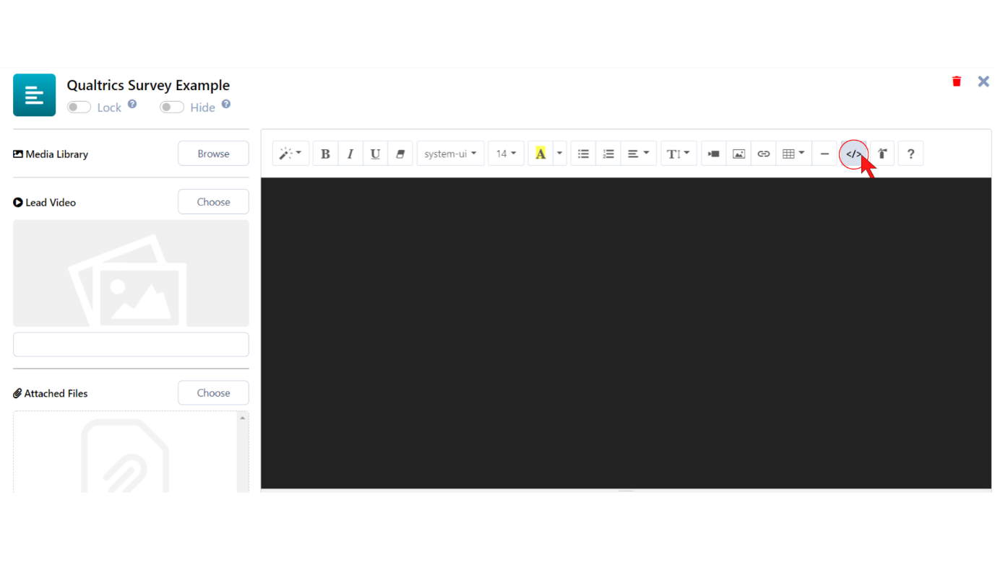
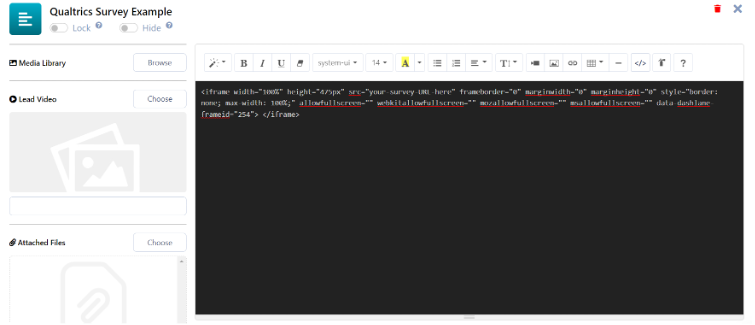
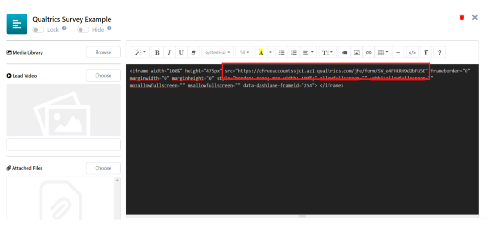
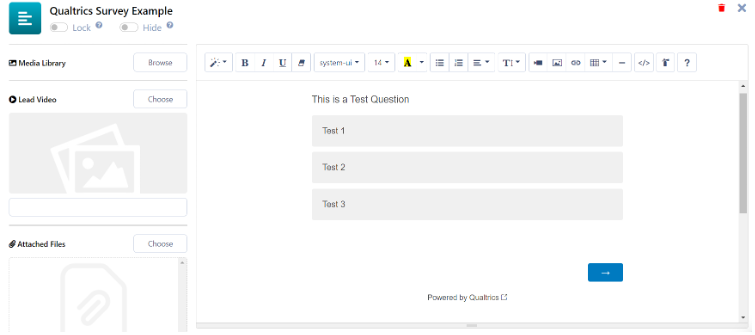
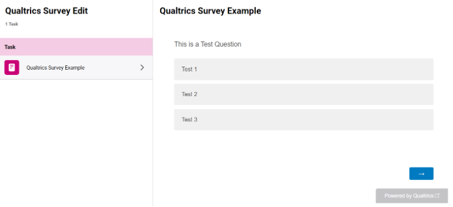

# Embedding Qualtrics Surveys


Learn how to embed Qualtrics surveys in the P2 content window

---

## What is a Qualtrics survey?


A Qualtrics survey is a **web-based survey software available for use by anyone for free**. It allows users to easily create surveys, collect and store data, and produce reports. As Qualtrics is web-based, you can embed it anywhere that allows embedding of content from other sources.

---

## How to source the Qualtrics embed URL

Once you have created your Qualtrics account and authoured your survey, it’s time to get the URL that we’ll be using to embed it into the Practera instruction window. You should find yourself at this window if you have just finished creating your survey:



From this page you should first click on the “Distributions” tab:



The Distribution tab is where you’ll find the various ways in which you can distribute your survey to your desired parties. We’ll be going to the “Anonymous Link” tab to find the URL we’ll need to embed the survey onto Practera.



We’ve now found our URL! Keep this tab open as we’re not quite ready to copy it over yet.
### Embedding the survey in the content window

To embed a Qualtrics survey in a Practera content window, you will first need to enter the source code section of the instruction window.
If you need a reminder on how to get to the instructions content editor, have a look at the [Activity Tasks](./the-experience-designer-overview/#3-toc-title) section of the [Building Experience Structure](./the-experience-designer-overview/) article.
Once you are in the content window, you can get to the source code section by doing the following:



After you have entered the source code tab, you will then need to copy this iframe code into the content window:

```html
<iframe width="100%" height="475px" src="your-survey-URL-here" frameborder="0" marginwidth="0" marginheight="0" style="border: none; max-width: 100%;" allowfullscreen="" webkitallowfullscreen="" mozallowfullscreen="" msallowfullscreen="" data-dashlane-frameid="254"> </iframe>
```



After this is completed it’s time to copy the embedding URL we sourced for your survey in the **“How to source your Qualtrics embed code”** step. This will go into the _src=”your-survey-URL-here”_ section of the code.



Once this is completed you can exit the source code section and you should see the Qualtrics survey in the default instruction editing window.



### Optional Additional Steps:

  1. If your survey is either shorter or longer than average, it is recommended that you edit the height of the survey to better fit the window. This can be done by editing the _height=”475px”_ numbers to a value more appropriate for your needs.
  2. Depending how you have laid content out around the survey, it is recommended to centre the survey in the content window. This can be done as if you were editing text.

Once this is completed you can now go and check how the survey looks in your learner/expert view. This is how it should look:



## What’s Next?

Now you know how to embed a Qualtrics survey into the content window you can start exploring what other tools and web-based applications work within Practera! Continue on your journey to becoming a Practera power user and find out about other configuration methods.
Want to learn something else? Check out the rest of the [**Becoming a Practera Power User Collection.**](index.md)
