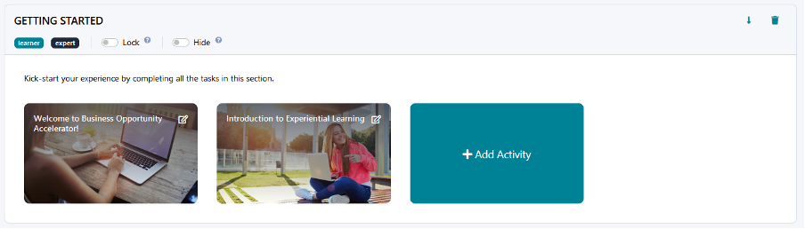
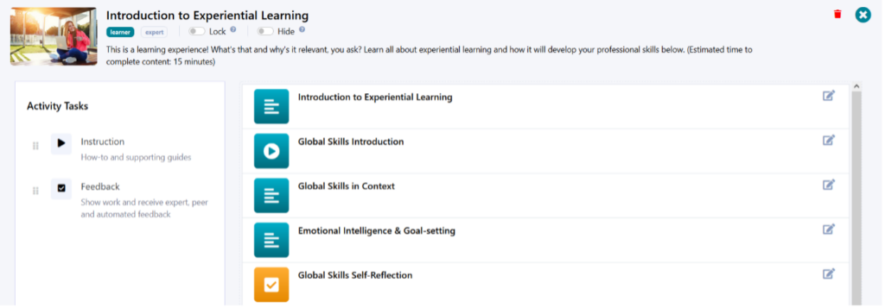

# Building Experience Structure

Learn how to structure your learning experience.

---

## Key Structural Elements of Your Experience

Whether you are configuring a new experience or adjusting a template you copied over from the Experience Library, knowing the hierarchy of structural elements on Practera is crucial for designing and organising your learning flow.
When you navigate to the Design page of your experience you will notice that this experience is comprised of the two core building blocks: **activity groups** (also known as milestones) and **activities** within those groups.
In the screenshot below, “GETTING STARTED” is an activity group, and “Welcome to Business Opportunity Accelerator!” and “Introduction to Experiential Learning” are activities:

If you then click on the editor toggle in the top right corner of any activity tile, you will see that activities, in turn, can contain two types of **activity tasks** : [instructions](./creating-instructions/) and [feedback](../designing-feedback-loops/configuring-assessments/).
For instance, this is an example of activity tasks you can find in the “Introduction to Experiential Learning” activity. “Global Skills in Context” is an example of instructions (or supportive learning content), and “Global Skills Self-Reflection” is an assessment or submission, otherwise known as feedback.

Let’s look at creating and editing each of these key structural elements separately.
### Activity Groups

Each experience template comes with a pre-set sequence of activity groups, but there are a number of ways in which you can customise them:
  1. **Create new activity group** by clicking on “Add Group” next to the preview button
  2. **Delete activity group** by clicking on the delete icon at the top right corner of the group
  3. **Reorder activity groups** by clicking on the up/down arrows next to the delete button
  4. **Change activity group title** by clicking on the title and starting to type to edit it
  5. **Change or add activity group description** by clicking on the description section above the activity tiles to add or update the description
  6. **Set up activity group visibility** by selecting or deselecting “learner” and “expert” buttons under the group title and/or using the “Lock” and “Hide” toggles

### Activities

Once you are happy with the activity groups in your experience, it’s time to edit the activities! While you are still on the Design page of your experience, these are the things you can do:
  1. **Add activity to a group** by clicking on “+ Add Activity”
  2. **Reorder activities within a group and between groups** by clicking on a relevant activity tile and dragging it around
  3. **Open activity editor** by clicking on an edit icon at the top right corner of an activity tile

After you have added a new activity to your group or clicked activity editor, you will be taken to a dedicated editor page for that activity. These are the actions you can perform on that page to customise your activity:
  1. **Change activity title** by clicking on it and starting to type to edit it
  2. **Set up activity visibility** by selecting or deselecting “learner” and “expert” buttons under the activity title and/or using the “Lock” and “Hide” toggles
  3. **Change or add activity description** by clicking on the description section below the “learner” and “expert” buttons and typing in your description
  4. **Change or add activity lead image** by clicking on the existing image or an empty image slot to the left of the activity title and choosing the image from your media library or uploading a new image from your device
  5. **Delete activity** by clicking on the delete icon at the top right corner of the activity editor page
  6. **Exit activity editor** by clicking on the “x” button next to the delete icon

Of course, the activity editor page is also where you create and edit activity tasks. Let’s look at how you can do that next.
### Activity Tasks

This is a quick summary of what you can do with activity tasks, that is, [instructions](./creating-instructions/) and [feedback](../designing-feedback-loops/configuring-assessments/), in the activity editor:
  1. **Add new tasks** by dragging and dropping “Instruction” or “Feedback” into the content area on the right
  2. **Reorder existing tasks** by dragging them up and down in the content area
  3. **Edit individual tasks** by clicking on the edit icon across from the activity title

The editor page that will open after you click on the task edit icon will differ depending on whether you will be [creating content](./creating-instructions/) or [configuring assessments](../designing-feedback-loops/configuring-assessments/), allowing you to further customise your experience.

---

## What’s Next?

Now you know how to create the foundational structure for your experience! Continue on your journey to becoming a Practera power user and find out how to create supportive instructional content for your learners and experts in the next article.
[Creating Instructions](./creating-instructions/)
Want to learn something else? Check out the rest of the [**Becoming a Practera Power User Collection.**](index.md)
