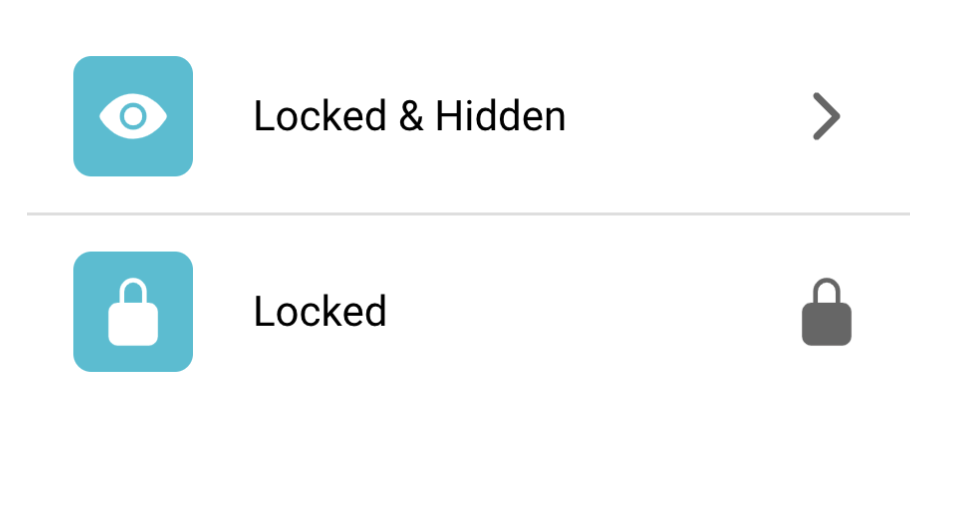
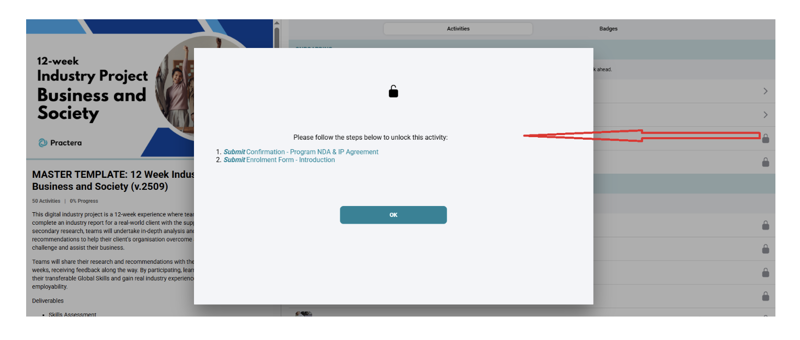
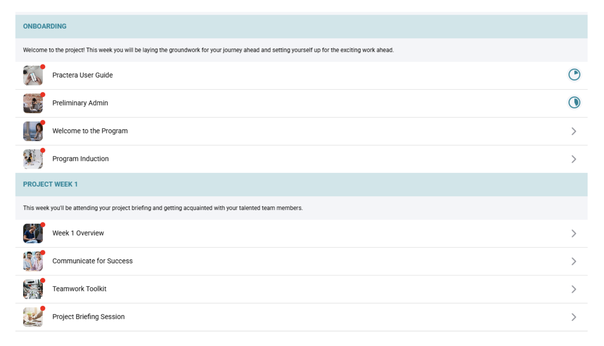
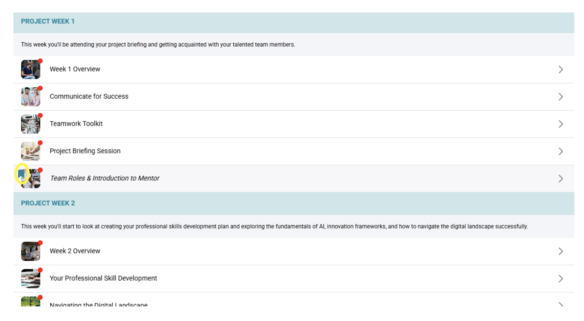
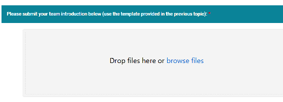
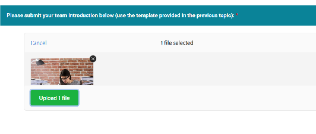
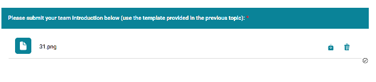

# Visual Cues: Locks, Red Dots & Bookmarks

Practera has introduced several new visual cues to make it easier for learners to navigate the platform. These cues provide clearer guidance on **what needs to be done**, **where to resume**, and **how to track progress**.

This article explains:

- 🔒 **Lock icons** (restricted content + unlock requirements)
- 🔴 **Red dots** (unfinished, stage-gated activities)
- 🔖 **Bookmark icons** (where to pick up next)
- ⬆️ **Upload function** (new way to submit files)

---

## 🔒 Lock Icons

Lock icons indicate that certain content is **not yet accessible**.

You may see lock icons on:

- Tasks
- Activities
- Milestones

These are intentionally restricted to guide the learner's journey and ensure steps are completed in the right order.

### What learners can do

Learners can **click the lock icon** to see the **exact requirement** needed to unlock the content, such as:

- Completing a prerequisite task
- Submitting an assessment
- Finishing a required activity

Once the requirement is met, the content will **unlock automatically**.

> **Tip:** If something looks locked, click the icon first—unlock instructions are shown there.

---

## 🔴 Red Dots

Red dots appear on **stage-gated activities** that a learner has **opened recently** but **has not completed**.

Think of red dots as a quick "still pending" reminder:

- Dot present = activity needs completion
- Dot disappears = activity is finished

Once the learner completes the activity, the red dot will **disappear automatically**.

---

## 🔖 Bookmark Icons

The bookmark icon shows the **last place a learner stopped** in the platform.

This helps learners quickly return to where they left off without needing to search through the full experience again. Bookmarking supports continuity and reduces navigation friction—helping learners stay engaged.

---

## New Upload Function

As part of the project, learners are often required to submit deliverables or tasks. Practera has introduced an improved upload function to make submissions easier and more reliable.

### How it Works

When learners reach a task that requires a submission, they will see an **option** to select a file.

After selecting their file, learners must click the **Upload** button to confirm their submission.

⚠️ If they don't click "Upload," their file won't be saved or submitted.

Once the file is uploaded successfully, it will appear in the task area as their submission record.

After submitting, the deliverable will automatically move into the **Feedback Cycle** where learners can track the status of their submission, receive expert feedback, and continue improving their work.

---

## Video Demonstration

Watch the video tutorial to see how visual cues work in the platform:

<a href="https://vimeo.com/1142706454?share=copy&fl=sv&fe=ci" target="_blank" rel="noopener">▶️ Watch Video Tutorial</a>

---

## What's Next?

Now that you understand the visual cues available in Practera, you can:
- Learn about [Creating Instructions](creating-instructions.md) to understand how to structure content for learners
- Review [Adding Media to Instructions](adding-media-to-instructions.md) to enhance your content
- Check out [The Experience Designer Overview](the-experience-designer-overview.md) for a complete guide to building experiences
