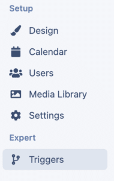
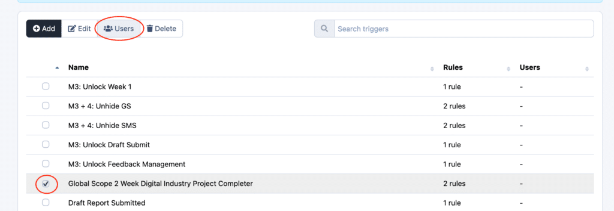
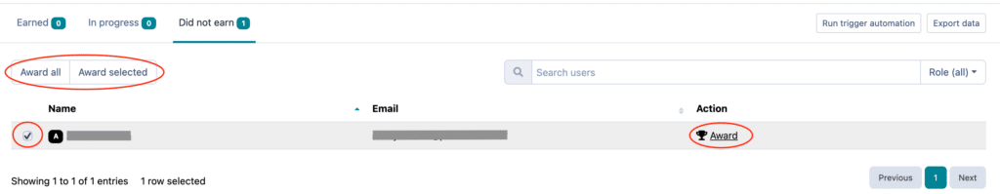

# Awarding a Manual Trigger

Manual triggers allow you to award learners and experts a trigger without any conditions.
Triggers are a set of rules which award learners and experts automatically, but sometimes you want more control over them. You may wish to award learners and experts a manual trigger.
There are multiple reasons you may wish to award triggers manually. You may want to provide access to content after a certain event (such as an onboarding session) or you may want to provide teams certain activities of content.
For full information on how to set up a trigger have a read of this article [“Creating and configuring triggers”](./creating-and-configuring-triggers/)

---

## Awarding a manual trigger to learners or experts

It is really easy to manually award learners and experts on Practera. This feature is available to all [Administrators, Authors and Coordinators.](../institution-set-up/understanding-user-roles/)
**Step 1:** Navigate to the “triggers” tab on the left hand side

**Step 2:** Select the trigger you want to award, and click users

**Step 3:** In the Users tab, select “Did not earn”. This will show a list of users who have not yet been awarded the trigger. You can either press “award all” if everyone in your cohort needs to be awarded, or select the relevant user/s and click “award selected”, or you can award the learners and experts individually by pressing the “award” icon on the right hand-side of each row.

## What’s Next?

Looking for more support? Check out the rest of the Creating Adaptive Pathways articles and find the additional help you might need.
[Creative Adaptive Learning Pathways](index.md)
