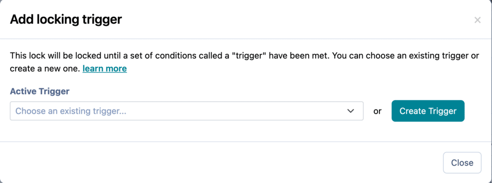
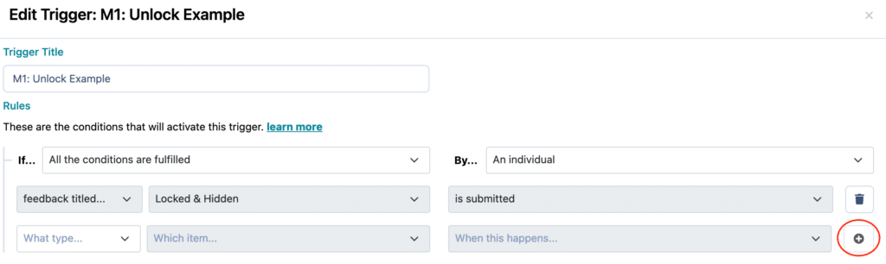
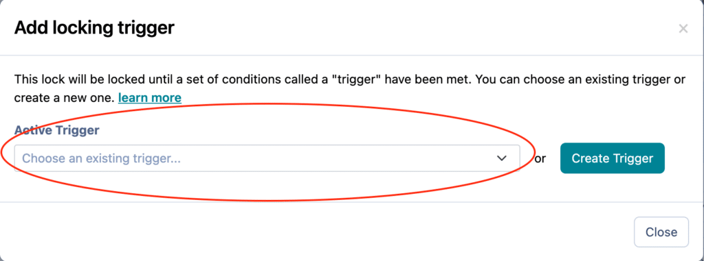

# Creating and configuring triggers

Triggers are sets of rules that are used to determine when a badge is earned and can also be used to unlock or reveal activities.

---

## What is a Trigger?

A trigger allows you to set certain rules for the learners and experts. These triggers are earned and awarded automatically to learners and experts based on them completing all the relevant rules/conditions you set. These rules will allow you to award badges, unhide, and unlock content. Triggers can be set up by [Administrators](../institution-set-up/understanding-user-roles/#administrators) and [Authors](../institution-set-up/understanding-user-roles/#authors) during the design of the experience.
Manual Triggers can also be set up. This allows you to award learners or experts without setting any conditions. For more information have a read of this article: “[Awarding a Manual Trigger](https://practera.com/docs/awarding-a-manual-trigger/)“.

---

## Setting up Triggers

When setting up your triggers in the program build, there are two options. [Option 1](./creating-and-configuring-triggers/#2-toc-title) is to set the triggers up as you design the program. [Option 2](./creating-and-configuring-triggers/#3-toc-title) is to complete the design then create all the triggers and add them in. See below for details on both of these processes.
### Option 1 – Set up triggers from the design page

When setting up the design of your program, you can create the triggers as you go.
**Step 1:** Simply select if the trigger is being used to [lock](../onboarding/the-practera-glossary/#3-toc-title) or [hide](../onboarding/the-practera-glossary/#2-toc-title) the milestone/activity/instruction/feedback by turning on the relevant toggle/button

**Step 2:** Select either an active trigger (one you have set up in the triggers tab) or press create trigger if you want to create one from scratch

**Step 3:** If you are creating a new trigger, add the “title” and the relevant conditions.
The conditions can be based on learners and experts completing feedback submissions, reading instructions or earning a previous achievement.
**Note:** Make sure you click the + button to save each condition and to be able to add a new one.

### Option 2 – Set up triggers after the design

**Step 1:** Click on the triggers tab and select “add trigger”. Add the “title” of the trigger and add the relevant conditions.
The conditions can be based on learners and experts completing feedback submissions, reading instructions or earning a previous achievement.
**Note:** Make sure you click the + button to save each condition and to be able to add a new one.

**Step 2:** Once you have created all the triggers go to the design page and find the relevant group/activity/instruction/feedback and turn on the [lock](../onboarding/the-practera-glossary/#3-toc-title) or [hide](../onboarding/the-practera-glossary/#2-toc-title) toggle

**Step 3:** Select active trigger and select the relevant trigger which you have already created from the drop down menu

## What’s Next?

Looking for more support? Check out the rest of the Creating Adaptive Learning Pathways articles and find the additional help you might need.
[Creating Adaptive Learning Pathways](index.md)
