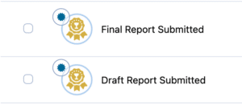
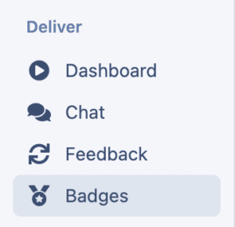
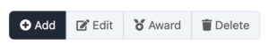
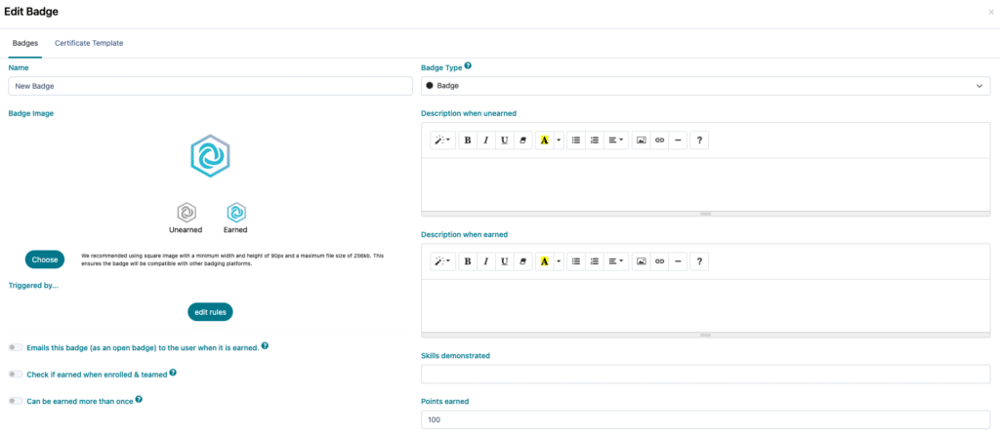
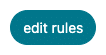
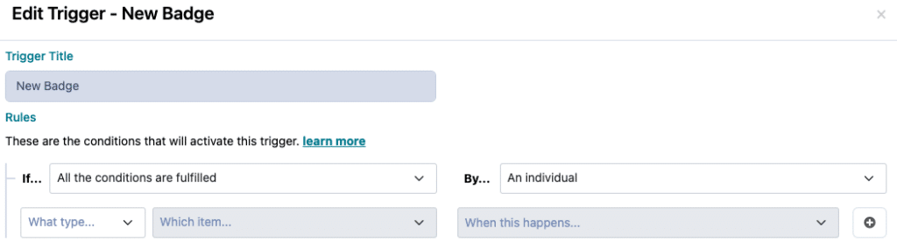
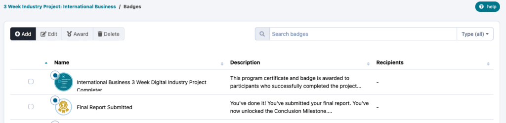
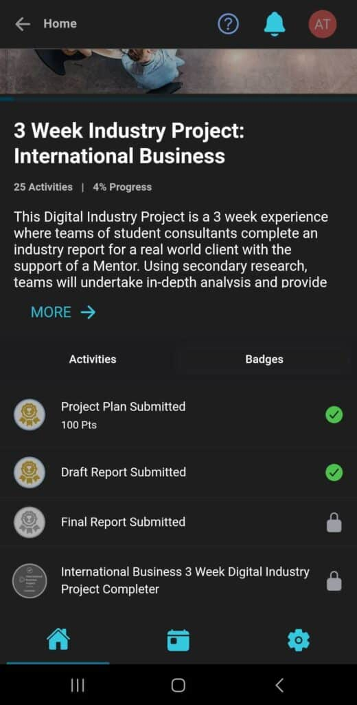
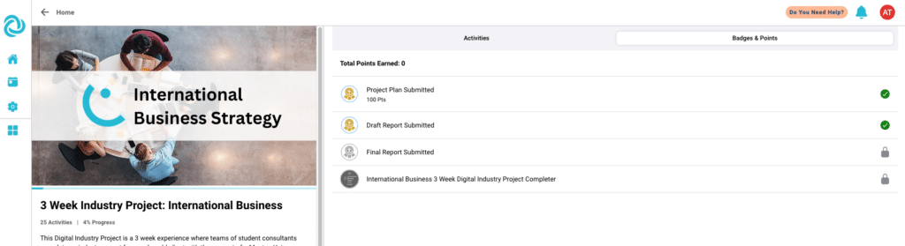
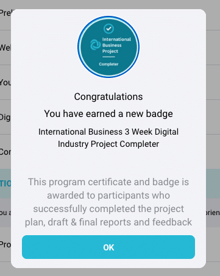

# Creating badges for your experience

## What are badges?

Badges act as indicators of accomplishments that can be earned; badges are a visual rewards given to users for successfully completing a certain action. An Open badge contains a digital watermark which enables their authenticity to be verified.

As an educator, you can use badges as game mechanics to motivate desired learning behaviours and drive higher engagement from your students.

---

## How to set up badges on Practera?

**Step 1:** Navigate to the ‘Badges’ page

**Step 2:** Click add a new badge

**Step 3:** Fill in the badge options as relevant

### Types of Badges:

  * **Badges** are always visible to the user in a listing of possible badges. They will be greyed out and will have the unearned description until they are earned.
  * **Secret Badges** only appear once they’ve been earned.

**Descriptions** :
  * **when unearned** : The description that shows to users that haven’t earned the badge yet.
  * **when earned** : The description that shows to users that have earned the badge.

**Points Awarded (optional)** : The amount of points earned when winning the badge.
**Badge image:** The Image of the badge. The interface will show you how it looks to learners or experts in the different states (unearned/earned). We recommend using square images with a minimum width and height of 90px and a maximum file size of 256kb. This ensures the badge will be compatible with other badging platforms.
### Advanced Options:

**Emails this badge (Open Badge):** Practera will send an email with the badge attached to the user once it is earned. The badge will contain a watermark which enables its authenticity to be confirmed.
**Check if earned when enrolled & teamed:** If selected, Practera will award this achievement when enrolled, and when added to a team, if the conditions for this achievement have been fulfilled.
**Can be earned more than once:** If the conditions for this achievement are met multiple times, the achievement will be awarded multiple times to the user. Each time earned will award any associated game items, points and open badges.
**Step 5:** Create a condition that triggers the badge by clicking on “edit rules”

Conditions determine when a badge is awarded to a learner or expert.

Once you create a badge you will find it in the list below, which will show you the badge image, name, count of conditions and the recipient count of how many have started with the badge and how many completed it.

   

Each badge can be edited, deleted or you can [manually (un)-award users](https://practera.com/docs/awarding-a-manual-trigger/).

---

## Now let’s see how this looks on the app!

### Order of the badges

Badges are ordered based on 3 factors:
  1. Status (earned or not earned)
  2. Date earned (only if status is earned)
  3. Name (alphabetically)

In the beginning of an experience, all badges have the same status: “not earned”. The order will therefore be based on the name of the badges.
**_Pro tip_** _: to control the order you can use numbers at the beginning of the name._
Once the first badge is earned, it shows at the top of the badge overview screen. The remaining unearned badges remain ordered by name.
Once the second badge is earned, it shows in position 2.
When a third badge is earned, it is displayed in the middle position and the previously earned badge will shift to the left position. The badge that was earned at first will disappear from the dashboard view. The third position (right) always shows the ‘next’ (alphabetically by name) unearned badge.
### Badge overview screen

Participants can tap on the **‘View all’** button and navigate to the **‘Badges’** list page, which displays all the visible badges (earned and unearned) that a user has earned or can earn during the program and the total points earned to date.

On clicking a badge, learners can see an **information po****p-up** as seen in the image below, which provides more information about the respective badge. The popup includes the following information:
  * Image
  * Name
  * XP points
  * Description

If you have any questions, feel free to reach out and we can setup your badges together!

---

## What’s Next?

Now you know how to set up your badges. Looking for more support? Check out the rest of the [Creating Adaptive Learning Pathways articles](index.md) and find the additional help you might need.
