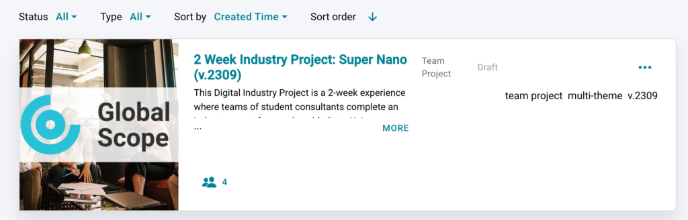
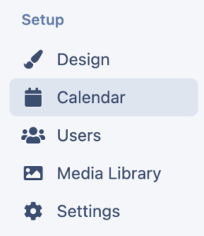
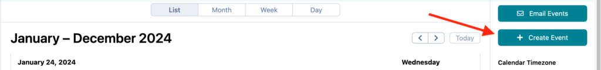
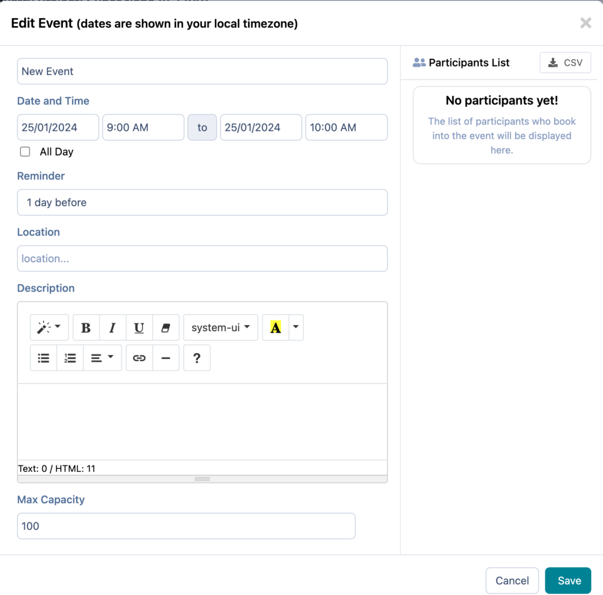
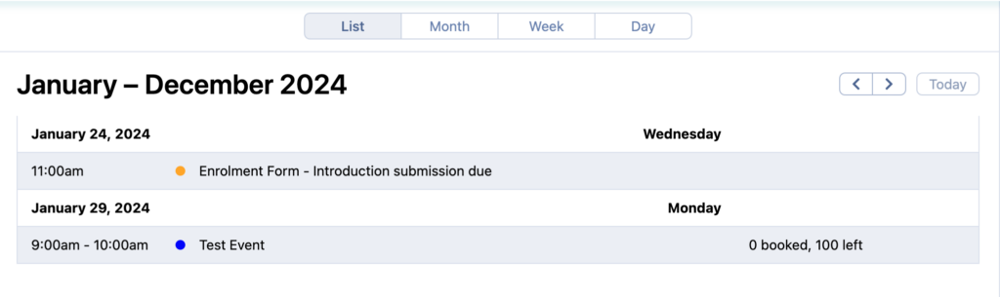
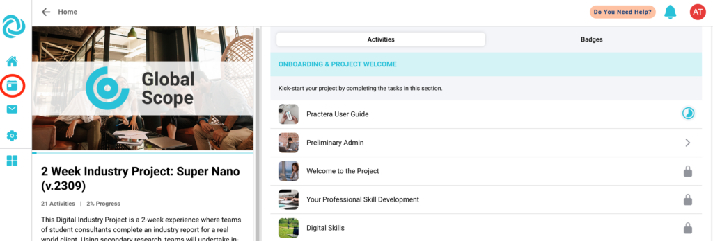
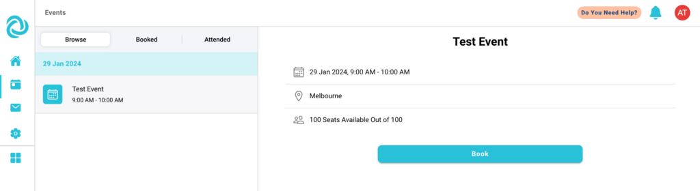
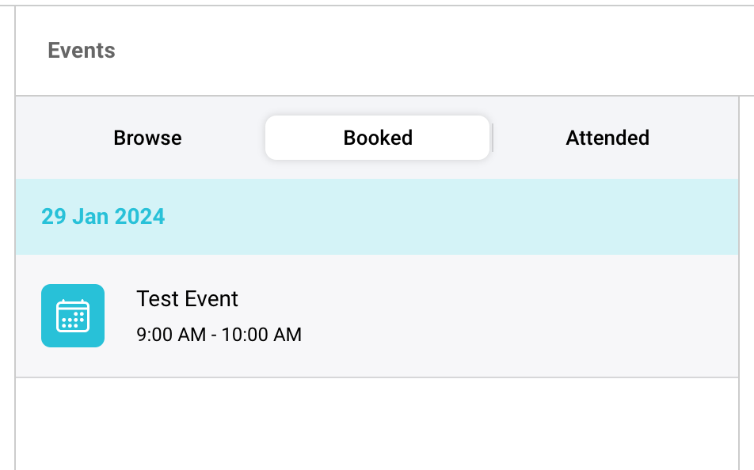

# Planning and Scheduling Events

Learn how to set up an event as part of your experience.
Some experiences may require some in person, or virtual meetings to occur. This could be for an orientation session to onboard the students to the experience, a workshop to provide more detailed content knowledge, or even at the end of an experience allowing learners to present their findings.

---

## How to create an event

To set up your event you need to:
  * Open up the relevant experience in your institution

  * Click on Calendar in the menu on the left hand side.

  * Click on + Create Event on the right hand side of the screen, alternatively you can click on month/week and click on the box for the relevant day you wish to host the event

  * Fill in the details for the event.

**Note:** If you wish to add a video conference link, such as a Zoom link. You can copy and paste this into the location section for students and experience managers to access.

---

## Updating an event

To update an event, please select the relevant event in either the list view or the calendar view. Click on it and update the relevant details.

This will send a new email to the learners letting them know the event has been updated.

---

## How will events appear in the app for learners?

In the app, students can access the events tab. This will allow them to browse the events within this experience.

They will then be able to see all events available in the program. Including those that have expired (already been run). Learners need to click on the event they wish to attend and then click “Book”

Learners will receive an email confirming the booking and if it is set up, a reminder will be emailed out prior to the event starting.

---

## Joining the event

Learners will be able to access their booked events and check the location or video conference link details by:
  * clicking on events in the menu
  * Selecting Booked
  * Then clicking on the relevant event.

## What’s Next?

For more tips on how to run your experience on Practera have a look through our “[Delivering Experiential Learning](index.md)” collection.
