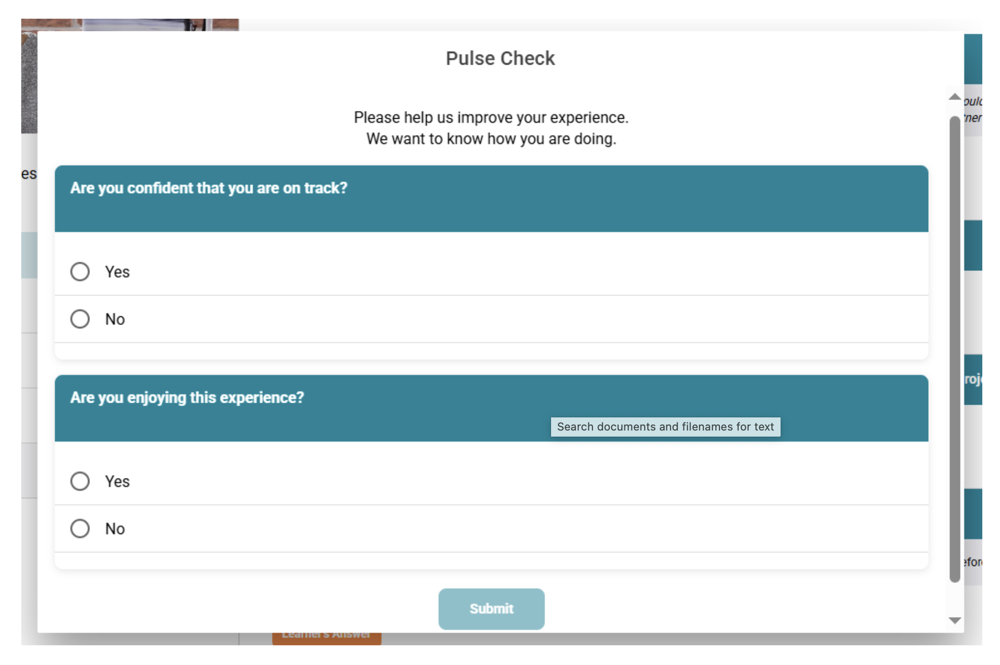
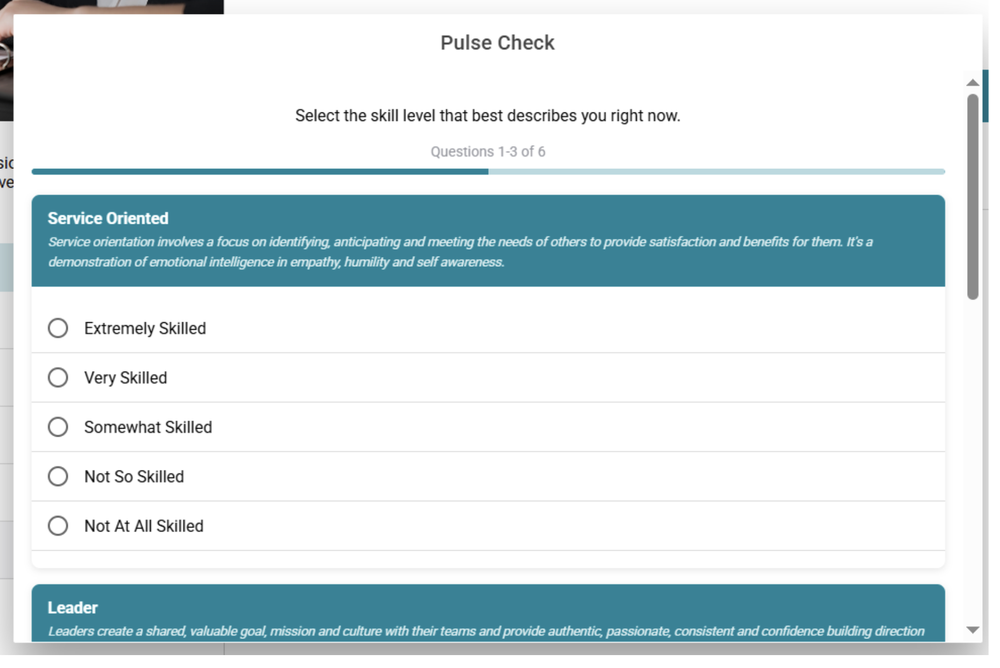

# Pulse Checks

The **Pulse Check** in Practera is designed to help learners reflect on their progress, monitor how they are feeling, and track their skill development throughout the program. It provides valuable insights into their learning journey and highlights areas where they may need additional support.

In a program, learners will complete two types of Pulse Checks: **On Track** and **Skills**.

---

## 1. On Track Pulse Check Pop up

The **On Track Pulse Check** helps learners reflect on their overall progress and experience in the program.

Learners will be asked to rate:

- **Their progress with submissions** – Are they keeping up with tasks and meeting deadlines?
- **Their enjoyment of the program** – Are they finding the experience positive, engaging, and rewarding?

These reflections help quickly identify if a learner may need extra support, while also encouraging them to pause and think about how they are tracking.

---

## 2. Skills Pulse Check Pop up

The **Skills Pulse Check** focuses on learners' personal skill development over the duration of the program.

Learners will complete this **Pulse Check** twice:

- **Before the program begins** – They select the skill level that best describes their abilities at the start.
- **After the program ends** – They select their skill level again to reflect on how much they've grown.

This before-and-after comparison helps learners clearly see their development and understand the skills they've gained throughout the experience.

---

## Video Demonstration

Watch the video tutorial to see how Pulse Checks work in the platform:

<a href="https://vimeo.com/1142708461?share=copy&fl=sv&fe=ci" target="_blank" rel="noopener">▶️ Watch Video Tutorial</a>

---

## What's Next?

Now that you understand Pulse Checks, you can:
- Learn about [Skills & Progress Tab](skills-and-progress-tab.md) to see how Pulse Check data is visualized
- Review [Reportcard](reportcard.md) to understand comprehensive progress reporting
- Check out [Planning and Scheduling Events](planning-and-scheduling-events.md) for managing your program timeline
