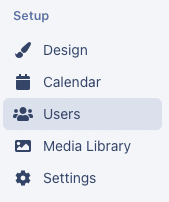
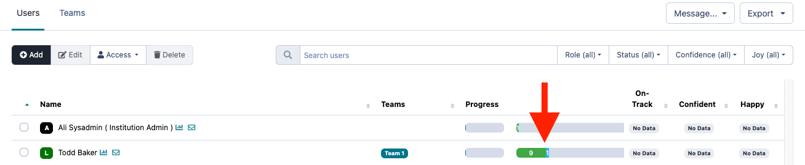
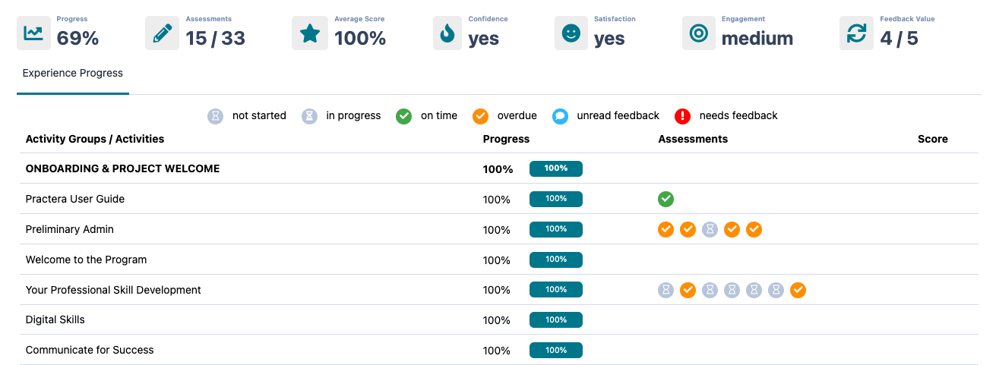
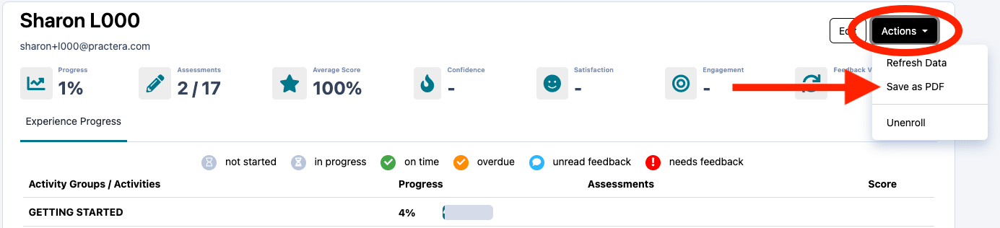

# Report Card

The report card is a way for you to see an individuals progress in one place.

---

## How to access the report card

To access the learners report card, go to the users tab,

Click on the progress bar to open up the reports card page for that specific learner.

## What information does the report card supply?

  1. Overall progress of the content
  2. Number of completed assessments
  3. Average score for their assessments
  4. Most recent [pulse check](./pulse-checks/) responses 
     1. Confident (Yes/No)
     2. Satisfied (Yes/No)
  5. Engagement with the program
  6. Feedback value (this is the average score taken from the [review ratings](./review-rating/) provided to their reviewers)
  7. A break down of each milestone and activity, outline progress percentage of content marked as read, and their assessment status.

## How to download a report card

If you wish to download a learners report card as a PDF, you can do this by opening up the learners report card, then clicking on “Actions” and select “Save as PDF”.

## What’s next?

For more tips on how to run your experience on Practera have a look through our “[Delivering Experiential Learning](index.md)” collection.
