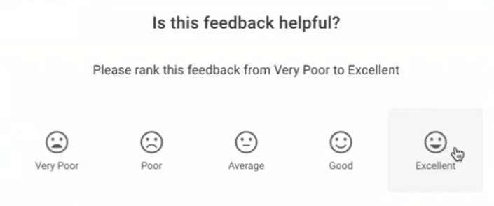
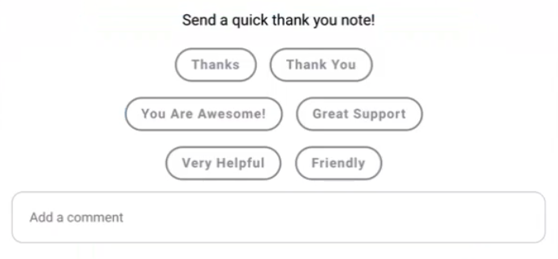
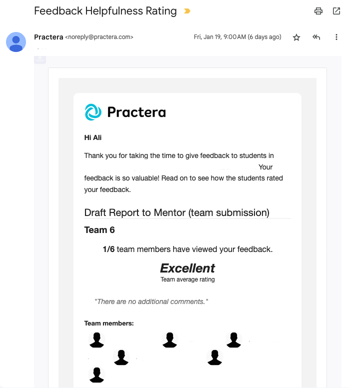
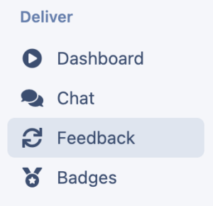
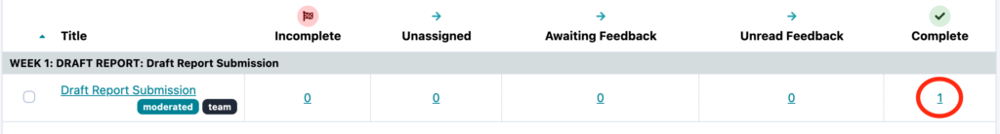
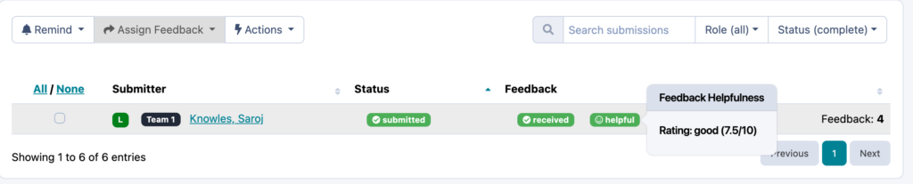

# Review Rating

Learn about how Practera facilitates feedback helpfulness ratings

---

## What is a review rating?

The review rating, or feedback helpfulness rating on Practera allows its users to rate and provide comments to the expert or peers on how they found the feedback they received on a [moderated assessment](../designing-feedback-loops/managing-your-feedback-loops.md).

Watch the short video below to see how this works in the app.

<video width="100%" controls>
  <source src="../assets/images/delivering-experiential-learning/review-rating/Review_Rating_Demonstration.mp4" type="video/mp4">
  Your browser does not support the video tag.
</video>

### Review rating Elements

The review rating feature consists of three elements
#### Rating scale:

Users, after consuming the feedback and marking it as read, get to submit the review rating for that feedback. They can choose the rating on the scale provided.

#### Feedback Tags and Comments:

On the review rating screen, users can quickly choose and let reviewers know what they thought of the feedback in the form of review **‘tags’** or they can choose to leave a quick comment/thank you note for the reviewer as seen below:

### What will the expert receive?

The review rating, tags and comments provided by students from one team are aggregated and an overall rating is provided to the reviewer in the form of a weekly email that looks like this:

### How can I view this data as an [admin/author/coordinator](../institution-set-up/understanding-user-roles.md)?
We realise at Practera how valuable this information may also be for our admins, authors and coordinators. That is why we provide you with the ability to easily identify how the learners have rated their reviews received on their moderated assessments. You can view this review rating via the feedback table:
  *     * Click on Feedback

  *     * Find the relevant assessment, click on the number under the column “complete”

  *     * You will then see red or green helpful or not helpful icons, if you hover over these it will provide you with the helpfulness average

## What’s Next?

For more tips on how to run a successful experience on Practera have a look through our "[Delivering Experiential Learning](./index.md)" collection.
