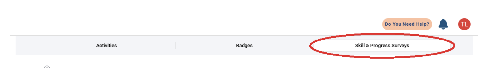
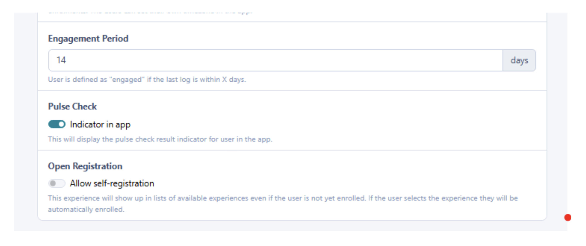
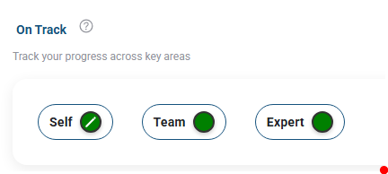
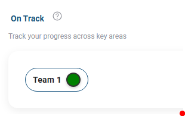
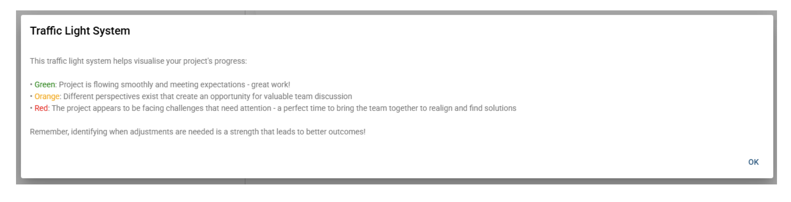
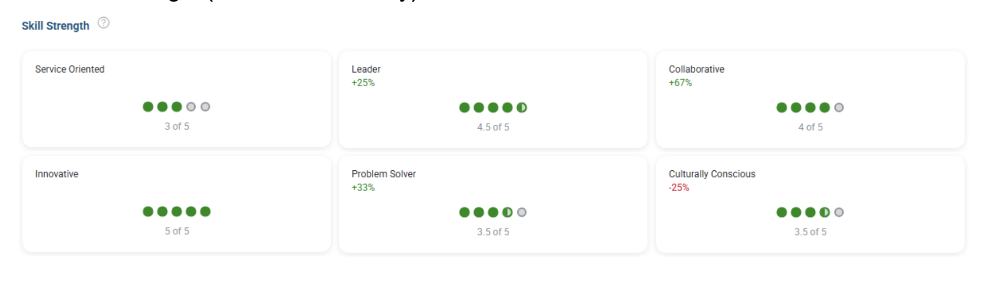

# Skills & Progress Tab: Traffic Light System and Skill Strength

Practera has introduced two new features to help learners and experts better understand progress, team sentiment, and skill development throughout the program. These features can be found under a new tab called **Skill & Progress Surveys** in both the learner and expert views.

To make these features visible, ensure that the **Pulse Check** setting is turned **ON** in the **Experience Settings**. Once enabled, both features will automatically appear in the **Skill & Progress Surveys** tab.

The two new features are:

- **Traffic Light System**
- **Skills Strength Report**

---

## Traffic Light System (Learners & Experts view)

The **Traffic Light System** provides a visual snapshot of how learners and experts are feeling throughout the project. It is directly linked to the **On Track Pulse Check**.

### How It Works

Before the **Traffic Light System** can appear, learners and experts must complete a few steps:

- **Learner** submits a moderated assessment.
- **Expert** completes the full feedback loop.
- An **On Track Pulse Check** pop-up survey will appear for the learner and expert.
- After the learner and expert submit the **On Track Pulse Check**, the **Traffic Light System** will display the results.

This process ensures that the **Traffic Light** results reflect meaningful progress and accurate learner sentiment.

### What the Traffic Light System Displays

In the **Learner View**, the **Traffic Light System** tracks feedback across three key areas:

1. **Self**: Learners rate how they currently feel about their individual progress and experience in the project.
2. **Team**: This shows the combined sentiment of the entire team, based on the ratings submitted through the **On Track Pulse Check**.
3. **Expert**: Learners can see how their expert (mentor or client) feels about the overall project progress.

In the **Expert View**, one category is shown:

**Team**

Experts see the overall sentiment of the team based on their **Pulse Check** responses.

### Color Indicators

The **Traffic Light System** uses simple color cues to visualise project sentiment:

- 🟢 **Green**: The project is flowing smoothly and meeting expectations — great work!
- 🟠 **Orange**: Different perspectives or concerns exist, offering an opportunity for valuable team discussions.
- 🔴 **Red**: The project may be facing challenges that need attention.

This system encourages regular reflection and helps teams identify when adjustments might be needed to improve the learning and project experience.

---

## Skills Strength (Learners View Only)

The **Skills Strength** helps learners understand how their skills develop throughout the program. It works alongside the **Skills Pulse Check** to provide a clear visual summary of their progress in key skill areas. This is only visible to learners' view.

### How It Works

Throughout the program, learners complete **Global Skills Assessments**. These assessments ask learners to reflect on their skill levels and select a rating that best describes their current ability.

Learners choose a rating on a **1–5 scale**, where:
- **1** – Not at all skilled
- **5** – Extremely skilled

These ratings are recorded at different stages of the experience, helping learners see how much they've grown from the beginning to the end of the programme.

### What the Skills Strength Shows

After learners submit their **Skills Pulse Checks**, their results appear in the **Skills Strength** section. This visual overview allows them to:
- See which skills they've strengthened
- Identify skills that may need more development
- Track how their abilities change over time
- Reflect on their confidence at different points in the programme

The report makes personal development clear and meaningful by showing growth in a simple, easy-to-read format.

Learners can revisit their **Skills Strength Report** anytime to stay aware of their development and reflect on their learning journey.

---

## Video Demonstration

Watch the video tutorial to see how the Skills & Progress Tab features work:

<a href="https://vimeo.com/1142709197?share=copy&fl=sv&fe=ci" target="_blank" rel="noopener">▶️ Watch Video Tutorial</a>

---

## What's Next?

Now that you understand the Skills & Progress Tab features, you can:
- Learn about [Pulse Checks](pulse-checks.md) to understand how the data is collected
- Review [Reportcard](reportcard.md) for comprehensive progress reporting
- Check out [Skills Growth Report](../practera-metrics/skills-growth-report.md) to see the admin view of skills development
