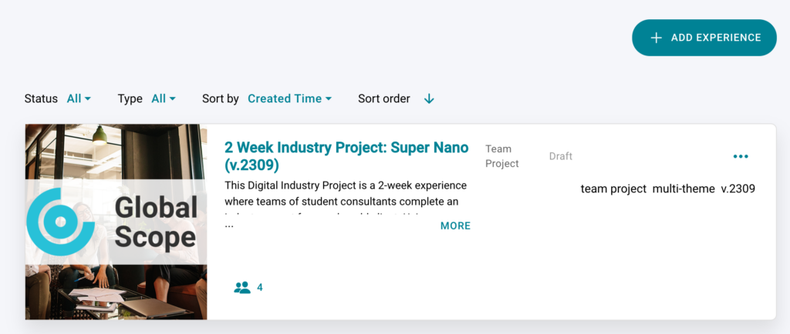
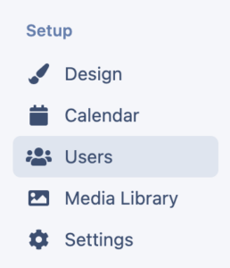
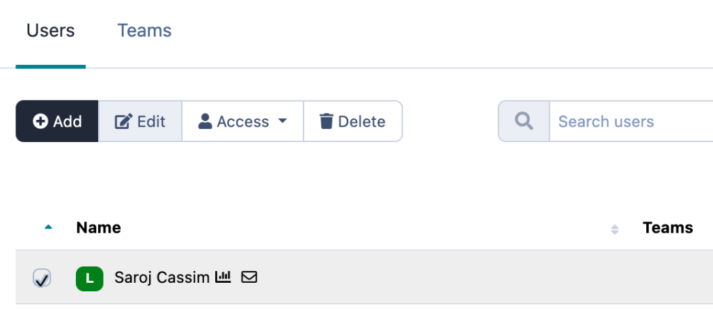
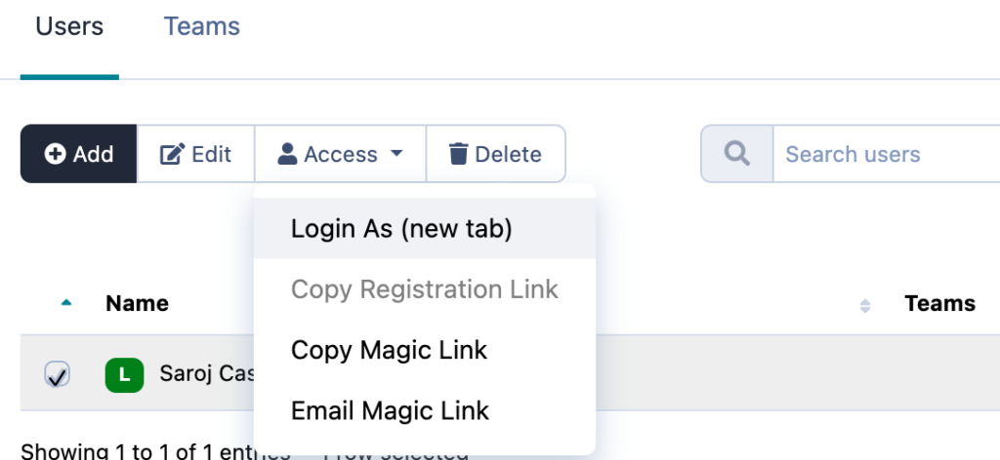
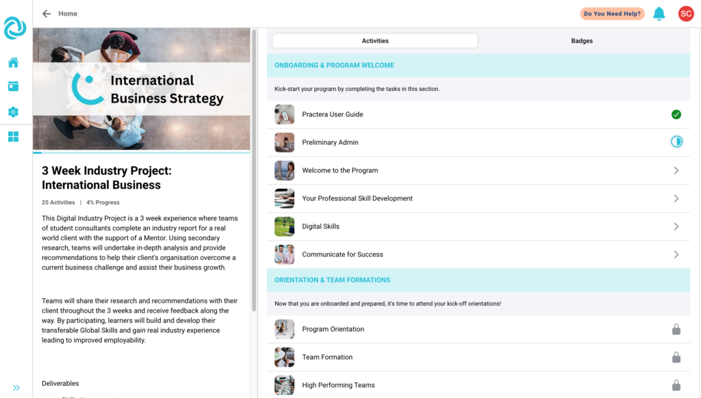

# Student Emulator

The student emulator allows you to impersonate a student so you can understand what they can see on the app.

---

## What is a student emulator?

The student emulator quite literally allows you to log in as and impersonate a learner in the app. It allows you to see their app in real time, so you can understand any changes you may have made to the design of the program and to experience exactly what the learner is experiencing. This is great when trying to answer any questions or queries they may have.

---

## How do I access the student emulator?

To access the emulator you need to:
  * Open up the relevant experience by clicking on the experience title

  * Click on users on the left hand side

  * Select the user you wish to impersonate in the list (Note: you are only able to impersonate a learner or expert)

  * Click the drop down menu on access, then select login as (new tab). This will then open up the app in a new tab and you will be able to access the app as the user.

This will open up a mobile emulator impersonating your student’s mobile app in real-time as seen below:

## What’s Next?

For more information on how to deliver your experience you may want to have a read of some of the other articles in our “[Delivering Experiential Learning](index.md)” collection.
