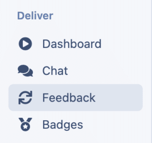
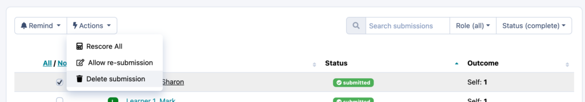
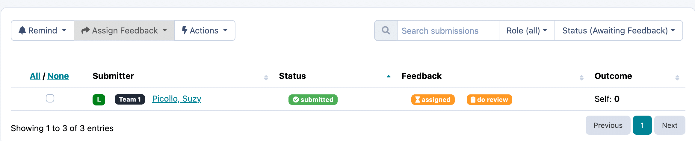
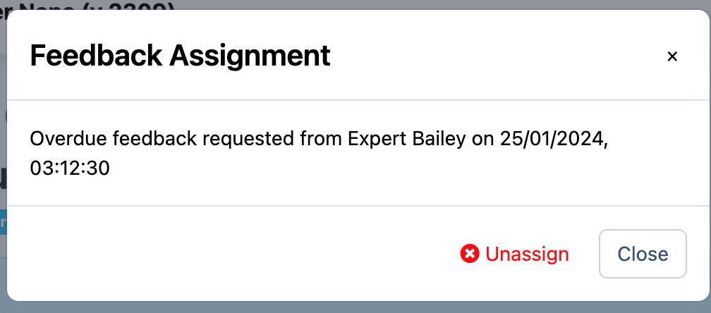
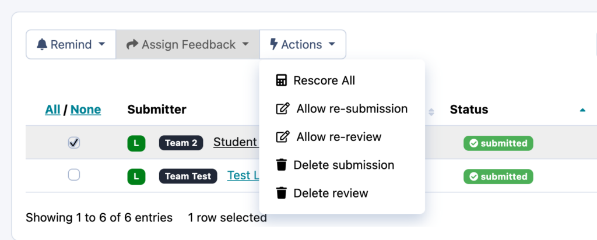

# Allowing Resubmission (Submitter & Reviewer)

There are two options when it comes to removing a submission. You can either delete the submission which will remove all responses and allow the submitter to start from the beginning, or you can allow resubmission which will allow the submitter to edit their current responses and resubmit once the changes have been made.

---

## How do I allow a submitter to resubmit a quiz/survey/reflection?

To allow resubmission for the submitter, go to the feedback table, by clicking on “feedback” in the left hand menu on your admin page.

Click on the number of submissions under the relevant feedback loop status

Select the check box next to the submission you wish to delete. Click on “actions” allow re-submission.

## How do I allow re-submission on a moderated assessment after a review has been completed?

If a moderated assessment submission has not yet been reviewed, follow the same process above.
However, if it has already been assigned a reviewer or had the review completed, this means you are **required to unassign the reviewer or delete the review prior to allowing re-submission for the submitter**.
**If a review has been assigned but not yet completed:** On the feedback tab, click on the number of submissions under the heading “awaiting feedback”, find the relevant submission and click on the orange “Assigned” box, then click “unassign” in the pop up box.

**If a review has been submitted** : On the feedback tab, click on the number of submissions under the heading “complete”, select the relevant submission with the checkbox, then click “actions”, then “allow re-review”.

## How do I all re-submission of a review?

To allow resubmission for the reviewer, go to the feedback table, by clicking on “feedback” in the left hand menu on your admin page.

Click on the number of submissions under the relevant feedback loop status – “complete”

Select the relevant submission with the checkbox, then click “actions”, then “Allow re-review”.

## What’s next?

For more information about managing feedback loops have a look at the [Designing Feedback collection](index.md).
