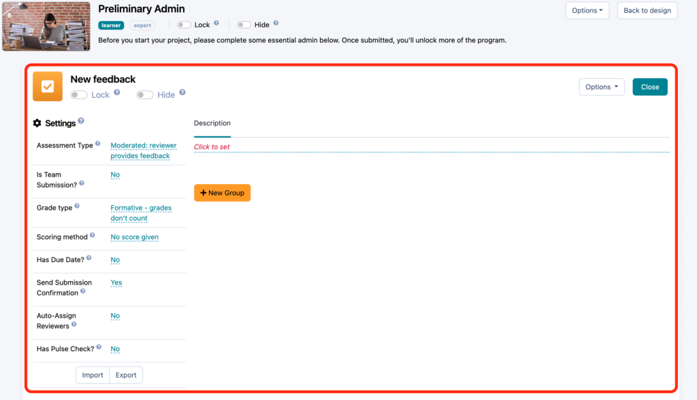
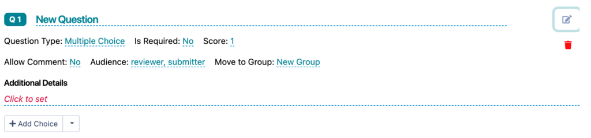
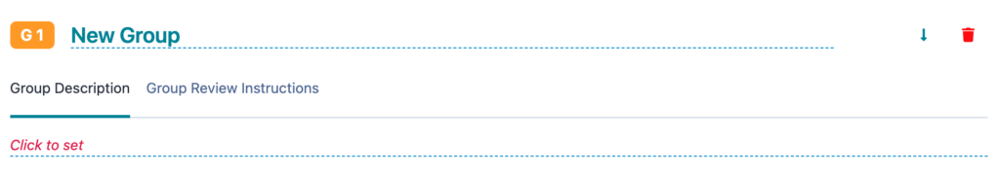

# Configuring Assessments

Learn how to build and edit assessments for your experience.

---

## Why Do We Call Assessments Feedback?

To have a meaningful and rewarding learning experience, feedback is essential. That’s why Practera’s assessments are conceptualised primarily as opportunities to get feedback rather than knowledge checks. The feedback learners receive can be automated (for instance, pre-set explanations in response to correct and incorrect quiz responses) or personalised, given by an expert, a peer, or even the learner themselves, as they reflect on their progress and performance.
To highlight the importance of feedback in [experiential learning](../onboarding/what-is-experiential-learning/), we chose to refer to assessments as feedback on the Practera platform.

---

## Accessing and Navigating Assessment Editor Page

Now that you are familiar with Practera’s concept of feedback, it’s time to take a look at the assessment editor page, which you will be using to configure new assessments or modify and update existing ones.
If you need a reminder on how to get to the assessment editor, please revisit the [Activity Tasks](../becoming-a-practera-power-user/the-experience-designer-overview/) topic of the [Building Experience Structure](../becoming-a-practera-power-user/the-experience-designer-overview/) article.
Once you have landed on the assessment editor page, please note that it opens inside the larger activity editor screen, so be careful when using exit and delete buttons.

The assessment editor page consists of three sections:
  1. Title and visibility settings at the top
  2. General assessment settings on the left
  3. Main assessment editor on the right

Let’s now go through the actions you can perform in the assessment editor, section by section.
### Editing Assessments

This is a brief summary of what you can do to configure assessments for your experience.
#### The Title Section of the Assessment Editor

  1. **Change assessment title** by clicking on it and typing
  2. **Set up locking and hiding**(please note that you cannot adjust learner/expert visibility preferences at the activity task level, which means that all instructions and assessments you create under a certain activity will follow the visibility settings for that activity)
  3. **Delete assessment**
  4. **Go back to the activity editor screen** by clicking on the grey “x” button

#### The General Settings Section of the Assessment Editor

  1. **Select assessment type** (if you would like to find out more about different assessment types you can choose from, head over to the “[Selecting Assessment Types](./selecting-assessment-types/)” article)
  2. **Specify assessment due date** if required (more on this in the [Scheduling Due Dates](../essentials/scheduling-due-dates/) article)
  3. **Configure other assessment-specific settings** , such as whether you would like the submissions to be made by teams or individuals, which experience user will act as a reviewer, and whether reviewers are assigned manually or [automatically](./preparing-feedback-loops/) for moderated assessments

#### The Main Editing Section of the Assessment Editor

  1. **Check if there have been any submissions** for this assessment. If there are, you will not be able to edit any sections.
  2. **Write or edit assessment description** (and, for moderated assessments, provide review instructions)
  3. **Add question groups and individual questions** by clicking on “+ New Group” and “+ New Question”, respectively
  4. **Add and edit question group description** and **edit question group name** by clicking on the relevant text fields
  5. **Edit question text** by clicking on it
  6. **Edit individual questions** by clicking on the edit icon across from question text (you can choose among multiple-choice, text, checkbox, file and video upload question types to suit your needs)

  1. **Reorder question groups** by clicking on the up/down arrow icons (which is exactly what you can do with activity groups on the main Design page)

  1. **Reorder questions** within a single group by dragging them up and down
  2. **Delete question groups and questions**

### Why am I unable to edit my assessment?

If you find yourself unable to make changes to the assessment you have set up, this is most likely because a Learner or Expert has started or made a submission already. To be able to edit the Assessment you will want to delete this submission to be able to proceed, so please check that all test submissions have been deleted/removed before your program has gone live. Have a read of the article “[Deleting Submissions](./deleting-an-assessment-submission/)” for full details.

---

## What’s Next?

Now you know how to create and edit assessments in your learning experience! Continue on your journey to becoming a Practera power user and check out the rest of the articles in this collection.
[Becoming a Practera Power User Collection](../becoming-a-practera-power-user/index.md)
