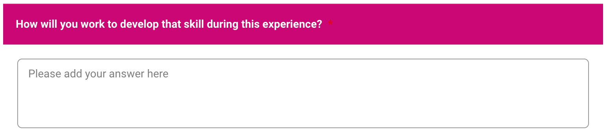
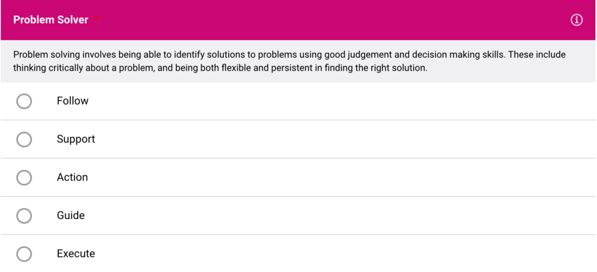
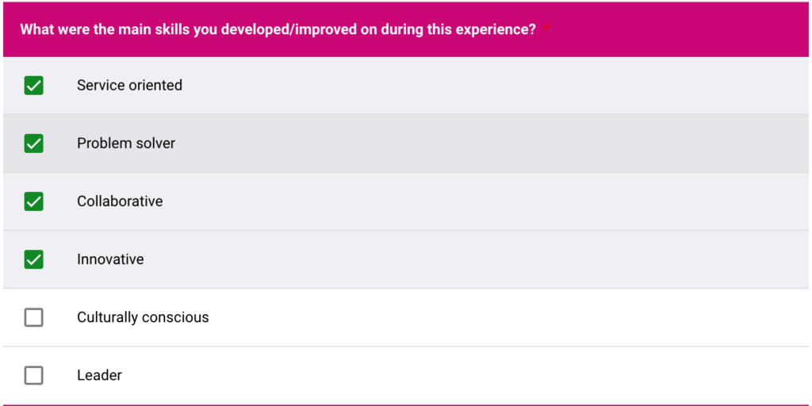

# Creating Different Question Types

Understand the different question types you can use within your feedback loops.
When building your feedback you will want to select the most relevant question type to facilitate the appropriate responses from your learners or experts. Practera has a range of different question types for you to chose from.

---

## What are the different question types available?

### Text Question

The text question type provides learners and experts with a text box so they are able to input their written response to the question asked. Allowing them to reflect, analyse, synthesise or portray their understanding in a longer form than what you can achieve with a multiple choice question. Providing more in depth qualitative data to assess their understanding of a topic.

### Multiple Choice

The multiple choice question allows you to input specific answers for learners and experts to select. This can be used as a likert or number scale, to assess if they have understood certain pieces of information or even to gain information about learners and experts preferences. It provides quick quantitative data outputs.

### Checkboxes

Checkboxes allow the learner or expert to select more than one option when responding to a question. This may be used when more than one answer may be correct, or for review purposes to allow the reviewer to select the areas the learner has demonstrated in their submission.

### File Upload

For many feedback loops it may be beneficial to allow a learner to submit a document, this may be a Word document, PPT or PDF depending on what the submission is. This allows students to format the document off of Practera and then upload it once ready, so it can be reviewed.

## What’s Next?

Now that you understand the different question types within feedback, you should have a good idea about which one works best for you! Now go on and give it a try:
[Designing Feedback Collection](index.md)
