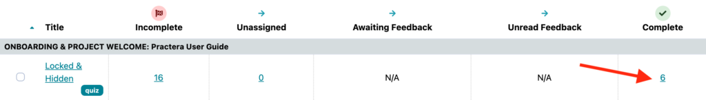

# Deleting a Review on a Moderated Assessment

There are two options when it comes to removing a review. You can either delete the review which will remove all responses and allow the reviewer to start from the beginning, or you can allow re-review which will allow the reviewer to edit their current responses and resubmit once the changes have been made.

---

## How do I delete or allow resubmission of a review?

On the feedback tab, click on the number of submissions under the heading “complete”

Select the relevant submission with the checkbox, then click “actions”, then select either “delete review” or “allow re-review”

## What’s next?

For more information about managing feedback loops have a look at the [Designing Feedback collection](index.md).
