# How to publish Team 360 reports

Team 360’s are a great way to provide valuable feedback to your learners. It allows an individual to self assess their current skills and provides the ability for them to rate their team members skills anonymously. Once the majority of the team have submitted their self and peer feedback the coordinator/author/admin is able to publish a contrast analysis (Team 360 report) allowing them to view the feedback provided.

---

## What does a Team 360 report look like?

Below is an example of a Team 360 report:

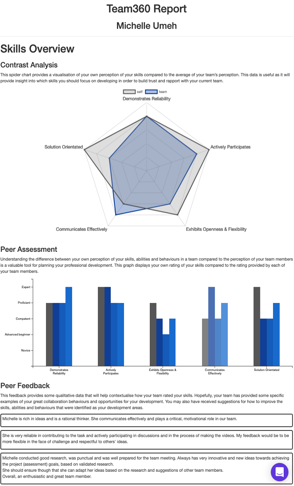

## How to send a Team 360 report to learners

Once the majority of the learners have completed their skills assessment for themselves and their peers, you are able to publish the contrast analysis/Team 360 report. To do so you need to follow the steps below:
  * Go to the feedback table

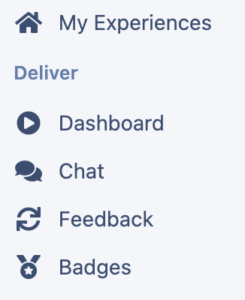

  * Either select the assessment and click on report, or click on the number under the table columns for the relevant team 360

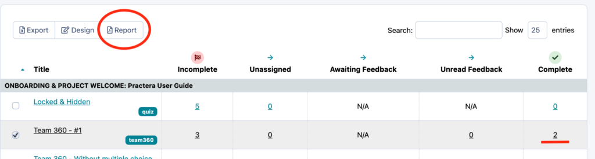

  * Select Reports, send learner reports

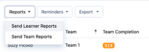

  * Type in the percentage and click send. (This will mean that a report will only be sent if more than this percentage of the team members have already submitted their team 360. Ensuring they are receiving valuable feedback)

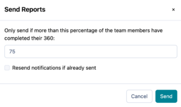

  * The reports table will then update to demonstrate who has received the reports and when.

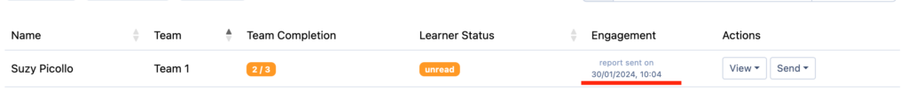

## How to send a Team report

Here at Practera we truly value the role of feedback, this is why we have enabled the ability to view, create and send a team coaching report to either the expert, coordinator or author allowing them to view the entire teams feedback in a nice easy to read format. To send a team report, you need to:
  * Go to the feedback table

  * Either select the assessment and click on report, or click on the number under the table columns for the relevant team 360

  * Select Reports, send team reports

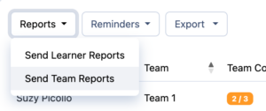

  * Select the role you wish to send the report to. Type in the percentage and click send. (This will mean that a report will only be sent if more than this percentage of the team members have already submitted their team 360. Ensuring they are receiving valuable feedback).

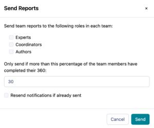

## How to resend the report

If you need to resend the reports to your learners or experts/coordinator/author, you can do this in bulk by going to the reports page:
  * Click on reports
  * Select the appropriate report type you wish to resend

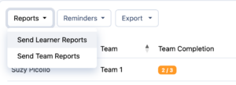

  * Fill in the percentage and ensure you select “Resend notifications if already sent”

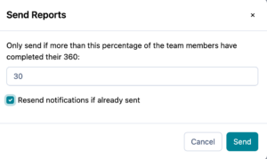

Or you can resend the report to a specific individual:
  * Find the specific user in the reports table
  * Click on send
  * Select either send learner report, or team report.

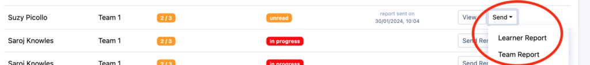

## What’s next?

Looking for more support? Check out the rest of the [Monitoring your Feedback Loops](index.md) Collection articles and find the additional help you might need:
