# Managing your Feedback Loops

## How can I monitor my learners submissions?

As an admin you will often want to dive deeper into the learners and experts submissions and reviews. This is why we have provided the feedback tab, which provides a table with information and tools to track, read and monitor all submissions and reviews.
To access the feedback table, on the left hand menu of your design page for the relevant experience click on “Feedback”.

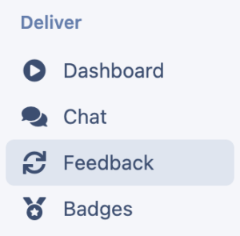

This then provides you with a table which provides information on:
  * all the feedback loops included in your program, in order of appearance in the project design.
  * the type of feedback loop ([quiz, reflection, survey or moderated](./selecting-assessment-types/))
  * whether it is a team or an individual assessment
  * [Due date](../essentials/scheduling-due-dates/) (if turned on)
  * where they are at in the feedback loop 
    * incomplete submission – the learner/expert has not yet submitted
    * ** unassigned – Moderated assessments only – the submission has been submitted, but it hasn’t been assigned to a reviewer. ([How to manually assign a reviewer](http://help.practera.com/en/articles/6239686-managing-your-feedback-loops#h_709505f399)).
    * awaiting feedback – Moderated assessments only – a reviewer has been successfully assigned to the submission.
    * unread feedback – Moderated assessments only – The review has been completed but the submitter is yet to read the feedback
    * completed feedback loop – The submitter has completed all stages of the feedback loop.

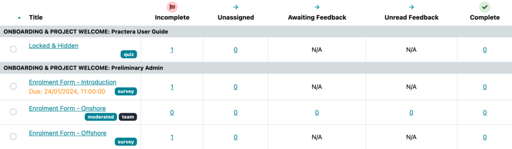

### Why are there submissions in the Unassigned column?

Were you expecting submissions to be auto-assigned to a reviewer? Submissions can sometimes fall into the Unassigned column if you haven’t teamed your learner with a reviewer, which means the auto-assign functionality can’t work. Learn how to create & edit teams [HERE](../essentials/creating-teams/).
If you haven’t made automated feedback loops already, we strongly recommend that you do. Fast feedback = impactful feedback! Find out how to create auto-assigned and auto-published assessments [HERE](./preparing-feedback-loops/).

---

## How do I view a submission or review?

If you wish to view a submission or review, you can go to the feedback tab
  * click on the assessment name,
  * then click on the green submitted icon of the submission you wish to view.
  * This will open up the app in a new tab allowing you to read through the submission or review

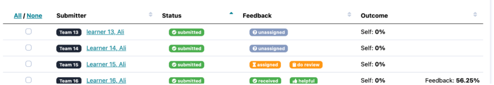

**Note:** To easily find the relevant submission you are able to search and filter on the top right

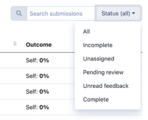

## How can I download the submissions and reviews?

If you wish to download a CSV of all the submissions and reviews made you can do so by:
  1. Selecting the relevant assessments
  2. Click export

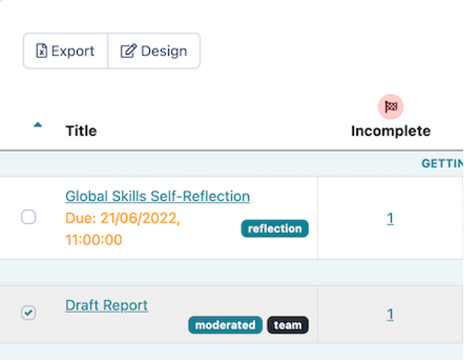

## How do I assign/un-assign a reviewer?

We all know we want submitters to receive their feedback in a timely manner, so you can set up auto assign to reviewer to speed this process up, have a read of [this article](./preparing-feedback-loops/#5-toc-title).
However, there are a variety of reasons why you may wish to manually assign, or you may need to re-assign a reviewer during a program.
### Remove a reviewer

  * Click on the number under “Awaiting review” for the relevant assessment

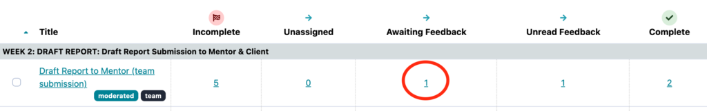

  * Click on the orange “assigned” icon

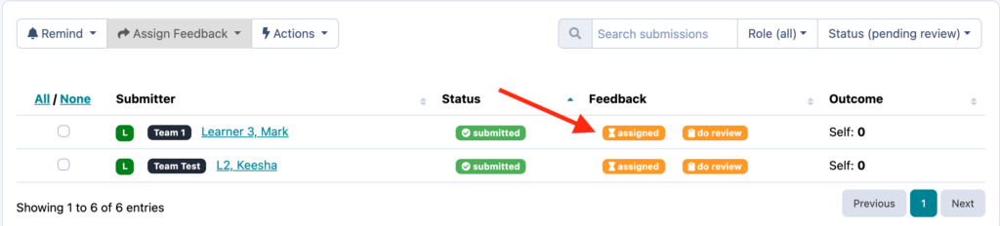

  * Click “Un-assign” in the pop up box.

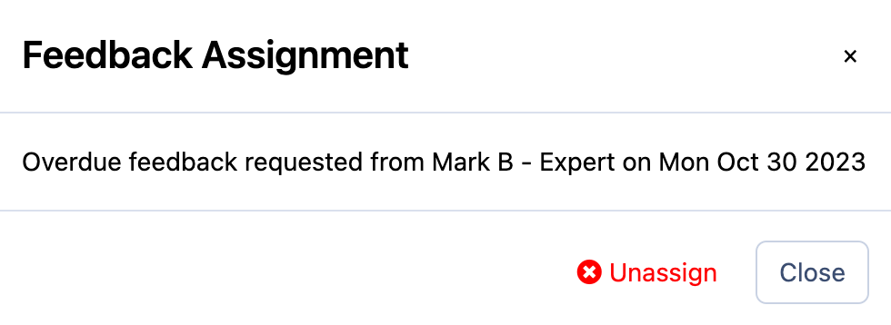

### Assign a Reviewer

  * Click on the number under “Unassigned”, or change the status to “unassigned”

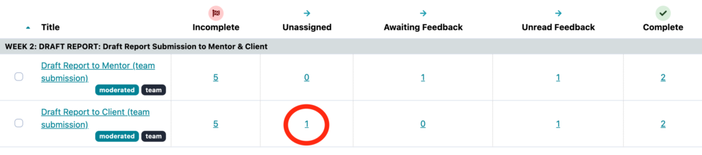
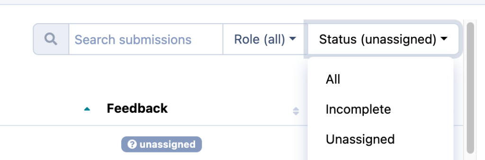

  * Click on the grey unassigned icon

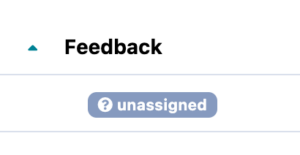

  * Type in the reviewers name or email address and click assign

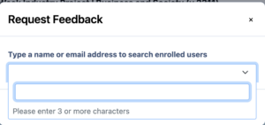

## What’s next?

For more information on managing feedback loops you may also want to have a read through the following articles:
  * [How to delete a submission](./deleting-an-assessment-submission/)
  * [How to send reminders to submitters and reviewers](./sending-assessment-reminders/)
  * [Why can’t I edit or delete an assessment?](https://practera.com/docs/configuring-assessments/#6-toc-title)

