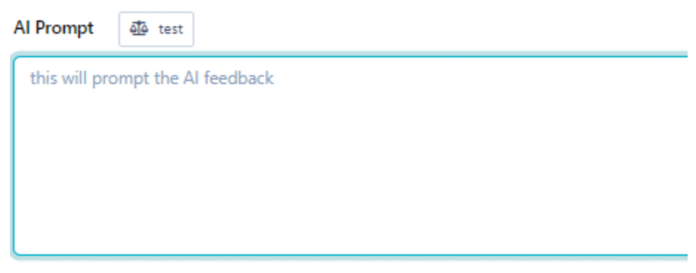

# Practera AI Feedback Prompt Framework

## AI Prompt

RRCOS Framework
AI Prompt: Role of the evaluator + the request to the evaluator + the criteria for evaluation + other specifics such as the format of the feedback
*In some instances, we can include the context of the topic from which it would generate it’s feedback

### Example:

Topic Context: Digital Marketing
Question: How would you leverage digital marketing tools to improve the online presence of a bookstore?
**ROLE****|** _REQUEST_ **|** _**CRITERIA**_**|** OTHER SPECIFICS
Prompt:
**You are a seasoned marketing professional** _tasked with evaluating student responses to a marketing strategy question. Provide feedback_ based on the following criteria:
  * _**Relevance to Marketing Principles:Assess how well the student applies core marketing concepts and strategies to their answer.**_
  * _**Critical Thinking and Creativity: Evaluate the depth of the student’s analysis and their ability to think creatively about marketing challenges and solutions.**_
  * _**Practical Application: Consider the feasibility of the student’s proposed strategies in real-world scenarios.**_

As the reviewer, provide detailed feedback on the student’s responses. If it is applicable, Highlight the missed aspects can be identified Offer constructive suggestions accompanied by a concise explanation. If the answers of the students include the gist or idea of the exemplar, you may only give commendations.
When providing feedback, adopt a personal tone as if it’s not given by an AI. Address the student in the first person. Keep your feedback at a maximum of 6 sentences only and to the point. DO NOT INCLUDE YOUR NAME OR a title, like ‘Senior Manager’. DO NOT INCLUDE ‘Best Regards, [Your Name]’ at the end. Do not directly mention the exemplar answer. Lastly, make sure that your response is set to British English. Students are not able to resubmit so do not offer this opportunity.

---

## Exemplar

**An Exemplar refers to a model answer, (IN THIS CASE, A****FEEDBACK****) that embodies the highest standard of quality for a given question.**
### Sample Exemplar Feedback (for the example question above)

As an experienced marketing professional reviewing the student’s response on utilizing digital marketing tools for a bookstore, the answer shows a commendable understanding of digital marketing, yet it requires refinement in certain areas.
_Relevance to Marketing Principles:_
The student aptly incorporates key marketing concepts like SEO and social media engagement. However, the response could be enriched by delving deeper into customer segmentation and targeting, crucial for crafting effective digital campaigns.
_Critical Thinking and Creativity:_
The proposal of virtual book tours and community forums demonstrates creativity and an understanding of digital trends. Yet, the inclusion of more innovative solutions, like augmented reality or AI-driven recommendations, would further enhance the response.
_Practical Application:_
The feasibility of the strategies is generally sound, but the response lacks depth in budgeting and resource allocation. A more detailed execution plan for creative ideas is necessary to ensure practicality.
_Suggestions for Improvement:_
The student could improve their answer by integrating more structured marketing models and theories, conducting a thorough analysis of customer behavior, and presenting a detailed implementation plan with a budget and timeline.
Overall, the student’s answer indicates a good grasp of digital marketing tools. Enhancing the response with structured marketing analysis, innovative solutions, and a realistic implementation plan would make it a more robust digital marketing strategy.

---

## Sample Answer

An effective marketing strategy begins with a comprehensive market analysis, identifying the target audience’s needs and preferences. The product should be tailored to these needs, ensuring that the value proposition is clear. Pricing strategies must reflect both the perceived value and market demand, while distribution channels should be selected based on where the target audience is most likely to engage with the product. Promotional activities should be creative, yet data-driven, aiming to build brand awareness and loyalty among the identified demographic. For example, leveraging social media analytics can inform targeted advertising campaigns, making them more effective. Finally, monitoring the strategy’s performance through key performance indicators is essential to allow for real-time adjustments and optimisations.

---

## AI Feedback

**Sample** AI Feedback (Exemplar | considering the AI prompt and exemplar)
Your answer provides a robust digital marketing strategy for a bookstore that is well-aligned with core marketing principles. You’ve demonstrated a commendable depth of understanding in the practical application of digital marketing tools. Here’s some feedback based on the criteria:
  1. Relevance to Marketing Principles:

  * You’ve effectively incorporated fundamental marketing principles by outlining the use of SEO, content marketing, and targeted advertising. This shows a solid grasp of essential digital marketing tactics.

  2. Critical Thinking and Creativity:

  * Your strategy reflects critical thinking, particularly in how you plan to use content marketing to engage with the reading community and analytics to adjust strategies. The creative approach of social media takeovers and collaborations is also notable.

  3. Practical Application:

  * The steps you propose are practical and actionable. You have mapped out a clear pathway starting from SEO and extending through social media campaigns to analytics, indicating a strategic mindset.

To further enhance your answer, consider the following:
  * While you mentioned the use of analytics, diving deeper into specific key performance indicators for each digital marketing tool would provide a clearer evaluation strategy.
  * Including examples of similar successful strategies implemented by other bookstores could strengthen your answer by providing real-world evidence of effectiveness.
  * Lastly, while email marketing was mentioned, elaborating on how to build and maintain the subscriber list and the types of personalized content that could be included in the newsletters would add depth to your plan.

Overall, your response is well-constructed and demonstrates a thoughtful approach to using digital marketing to boost a bookstore’s online presence.
