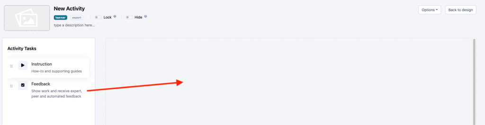
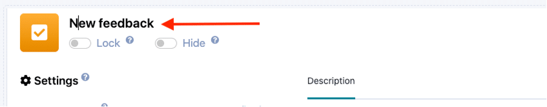
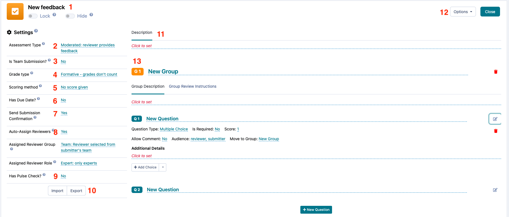
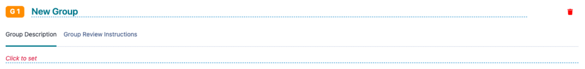
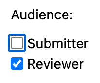

# Preparing Feedback Loops

This is the heart and soul of Practera: Unique experiential learning loops with peer, expert or automated feedback.
Learn how to set up and automate feedback loops within your experience.

---

## Feedback Loops

Practera is built around the [experiential learning cycle](../onboarding/what-is-experiential-learning/) and learners receiving timely and meaningful feedback is an essential part of their learning journey!
A feedback loop occurs when a learner (or team of learners) submits work or a deliverable for feedback or review. The review/feedback may come from a peer, an expert, a coordinator or an author.
The feedback/review itself can take many different forms, and authors are able to determine which type of questions they would like the reviewer to respond to. It could be as simple as a feedback video upload or as detailed as multiple likert scale questions. The possibilities are almost endless!
When considering the format and structure of your feedback loop, we find that the most valuable feedback loops are those that are simple and straightforward to complete. One goal is to set the review process up in a way that makes it easy to provide feedback and streamline its turn around, which values the reviewer’s time. Another goal is to ensure that the format or structure of the feedback is easily understood by both the learner and the reviewer – that way everyone knows what to expect!
If you’re looking for some further support in developing your feedback loops, please check out the [Designing Feedback articles](index.md).

---

## How to set up your moderated assessment

In order to set up a feedback loop in your experience, an author must create a **moderated** assessment. Unlike other assessment types, moderated assessments have a built-in feedback function, meaning that their completion involves both a **submitter**(that is, a learner or a learners team) and a **reviewer**(for example, an expert).
To add a Feedback loop, simply drag the task into the content area.

Once created, click on the title or the edit icon to configure the feedback loop.

We have designed Practera to support the largest possible amount of flexibility when it comes to feedback. Configuration of feedback loops has a somewhat steep learning curve, but once you get comfortable with the options, you have an immensely powerful tool at hand that no other learning system can offer.
There are 13 distinct areas that are editable

  1. Change the **title** by clicking on it
  2. Change the assessment type. **Feedback loops are defined as “moderated”. If you want to setup an experiential learning feedback loop, do not change this.** Practera offers other types of assessments as well, which are described in the article ([Selecting Feedback Types](./selecting-assessment-types/))
  3. Define **team or individual submission**. If it is a team submission click yes, only one member of the team needs to submit the task, which will submit it on behalf of every team member. “No” means that each individual needs to submit.
  4. Grade Type – This will allow you to have **grades present in the CSV** and if you have LTI 1.3 working you can have the final grade passed back to the relevant system.
  5. **Scoring Method** – You can select whether the score is shown as a percentage, number of points, or no score give.
  6. Indicate whether or not the task has a**due date**. If so, it needs to be scheduled on the calendar before the experience can go live.
  7. Submission **confirmation email**. Select yes if you would like the learners to receive an email upon submission and no to turn these off.
  8. Automate the **assignment of reviewers**. If yes, you can choose the role of the reviewer that should be assigned. E.g. “learner” for peer reviews, “expert” for expert reviews or “coordinator” for coordinator reviews etc. The scope will define the pool of reviewers: If “team” is selected, Practera will assign a person with a matching role that is in the same team as the submitter. If experience is selected, Practera will select a person at random with a matching role that is enrolled in the experience. Practera selects the next reviewer by checking who has been assigned to the least amount of reviews to date.
  9. Pulse Checks – this will trigger a **pulse check after the submission** , allowing the learner and expert to select if they are satisfied with their experience, and if they feel they are on track. If it is a team submission, all members will be required to respond to the pulse check to provide a team average.
  10. **Export the structure** for import into a different experience or the same one (cloning).
  11. Set a **description** for submitters
  12. **Delete** the Feedback loop by clicking on options and selecting delete.
  13. Set the **questions and structure**. Full details in the next section below

## How to structure and set up your questions

Submissions are structured in question groups. Each question group can have one or multiple questions. Each question has a type, which defines its behaviour on the app.
### Create question group

Click on “New Group” to add a question group. As well as changing the title by clicking on the dotted line of “New Group”, you can set instructions for submitters and reviewers.

 

### Create a question

Click on “New Question” to add a question to the submission. Change the title by clicking on the underlined “New Question” and then click the edit icon on the right to configure the question. For more details on the different question types and how they are used see the article [“Creating Different Question Types”](./creating-different-question-types/) for more details.

### Select the question audience

When creating a moderated assessment, you will be able to set the **audience** for each question.

This lets you create questions that only learners have to complete, that only reviewers complete, or, that both learners and reviewers complete!
### Submitter only

A submitter only question will display for learners and they will have the opportunity to answer it, or will be required to answer it if the question is marked as **required.** These questions will display for reviewers for their reference, but they will not be able to answer them.
### Reviewer only

A reviewer only question will not display for learners when they complete their submission. This question will display for reviewers when they review learners’ work and then will be visible to learners (including the reviewer’s response) once the feedback has been published. Reviewer only questions can also be marked as required.
### Both Submitter and Reviewer

This type of question is visible to both learners and reviewers and requires a response from both. Such questions work well when you’d like a learner to self-assess against the same criteria a reviewer will use.
Once you’ve created all of your questions for your moderated assessment, you’re ready to review the assessment settings where you can choose to automate the feedback process.

---

## What’s Next?

Looking for more support? Check out the rest of the [Becoming a Practera Power User articles](../becoming-a-practera-power-user/index.md) and find the additional help you might need.
