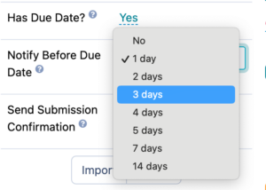
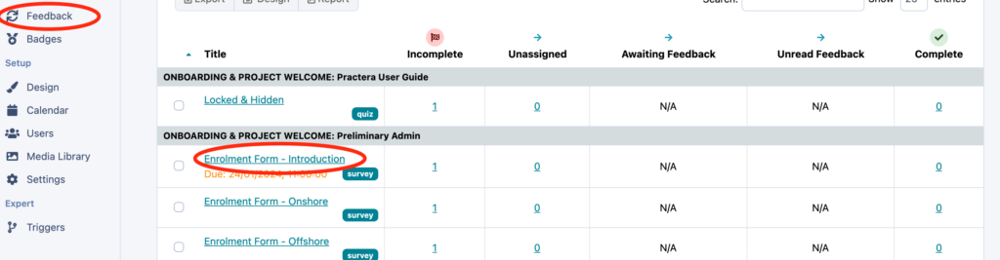
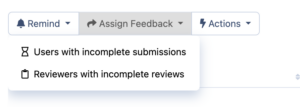

# Sending Feedback/Assessment Reminders

## How to send an automatic reminder

You have the ability at your finger tips to set up automatic reminders which go out prior to the due date of an assessment. You can do this by turning on the[ due dates](../essentials/scheduling-due-dates/) for the feedback loop, then selecting the relevant number of days you would like the reminder to be sent under the “notify before due date” setting.

**NOTE** : If you do not wish to notify people prior to the due date, you can either turn the due date off on this specific feedback loop or set the “notify before due date” setting to “no”.

---

## How to remind learners and experts manually

You may decide you wish to send more than one reminder, or you wish to remind learners and experts after the due date. You can do this by going to the feedback table to send these reminders.
Click on the name of the relevant feedback loop

Click on “remind” in the top left hand corner of the table. Here you can select if you wish to remind users with incomplete submissions or reviewers with incomplete reviews.

## What’s next?

For more information on Feedback loops and tips on how to set these up effectively have a read through our [Designing Feedback Collection](index.md).
