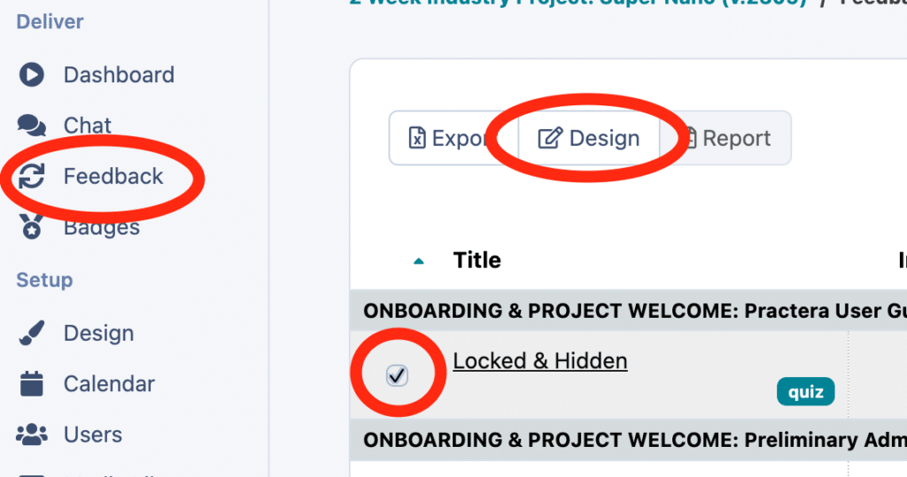
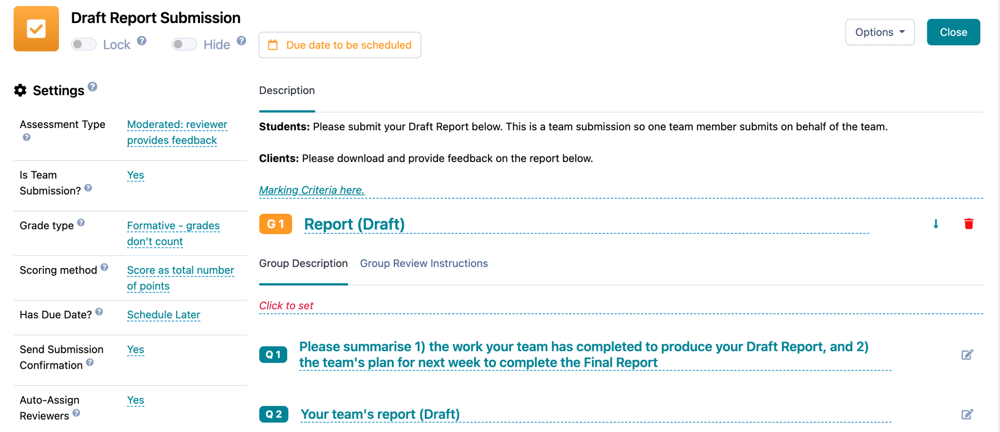
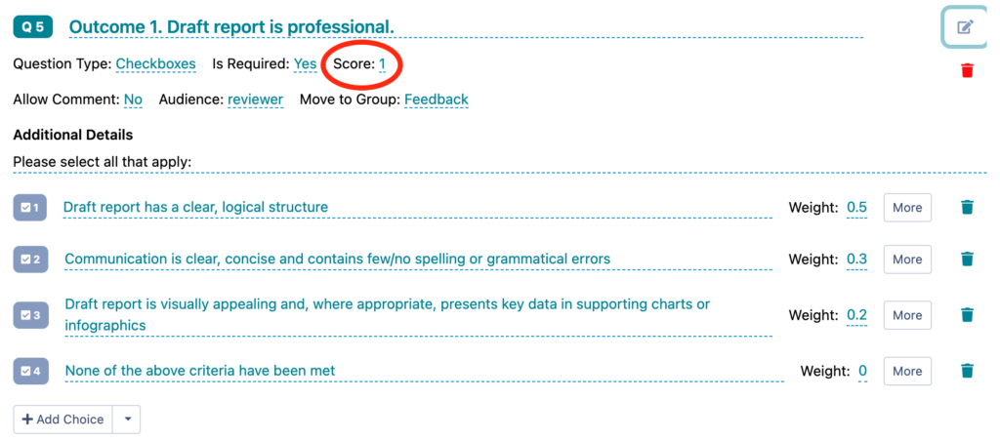
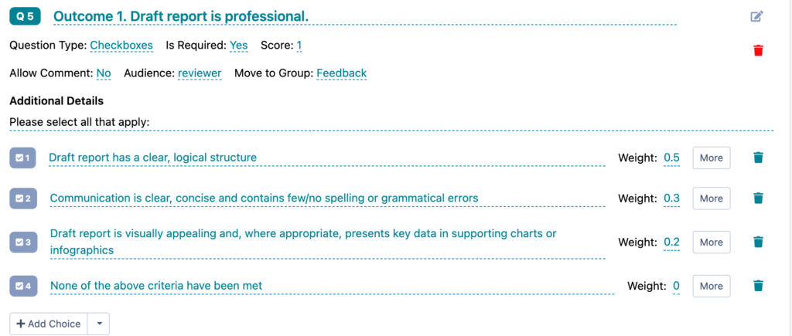
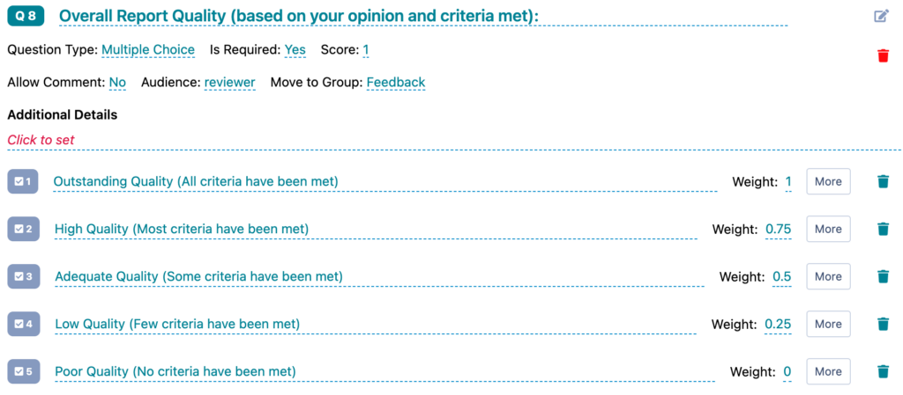
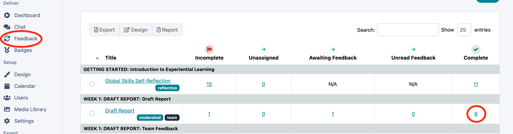
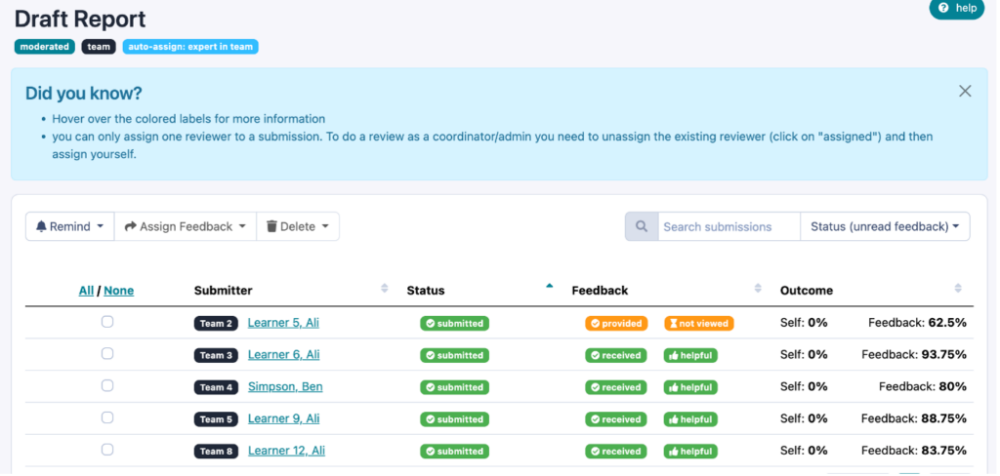
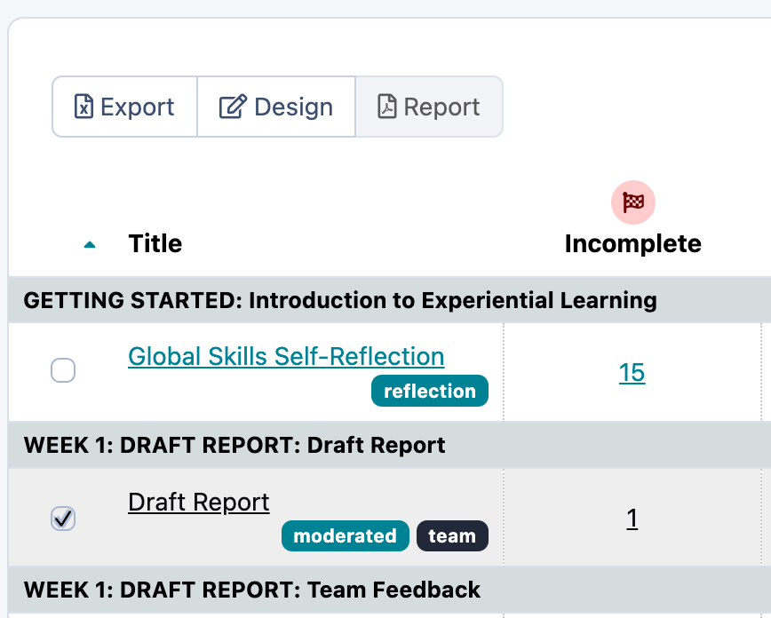

# Setting up Assessment Scores

## How to set up an assessment score?

When setting up a moderated feedback loop or Quiz you are able to add weightings to the questions so you as the [admin/author/coordinator](../institution-set-up/understanding-user-roles/) can see how the learners have performed or to allow certain triggers to unlock based on the learners score.
To set up an assessment score you will need to access the relevant assessment, you can do this by going to the Feedback tab, then select the relevant assessment and click design.

This will open up the assessment editing page which will look similar to below:

You can then add a score to the overall question (or put a score of 0 if you do not wish this question to be included in the scoring system). You can picture these scores like you would in an exam paper, where you may have a question worth 1 point, and another worth 2 points as it is a higher value question.

You will then set the weighting of each of the answers. For a check box question where the submitter can select as many options as they wish, you need to ensure that the weightings add up to the overall score of the question. In the example below you can see they will earn 50% of the overall score of 1 when the first response is selected, then 30% for answer 2, so 80% overall if these two answers are selected.

Whereas, if you have a multiple choice question, you would be setting the percentage for the one answer selected. So the correct answer, or top answer would = 100%, so if it is scored out of 1, the top answer would have a weighting of 1.

## Where can I see the learners score.

To view the students scores and see how they have performed you can go to the feedback tab, then click on the number under the relevant heading for the assessment you wish to view scores for.

You will then be taken to a table which shows all the feedback scores earned by the learners.

## Can I export these scores?

Yes you can, simply select the assessment on the feedback page and click export, this will download the submissions and scores in a CSV file for you to easily browse.

## What’s next?

So now you know how to set up the scoring system on an assessment. You may want to explore articles to dive in deeper about feedback loops and different assessment types to be able to start putting this new knowledge into action. You will find these in our [Designing Feedback Collection](index.md).
