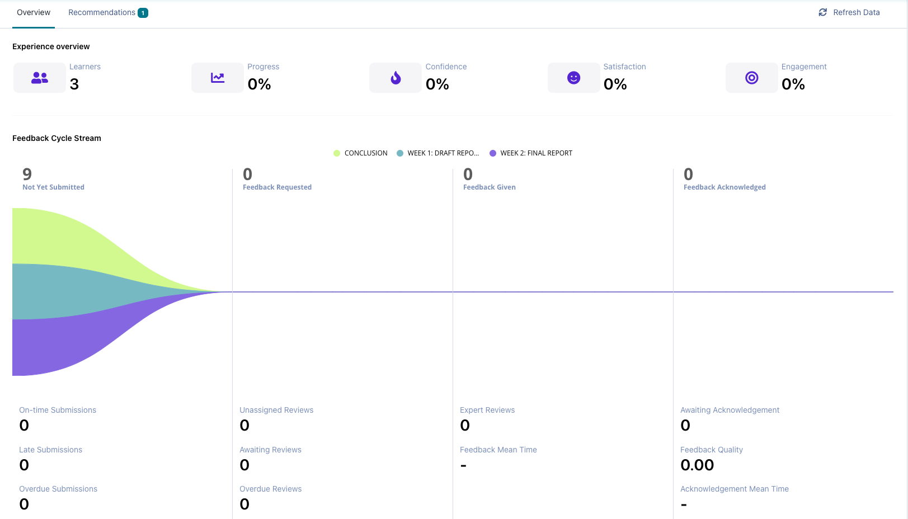
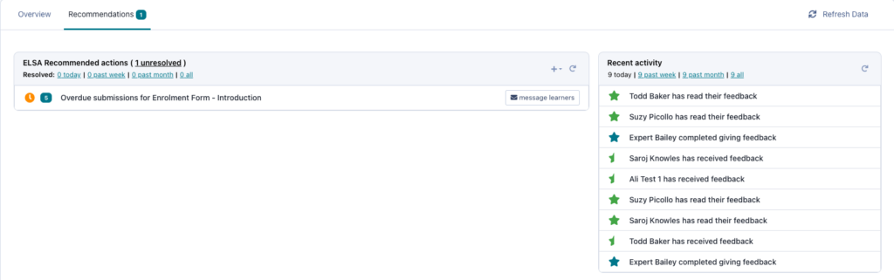

# The Experience Dashboard Explained

An introduction to the experience management dashboard and its power to quality assure experiential learning.
As a user on Practera who is responsible for the delivery and quality assurance of the experience, you’ll be able to manage the learning for any number of students with ease from your Dashboard. This article is for active or interested coordinators, authors and admins, and will help you to understand what information and analytics you can garner from the dashboard in order to manage and quality assure your learners’ experiential learning at scale.

---

## The Basics

We all know that real-world experiences for learners to apply their knowledge is crucial for work-readiness and skill development. But one key obstacle that prevents educators from delivering more experiential learning, is how to support large groups of learners remotely and ensure you detect issues before it’s too late.
_Enter, the Practera experience dashboard._
The Practera experience dashboard is the super tool that will empower you with **real-time, rich data on your cohort’s progress and performance** , as well as the **tools to quickly remedy and pre-empt any issues**. Say goodbye to finding out in the eleventh hour that your student hasn’t been keeping on top of their tasks or hasn’t had a supportive supervisor.

### The stats explained

At the top of the page, we have curated the most important metrics that help you deliver and quality assure the experience. We have seen individual educators deliver a great experience with more than 200 learners in 40+ teams – thanks to the learning analytics!
### Experience Overview

The Experience Overview displays 5 important stats:
  * **Learners** – Number of active learners, and it highlights how many learners are still required to activate their account
  * **Progress** – The overall progress of the cohort
  * **Confidence** – At key points in the experience, participants are asked if they feel they (or the team they are mentoring) are on track. This represents the average % of people responding they feel on track.
  * **Satisfaction** – At key points in the experience, participants are asked if they are satisfied with the experience. This represents the average % of people responding that they are satisfied.
  * **Engagement** – Percentage of learners who have been active in the last week.

### Feedback Cycle Stream

The feedback cycle stream provides you with a visual to demonstrate how your learners are progressing on the experience. The feedback cycle stream shows the flow of “moderated” assessments from **not submitted** to**feedback acknowledged**. Admins and coordinators now have a holistic view of the experience performance and get actionable alerts to improve it. This is then broken down in a more granular level to help you identify how many on-time, late and overdue submissions and reviews there are. As well as stats on the review and feedback read timings.
The four columns represent stages of the moderated assessment life cycle.
  * **Not Yet Submitted** – no action has been taken yet
  * **Feedback Requested** – the student has submitted the assessment but a reviewer has either not been assigned or has not completed the review
  * **Feedback Given** – the reviewer has provided feedback, but the student has not yet seen it.
  * **Feedback Acknowledgement** – the student has seen the feedback and provided a “helpfulness” rating.

### Feedback Loop KPI’s

  * On-time submissions (Submissions sent on time)
  * Late submissions (Submissions sent late)
  * Overdue Submissions (Submissions currently late)
  * Unassigned reviews (Submissions without expert assigned)
  * Awaiting review (Submissions waiting for expert review)
  * Overdue reviews (Submissions waiting longer than the expected time for expert review)
  * Expert reviews (Total number of reviews by experts)
  * Feedback Mean Time (Average time of requesting feedback and feedback given)
  * Awaiting acknowledgement (Average time of feedback given and leaner acknowledge the feedback)
  * Feedback quality (Average learner feedback given by expert score)
  * Acknowledgement Mean Time (Average time between feedback given by expert and acknowledge by learner)

### Welcome to ELSA’s recommended actions

If you click on the recommendations tab at the top of this page, you will find a list of ELSA recommendations – your AI-driven Experiential Learning Support Assistant (not the Frozen character, but we like your thinking).
ELSA flags issues to the coordinator that are important to quality experiential learning. These are small issues before they become bigger **issues, such as overdue submissions, overdue reviews, or team dissonance.**
In a couple of clicks, you can **send impactful interventions to keep the cohort on track** and ensure positive participant experiences.

---

## What’s Next?

Now you know what data dashboards and intervention tools are at your fingertips, start to think about which will be most useful for your program management. For more tips and articles on delivering a successful experiential learning experience, click on [this link](../delivering-experiential-learning/index.md).
