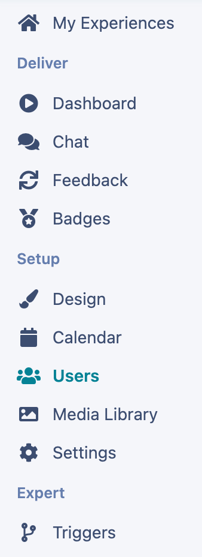
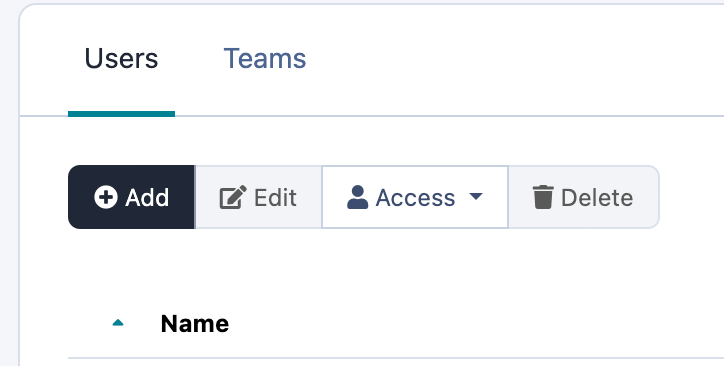
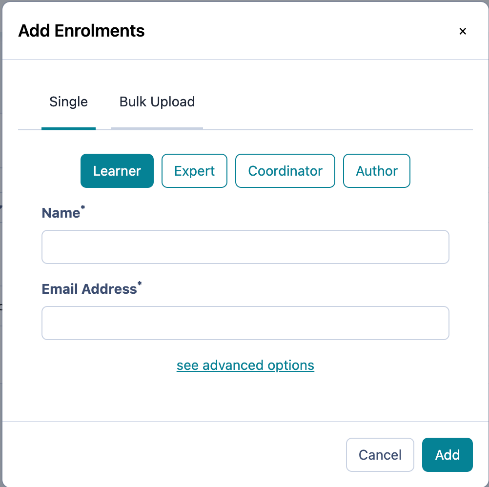
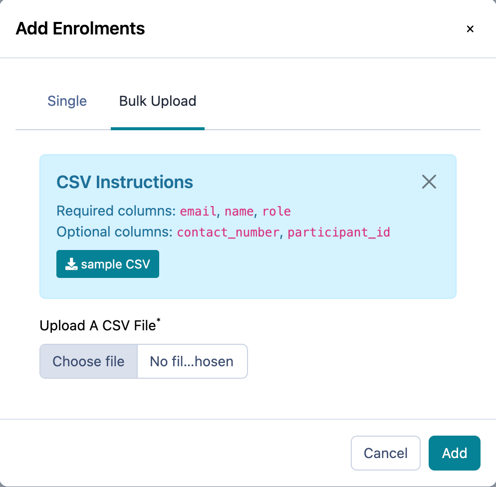

# Bulk Enrolment via CSV Upload

Do you have lots of users to enrol, this article will show you how to do a bulk upload to make the task quick and easy.

---

## How to complete a Bulk enrolment.

For a lot of experiences you will often find you have multiple learners or experts which you need to enrol. Therefore, using the manual method of enrolling them one by one may not be the most beneficial. Instead try using the Bulk Enrolment feature to do it quickly and easily.
  1. In order to do so, you will navigate to the “Users” part of your menu under “Setup” on the left hand side. This will take you to the users page that will display all of the users in your experience, their team, and their status.

2\. On the top left of the box, you’ll see the “+ Add” button:

3\. Select the “+ Add” button in order to add users to your experience. Once that has been clicked, you’ll get the enrolments pop-up that looks like this, click on the Bulk Upload tab:

4\. Click on Sample CSV to download the template. Then copy and paste in your users details, including their name, email address and role (Learner, expert, author):

5\. Save the CSV, then on Practera click “Choose file”, then click “add”

That’s it. Use this method and you can quickly and easily enrol 100’s of learners and experts!

---

## What’s Next?

Now that you’ve got your learners and experts enrolled, it’s time to Go Live so that they are invited to the experience!
[Go Live](./going-live/)
