# Communicating with Experience Participants

As the Experience Coordinator you will want a quick and easy way to keep your participants up to date and engaged. This is where the messages come in.

---

## Types of Messages

Over the years of running experiential learning programs, we have seen the positive impact of regular, clear communication with our participants. It helps to enhance their productivity, understanding and can help to ensure timely submissions.
You may use the messages to provide:
  * an overview or what learners should expect this week
  * reminders about deadlines
  * updates or information about changes made to the experience or the due dates

This is why Practera provides you with the flexibility to send a variety of messages and allows you to personalise who these messages will be sent to. Practera’s Chat allows you to send a variety of media types, including: text, files, images and videos.

---

## How to send messages on Practera

Click on Chat on the left hand side of your experience screen

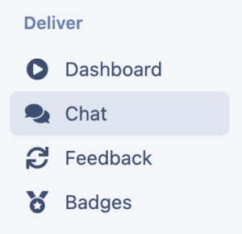

### Send a team message

If you wish to send a message to a specific team click on the relevant team in the list, start typing your message and click on the send arrow.

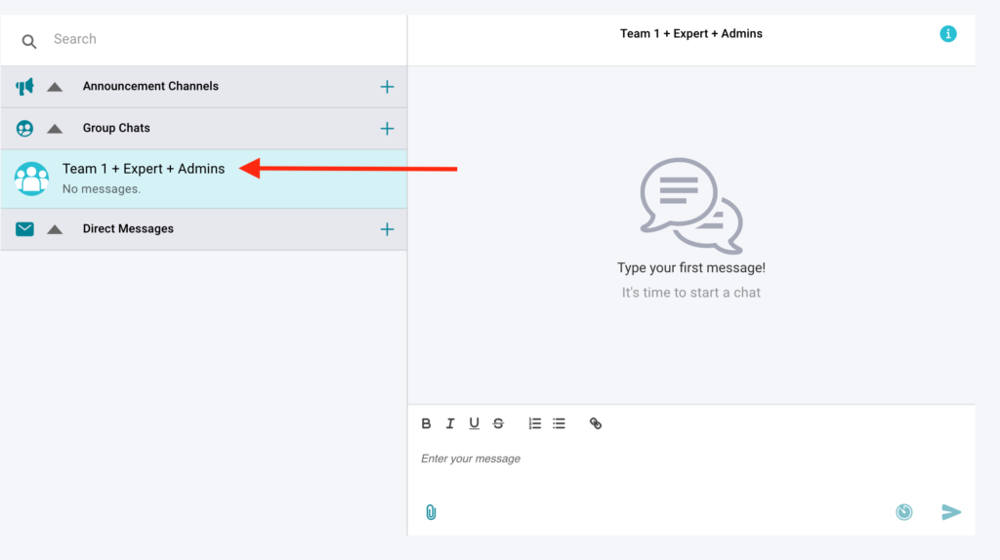

### Send a direct message

If you want to send a direct message to a specific learner or expert, you can:
  * click the “+” next to direct Messages.

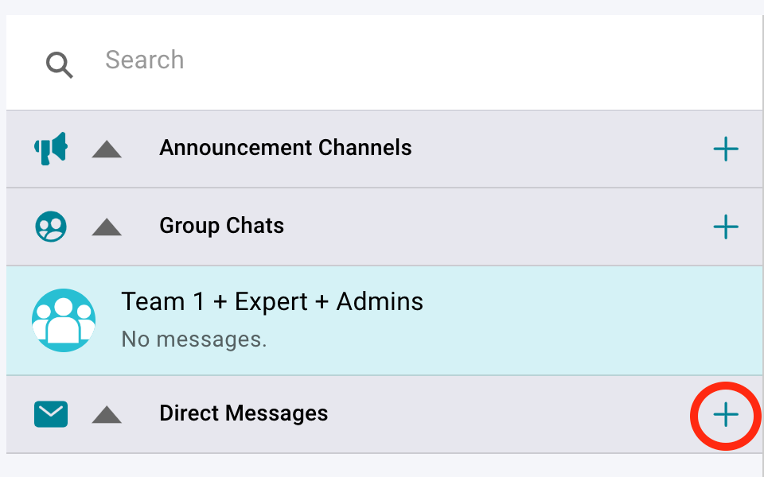

  * Search for the relevant learner or expert and click on their name.

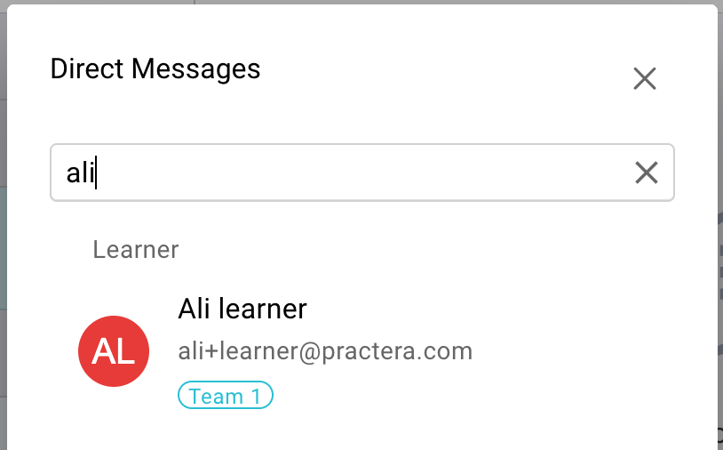

  * Start typing in your message in the text box provided.

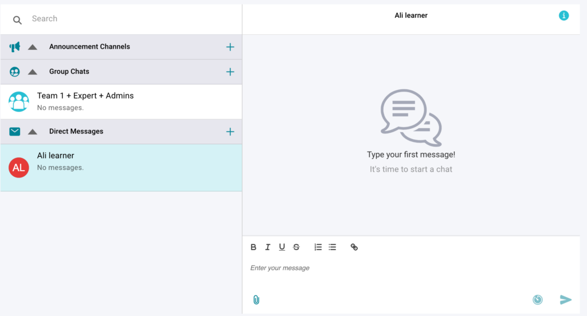

  * Click the send arrow.

### Send a message to everyone in the experience

To send a message to all learners and experts in the whole cohort, you need to:
  * Click the “+” next to Announcement Channels.

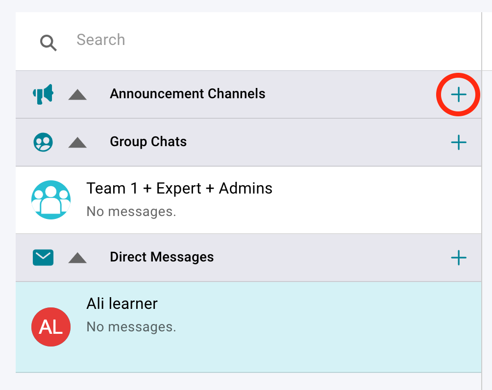

  * Select who the announcement is for, learners or experts

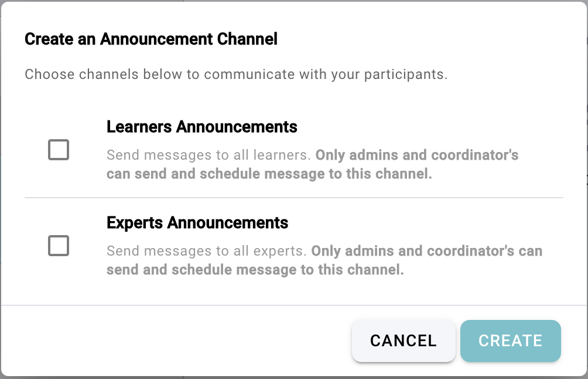

  * This will then add a Group chat in the list. Click on the relevant chat.
  * Start typing your message.

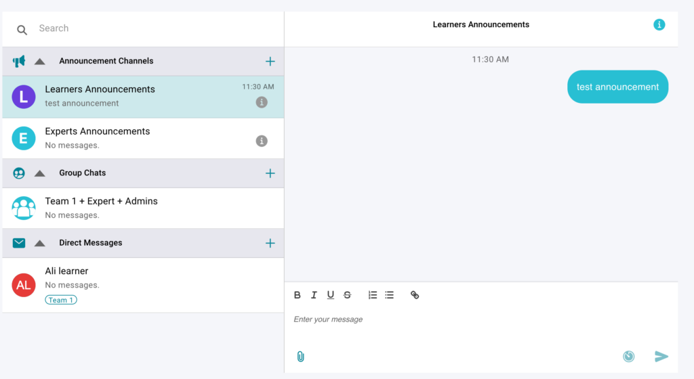

  * Click the send arrow to send a message to all learners and experts in your cohort.

## Who is in the Chat?

By selecting the **‘i’** icon in the top right-hand corner of the Chat screen, users can see who is in the Group Chat:

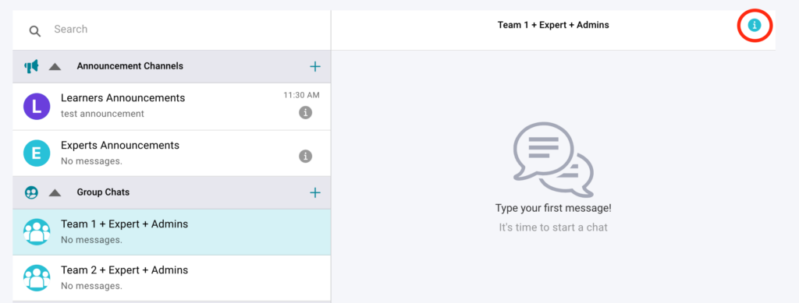
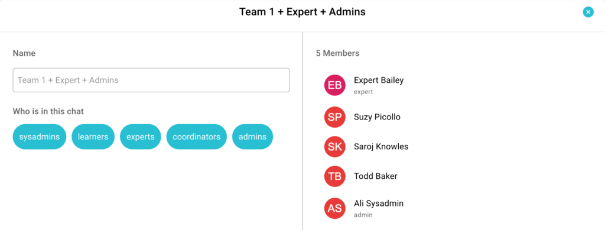

## Privacy

Any user can see who is in that group by selecting the ‘i’ icon in the top right-hand corner of the Chat screen.
**Note:** Teams will also be able to send messages to one another in a group without admins. You will not be able to see these messages in your Admin Practera Chat.

---

## How to schedule your chats in advance

  * Sometimes it is handy to set up weekly messages or announcements in advance. To do this, select the chat recipients (learners announcements, a specific team or a specific participant).
  * Type the message you wish to schedule
  * Click on the schedule to send icon

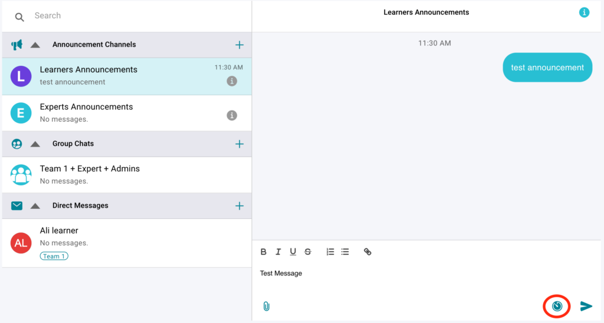

  * Set the date and time, and click schedule message

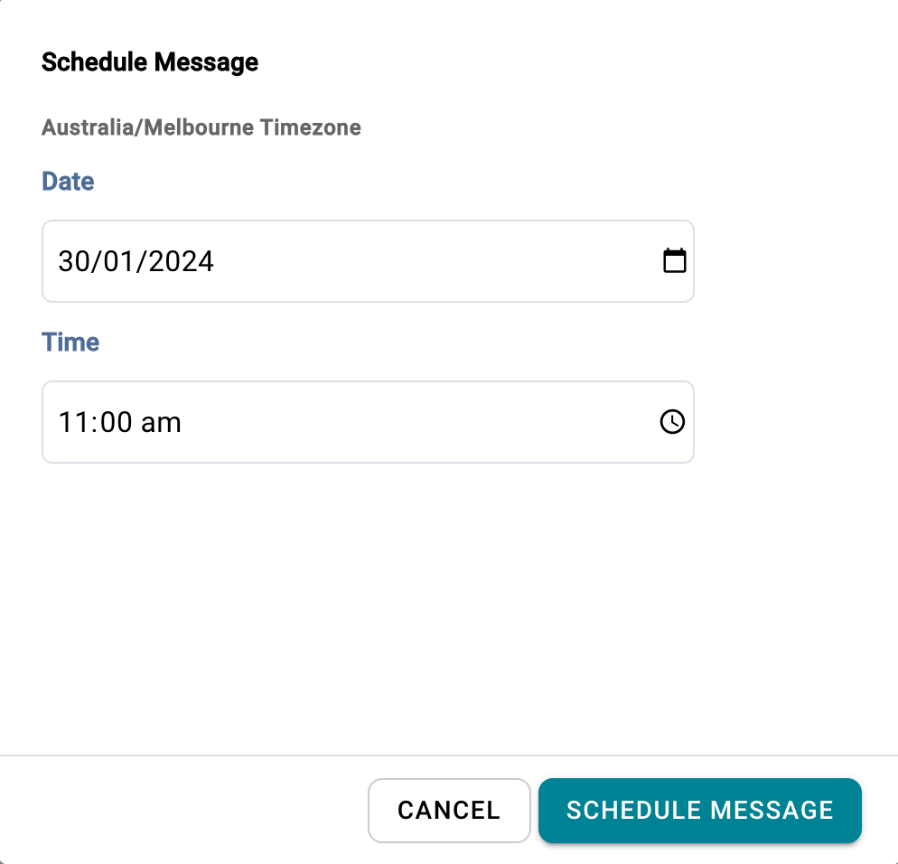

## What’s Next?

Now you know how to set up your messages and why you may wish to use them have a look through the other articles to help you to effectively [deliver your experiential learning experience](../delivering-experiential-learning/index.md).
