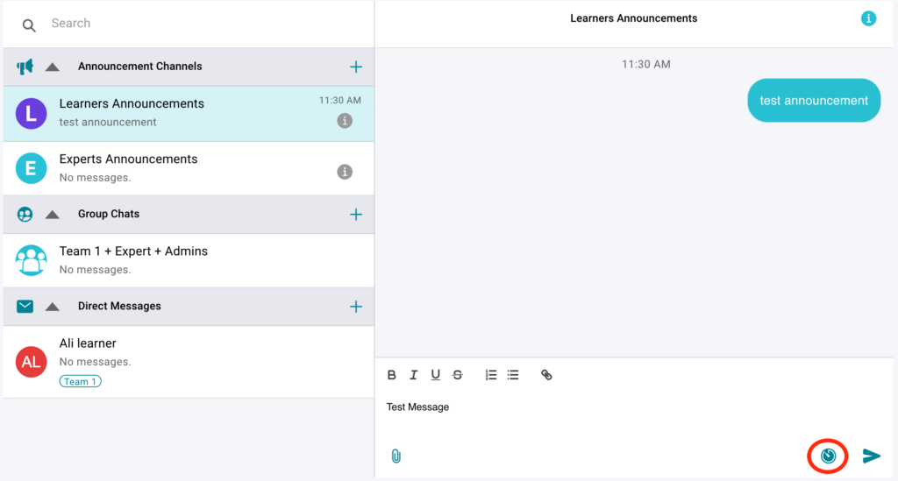
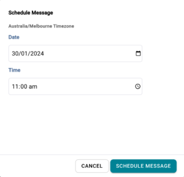

# Scheduling chat messages

## How to schedule your chat messages in advance

  * Sometimes it is handy to set up weekly messages or announcements in advance. To do this, select the chat recipients (learners announcements, a specific team or a specific participant).
  * Type the message you wish to schedule
  * Click on the schedule to send icon

  * Set the date and time, and click schedule message

## What’s Next?

For more details about how to set up your experience have a read through our “[Essentials Articles](index.md)“
