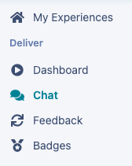
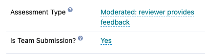
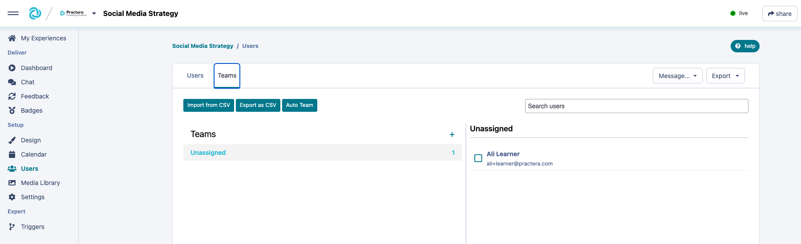
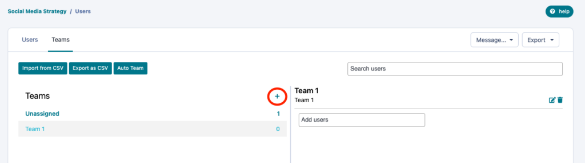
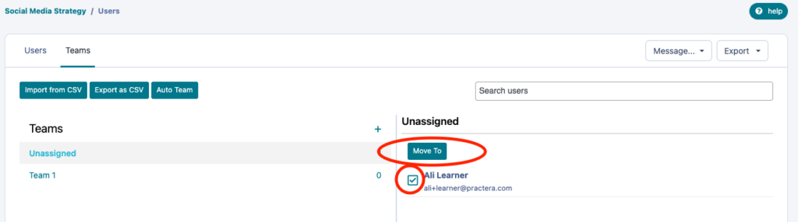
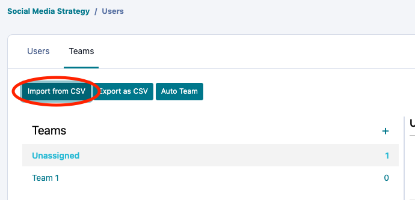
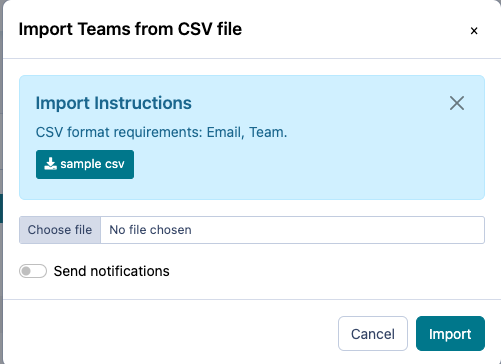

# Creating Teams

Learn how to create teams within your experience for team-based submissions and chat.

---

## Benefits of Using Teams on Practera

Setting up teams in your experience allows leaners to submit team based assessments and access team chat with other users like experts or coordinators. Here’s what you can expect when you implement teams in your experience:
### Team Chat

When learners are teamed, they will have access to a chat channel in their Practera interface so that they can interact with each other. There are multiple team chat channels available when teams are created.
  * Team Chat: Learners only
  * Team + Expert Chat: Learners and experts (only available if experts are added to the team)
  * Team + Expert + Admins: Learners, experts and authors or coordinators can communicate with each other

**Note:** All administrators, authors, and coordinators can see the chat channels that involve Admins by selecting **Chat** on their menu in the Author & Coordinator Interface.

### Team Submissions

If your learners are in teams, they are able to submit assessments as a team. That means that only one learner on the team needs to submit on behalf of the rest of their teammates. Once a submission is made for the team, the assessment is marked as submitted for all team members. In order to set an assessment as a team submission, you’ll see the option in the assessment’s setting menu. Any assessment can be a team submission.

## How to Create Teams

You can set up teams in your experience in one of these two ways:
  1. [Manually create teams.](./creating-teams/#4-toc-title)
  2. [Automatically create teams. ](./creating-teams/#5-toc-title)

To start creating teams, head to the **Users** page. Here you’ll see two tabs: **Users** and **Teams.** Select the **Teams** tab to get started.

### Manually Create Teams

Manually creating teams takes just a few clicks!
  1. Click the **+** button in order to create a new team.
  2. Name the team, if you prefer.
  3. Press **Save**.

Now it’s time to add users to that team! You can go to the Team you have created and **add members** using the drop down list by inputing user names or email addresses.
Or, you can add users to the team from the **Unassigned** list:
  1. Select the users you’d like to add.
  2. Select **Move To**.
  3. Select which team you would like those users to be on.

### Automatically Create Teams

You can also create teams automatically by importing a CSV file. To do so, select **Import from CSV** :

We recommend downloading the sample CSV file to make sure your CSV follows the correct format. Your CSV file needs to have two columns:
  1. **Email** – User’s registered email (learner, expert or coordinator)
  2. **Team** – Team name

Once your CSV is ready to upload, choose the file from your device and select **Import.** Practera will automatically create the teams with the users that you have outlined!

**Please note:** If you create teams from a CSV file, you cannot repeat this process to add additional teams. It will override the teams you have already created!

---

## What’s Next?

Looking for more support? Check out the rest of the Essentials Collection articles and find the additional help you might need:
[Essentials Collection](index.md)
