# Deleting User Data

---

## How long should data be kept?

Generally, data should be deleted after 2 years unless it is still being used for the purpose for which it was collected. Practera will delete user data after 2 years.

### Who can delete data?

All Institution Admins can delete data.

### How do I set the dates?

When you set an experience to 'Live', the following screen will appear. The date that is set as the start date will be used as the first day of the 2 year period. The program end date will not affect the data retention period, but you can edit that if you would like it less than the 2 year period.

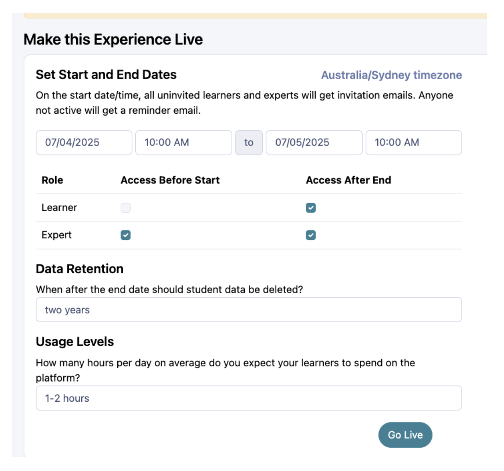

---

## How to delete a whole experience

1. Select the drop down menu at the top left next to the institution name. Then select **Overview**.

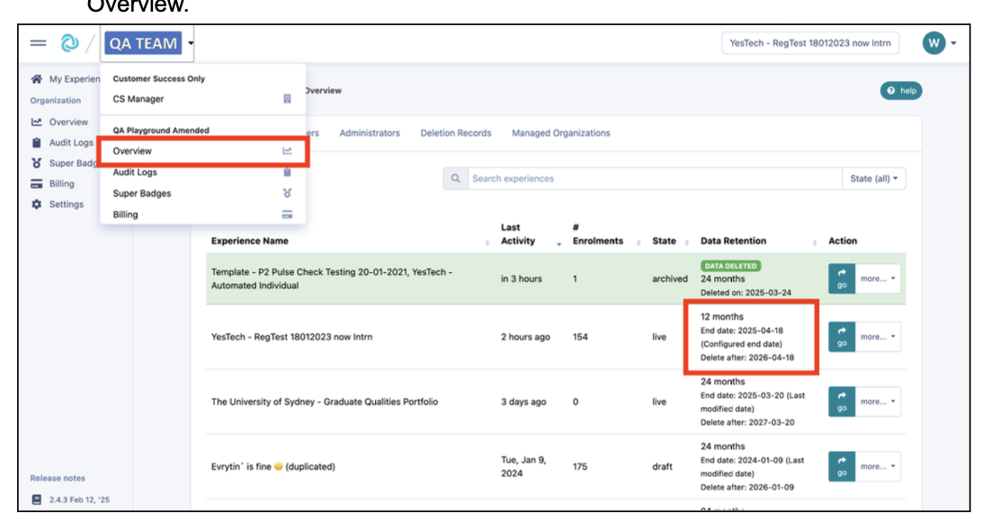

2. This view will show you the list of unique experiences you have within your institution.
   - **White** = Deletion is not due for some time
   - **Orange** = Deletion is due within 3 months
   - **Red** = Deletion is overdue
   - **Green** = Data has been deleted

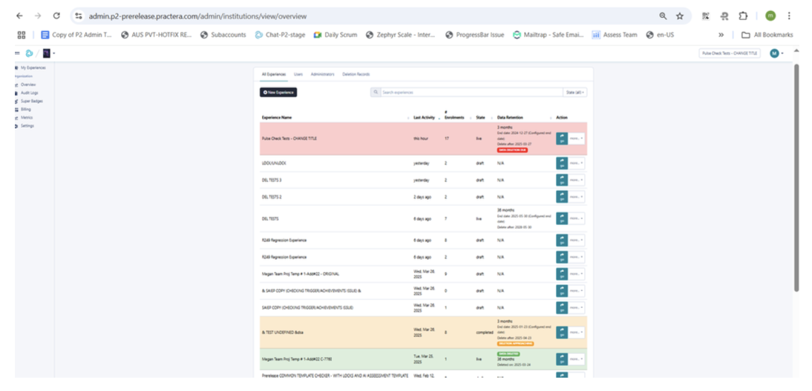

3. To start the data deletion process, select **more** then **Delete user data**.

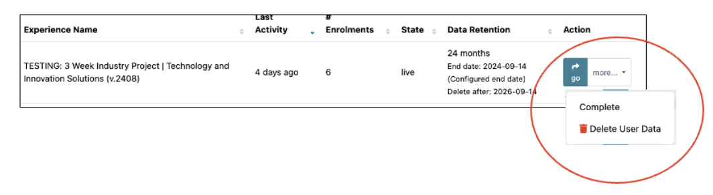

4. This will bring you to the following screen.

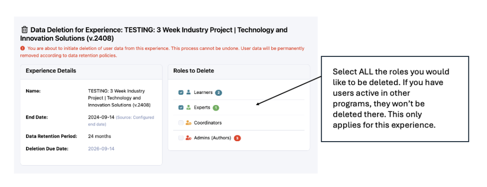

5. You can see the type and amount of data to be deleted. The amount will determine the amount of time this process will take:
   - Smaller programs of about 30 licences take about 15 minutes
   - Programs with 50+ licences take about 30 minutes
   - Programs with 100+ licences can take an hour or more

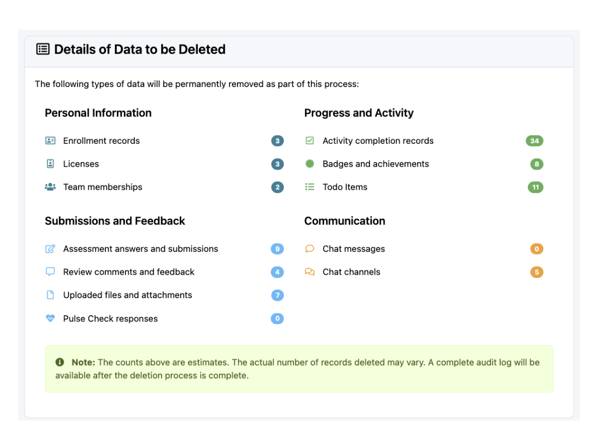

6. Finally, you will be asked to confirm that you want to proceed. You will need to move the toggle to the right to do this.

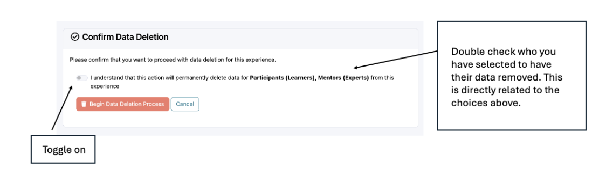

7. Select **Begin Data Deletion Process**. It will take about 30 seconds but you will then see this screen.

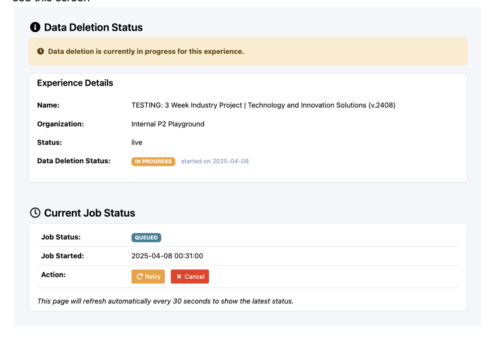

8. It will then commence the process. It can take up to a minute to process what it needs to do, then you see this screen. This screen will update every 30 seconds until all the records are deleted.

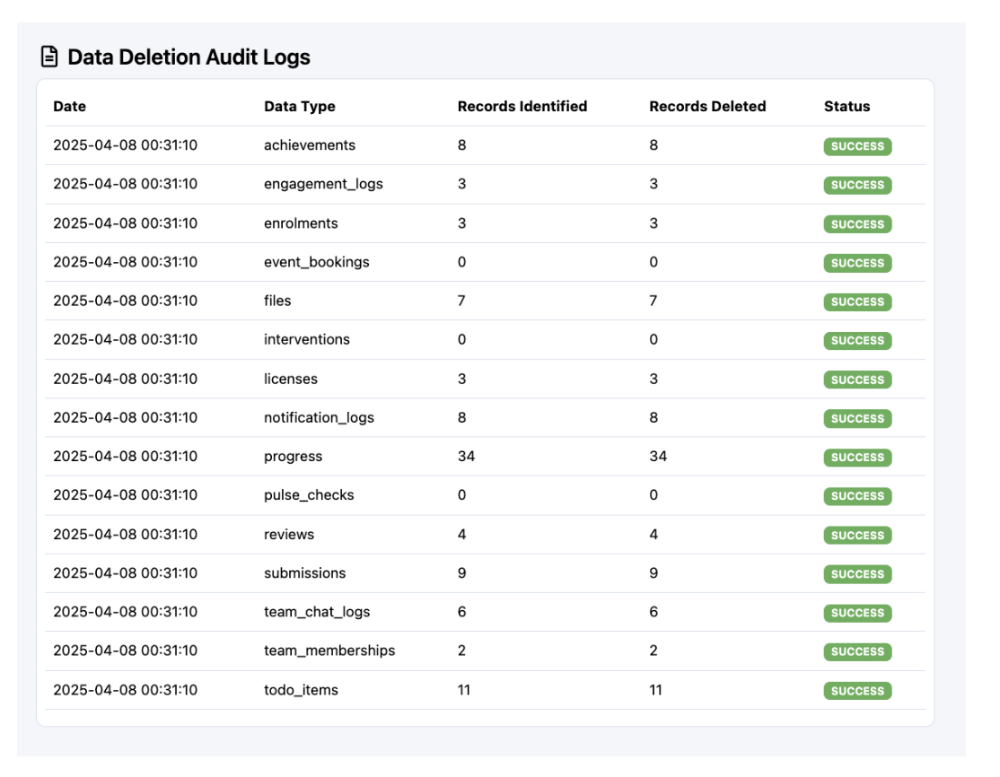

9. Once it has finished deleting the data, a certificate will become available.

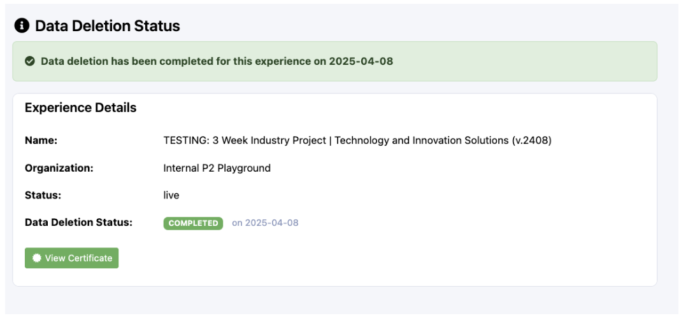

10. Select **Print certificate** to download a copy for your records.

---

**⚠️ IMPORTANT:** Once the data has been deleted, it can not be restored.

---

## How to delete an individual user

1. Select the drop down menu at the top left next to the institution name. Then select **Overview**.

2. From here, select the **Users** tab from the to

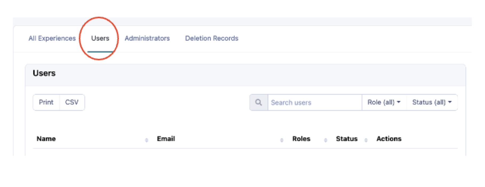

3. Select the user you want to delete and click on the red trash bin.

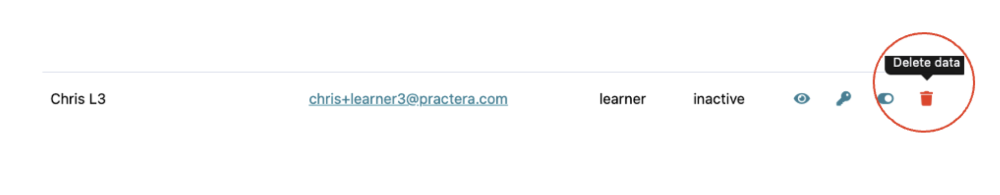

4. This page will appear:

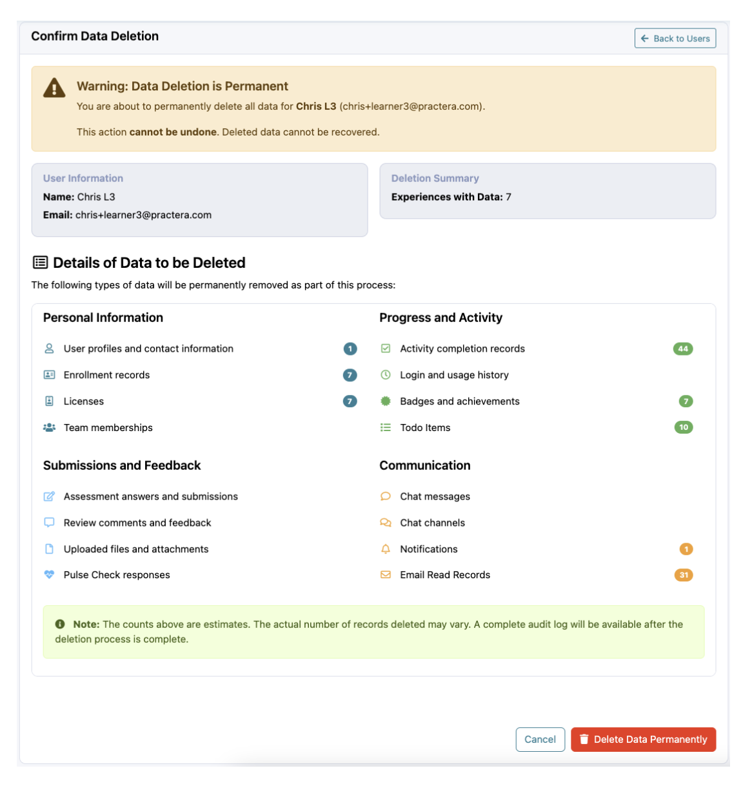

5. Select **Delete Data Permanently** to confirm you want to delete the data.

6. Upon clicking **Delete Data Permanently**, a pop will appear that asks you to confirm this is really what you want to do. If you choose **ok**, the process will begin.

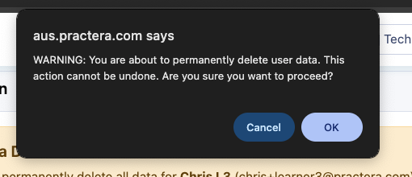

7. Once the process is complete, you will see another pop up that says:

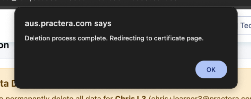

8. You will be directed to the Certificate of Data Deletion. You can verify that the data has been deleted by entering the users email address in the verification field and clicking **verify**.

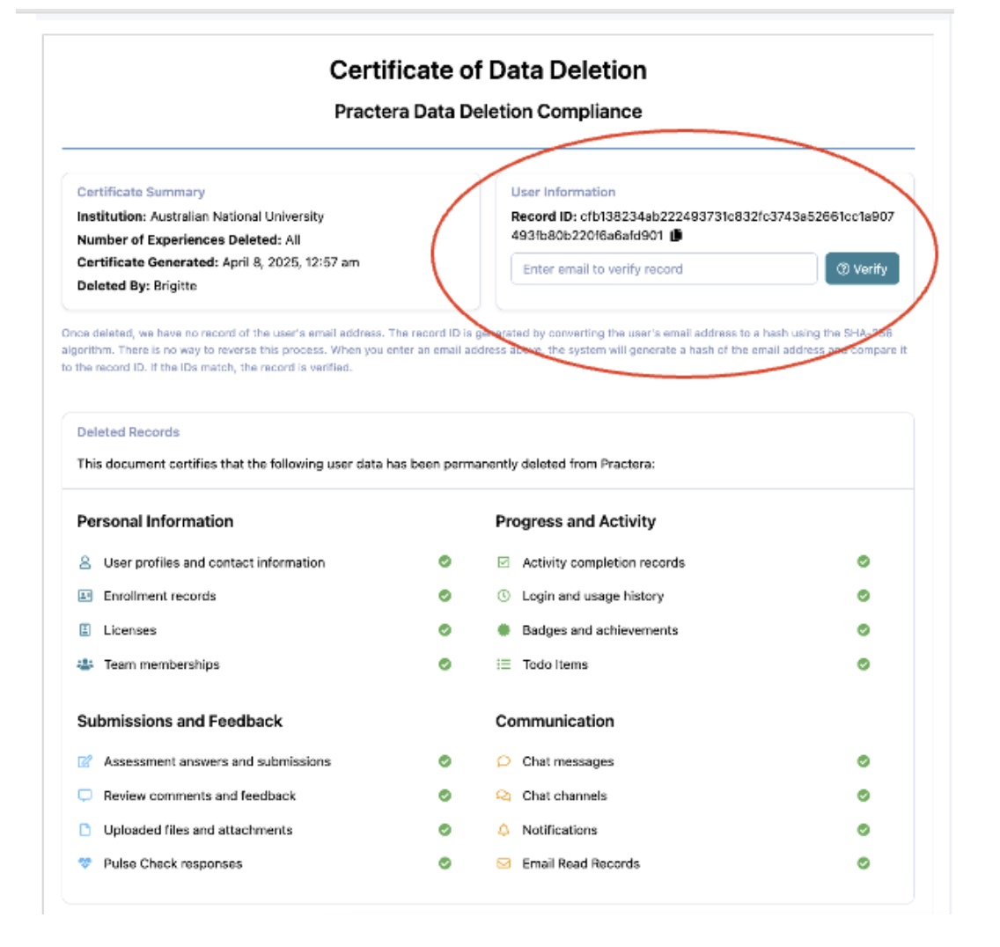

9. There will also be a button that will allow you to print or save this certificate as a PDF file.

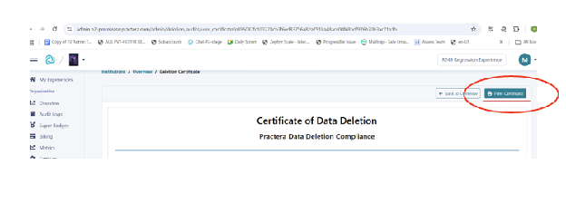

---

## Deletion Record Verification

There is a page for Institution Admins to verify data deletion for a deleted user and re-generate the users data deletion certificate if required.

1. Select the drop down menu at the top left next to the institution name. Then select **Overview**.

2. From here, select the **Deletion Records** tab from the top.

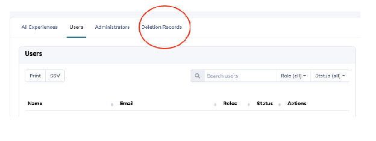

3. To verify and generate a deletion certificate for the deleted user, enter the email in the email address field in this page and then click the **Verify Deletion** button.

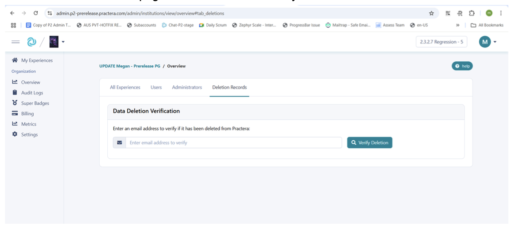

4. Practera will verify that the user is deleted and take the admin to the user's data deletion certificate page. This can then be downloaded as a PDF file.

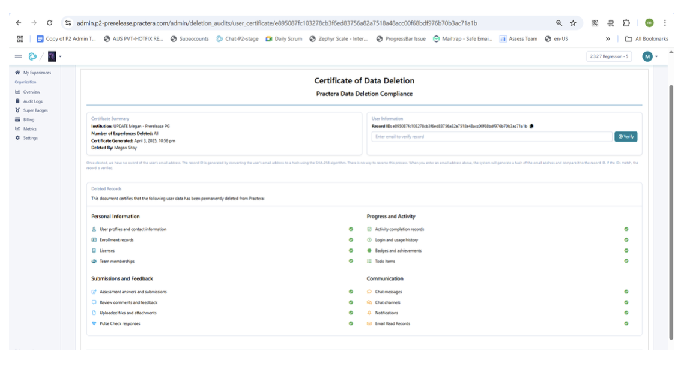

---

## What's Next?

Now that you understand how to manage data deletion, you can:
- Learn about [Going Live](going-live.md) to understand how data retention periods are set
- Review [Bulk Enrolment Via CSV Upload](bulk-enrolment-via-csv-upload.md) for managing multiple users
- Explore the [Essentials collection](index.md) for other core functionality guides