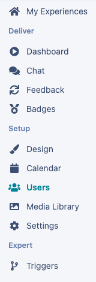
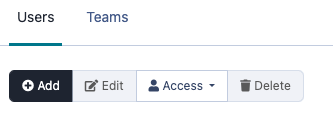
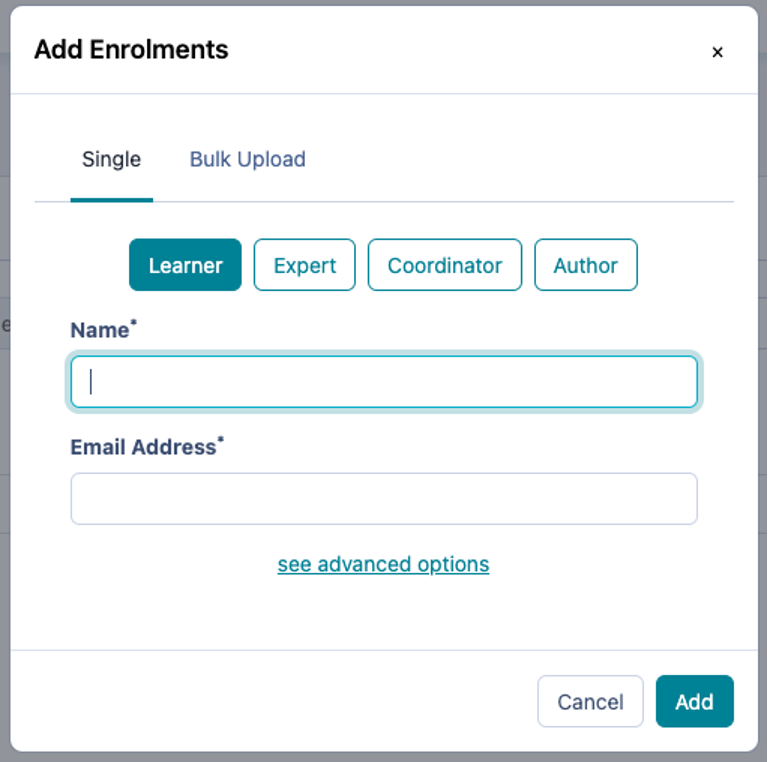
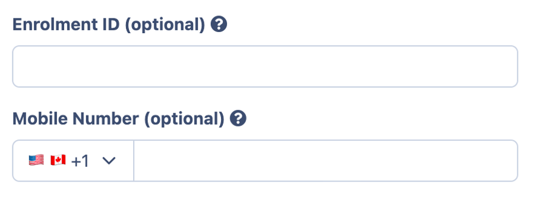
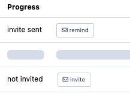

# Enrolling Learners & Experts

Learn how to add your learners and experts to your experience.

---

## Where to Add Users

Now that you have checked what your experience looks like for both learners and experts, you can add them into the experience. In order to do so, you will navigate to the “Users” part of your menu under “Setup” on the left hand side:

This will take you to the users page that will display all of the users in your experience, their team, and their status. It’s most likely that there will only be one user currently on the list – you! You will be listed as an author with an “A” next to your name.

---

## How to Enrol Learners & Experts

Now that you can see the list of users in your experience, it’s time to add some learners and experts so that they can access the experience. On the top left of the box, you’ll see the “+ Add” button:

Select the “+ Add” button in order to add users to your experience. Once that has been clicked, you’ll get the enrolments pop-up that looks like this:

  1. To begin, select either Learner or Expert as the user’s role.
  2. Input the user’s name – we recommend their full name.
  3. Next, input their email address – this is how they will receive their invite.
  4. Finally, click “Add”.

Repeat the above steps to quickly and easily add individual users to your experience!
One important thing to remember is that adding users doesn’t automatically invite them to access your experience. On your user page, you’ll notice that there is an option to invite users that you’ve added. Invites are sent out when you “Go Live”.
### Advanced Options:

If you click on the “See advanced Options” link at the bottom of the add enrolments box you are able to add in:
  * Enrolment ID – A way for you to differentiate students by another particular ID, so this could be University ID number for example
  * Mobile Number – Allowing you to input a learner or experts phone number so they receive SMS notifications during the experience.

#### Still have some questions about adding enrolments? Check out the other articles below:

  * Want to learn about the roles of **Coordinator** and **Author**? Check out** <**[**this article**](../institution-set-up/understanding-user-roles/)**>.**
  * Want to learn how to use **Bulk Upload** for enrolments? Check out **<**[**this article**](./bulk-enrolment-via-csv-upload/)**>**.

**_Please note:_** Your experience may require your learners and experts to be on teams together. Want to learn how to create teams? Check out **<**[**_this article_**](./creating-teams/)**>**.
### User Status

As you already know, the users you add into your experience are not invited to register until you choose to “Go Live”. You can see whether or not a user has been invited by looking at their “Progress” on the table of experience users:

There are three different statuses that you may see next to a user. They are:
  * **Invite Sent** : This user has been invited to the experience but has not completed their registration.
  * **Active** : This user has been invited and is registered in the experience. The view you can see is a graph which will show the percentage of completion of the experience.
  * **Not Invited** : This user has not yet been sent an invitation to register for the experience.

## What’s Next?

Now that you’ve got your learners and experts enrolled, it’s time to Go Live so that they are invited to the experience!
[Going Live](./going-live/)
