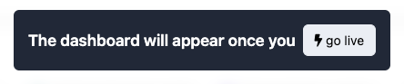
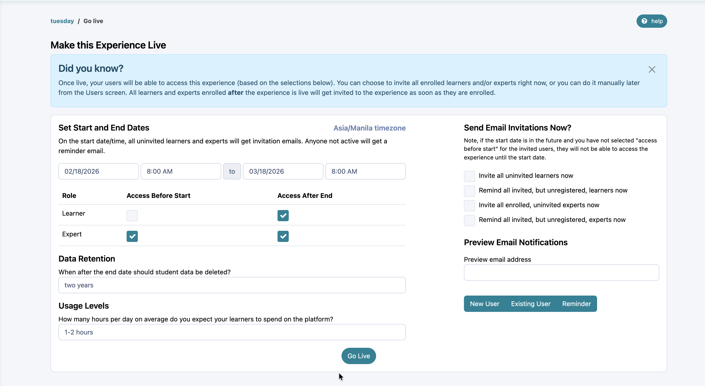

# Going Live

Learn how to get your experience officially started!

---

## What does Go Live mean?

It means launching your experience! When you select to make your experience live, invites will be sent out to the users that you have enrolled and Practera will start collecting and displaying data on your experience so that you can monitor progress.
### Before you Go Live:

  * Your experience is listed as “Draft” in “My Experiences”
  * The dashboard does not yet appear as there is no data to populate it.
  * Learners and experts are not invited.

### After you Go Live:

  * All invites are sent to enrolled learners and experts.
  * Your dashboard is available and is populated by the tracking and learning analytics for all learners and experts in your experience.
  * Practera will recommend any interventions that may be required to support great outcomes for your experience.

So, what are you waiting for? You’ve got your learners and experts enrolled, is it time for you to Go Live?

---

## How to Go Live

It’s as simple as clicking a button! You will see the Go Live button on your top navigation bar:

You can also select the Go Live button that you see on the Dashboard page that says, “The dashboard will appear once you go live”.
Once you press the “Go Live” button, you’ll be directed to a page that lets you preview the invites. Input your email or phone number to see what the invites and registration reminders will look like for new or existing platform users. If you’re satisfied with the invites to your experience, it’s time to click that final “Go Live” button! Please note that as you Go Live, the experience cannot be reverted to Draft form, and all users listed will be notified to register.

And now your experience is live and your dashboard will begin to display data!

---

## What’s Next?

Now that your experience is live and your invites have gone out, it’s time to celebrate! You may find that you have some more questions and we’re here to help. Find out where to get additional help in the next article.
[Getting Further Help](../onboarding/getting-further-help/?preview_id=2123&preview_nonce=a6b863f8c3&_thumbnail_id=-1&preview=true)
