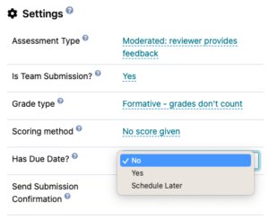
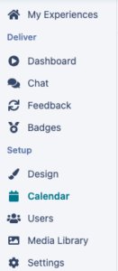
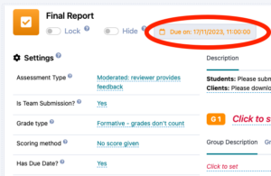
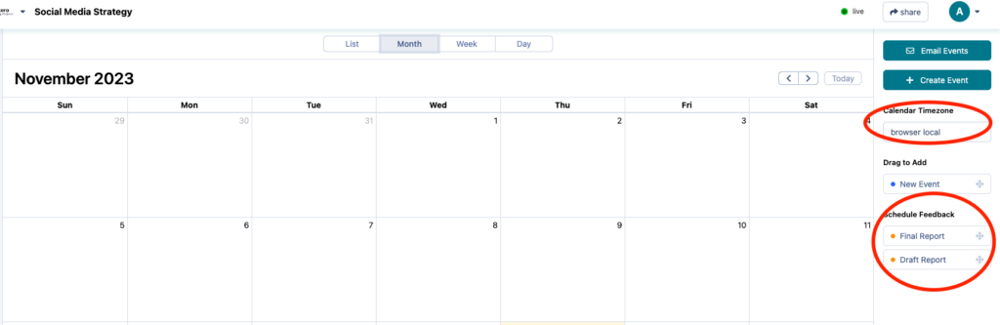
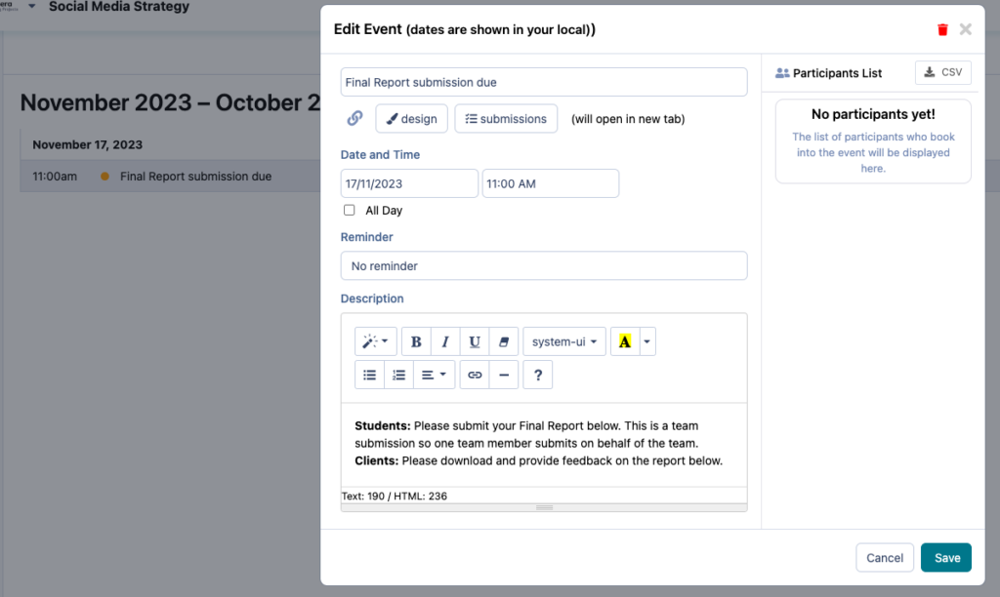
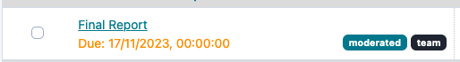

# Scheduling Due Dates

Learn how to set the due dates for the assessments in your experience.

---

## Turn on Due Dates

If you’re looking to have due dates implemented for the assessments in your program, you can! Each assessment has the option to have due dates and you configure the due date setting for each assessment individually (have a look at the screenshot below).

If you select “**No** “, no due date will display for either learners or experts.
If you select “**Yes** “, you’ll be able to set the due date and time in **Calendar** from your experience menu
If you select “**Schedule Later** “, you’ll be able to set the due date and time in **Calendar** from your experience menu:

## Scheduling Due Dates

After you’ve turned on the due dates for an assessment, you’ll be able to schedule them. If you select “**Yes** ” or **“Schedule later”** a due date bar will appear at the top of the assessment.

This will take you to the calendar page, on the right hand side you will be able to see all due dates which need to be set. **Note** : if you are in a different timezone from the learners, you may want to select the relevant timezone for the program before scheduling your due dates.

Select the assessment you’d like to schedule, drag it onto your calendar, and set the date, time and details of your assessment due date. You can also set a reminder for your learners and experts!

Once your due date has been scheduled, you’ll see the due date listed underneath the assessment when looking at the **Feedback** page.

### What’s Next?

Looking for more support? Check out the rest of the Essentials Collection articles and find the additional help you might need.
[Essentials Collection](index.md)
