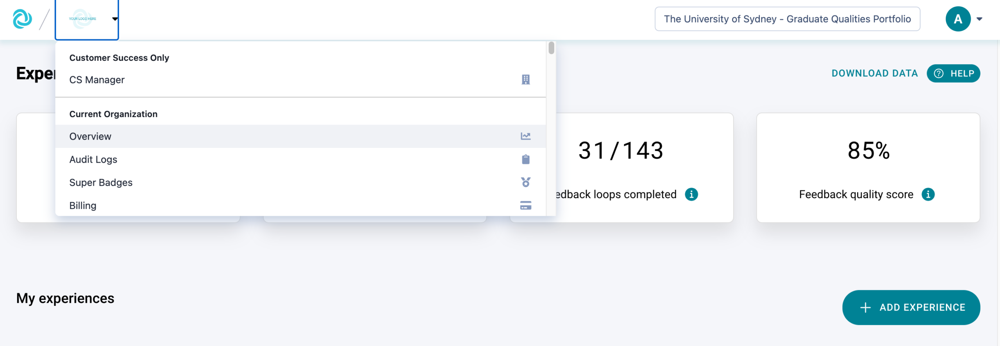
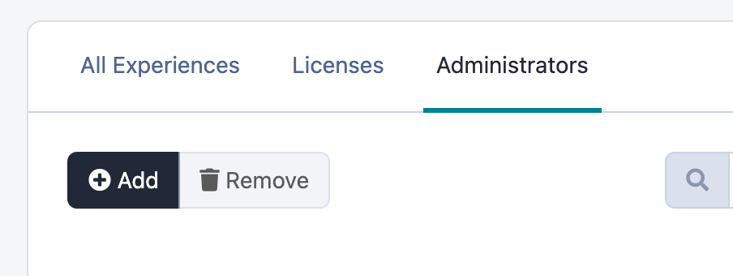
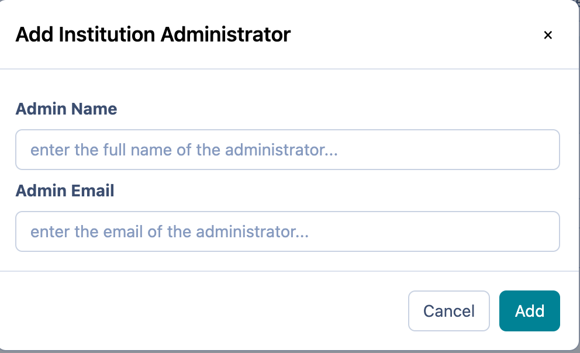
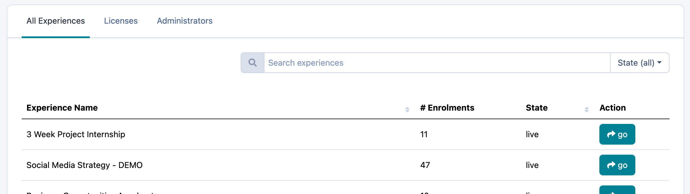
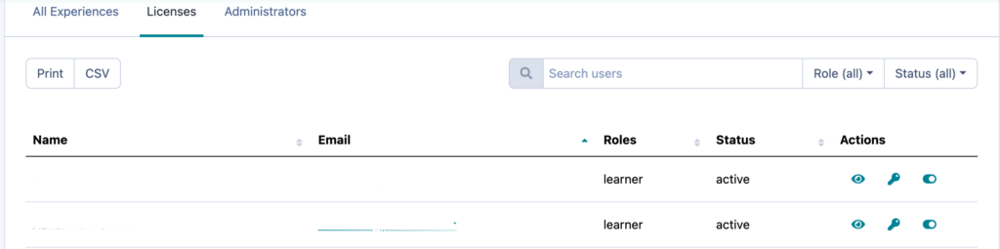
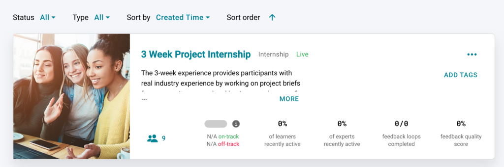
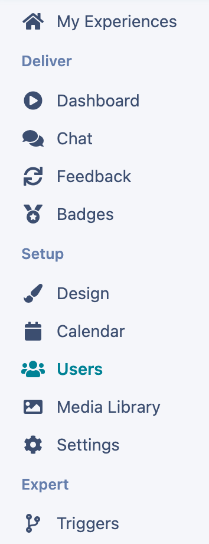
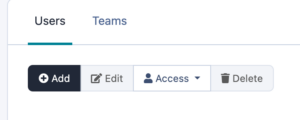
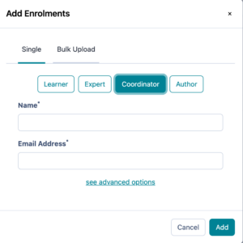

# Adding new Administrators, Authors and Coordinators and institution wide user overview

Find out how to see all users in your institution and how to add new administrators from the institution settings page
A Practera user is anyone with an administrator, author, coordinator, expert or learner license. These user roles can be divided into two groups: those who design and deliver experiences (administrators, authors, and coordinators) and those who participate in the experiences (learners and experts). [This article](./understanding-user-roles/) explains the full details of what these roles provide access to.

---

## Adding new Admins

As an Institutional Admin, you have the ability to manage all aspects of Practera. The admin role is the highest level of Access. This means that an Admin is enrolled at an institutional level. To do this, you need to:
  * Click on the logo in the top left hand corner and select Overview.

  * Then select Administrators and click Add

  * Then type in the Admins Name and Email address and click Add. An invite will automatically be emailed to them, inviting them to the institution.

## View all users in your Institution

The overview tab will then allow you to:
  * See all the experiences within your institution, the number of enrolments (all users – authors, coordinators, learners and experts), the experience status (Live/Draft/Archive) and allows you to search and “go” to that experience design page.

  * See all the licences within the institution experiences (learners, experts, coordinators, authors). The users status (active/inactive). As well as make actions including: 
    * View the users enrolment record to see how many programs they have participated in
    * Reset their password
    * Disable the users access

## Adding new Authors and Coordinators

Authors and Coordinators have access to one or a set of particular experiences. They do not have access to the whole Institution. To enrol an Author or Coordinator you need to:
  * Click on the particular experience tile

  * Click on Users within that experience

  * Click “Add”

  * Select the relevant role and insert the Name and email address associated with the Author or Coordinator and click Add.

## What’s Next?

Looking for more support? Check out the rest of the[ Essentials Collection](../essentials/index.md) articles and find the additional help you might need.
