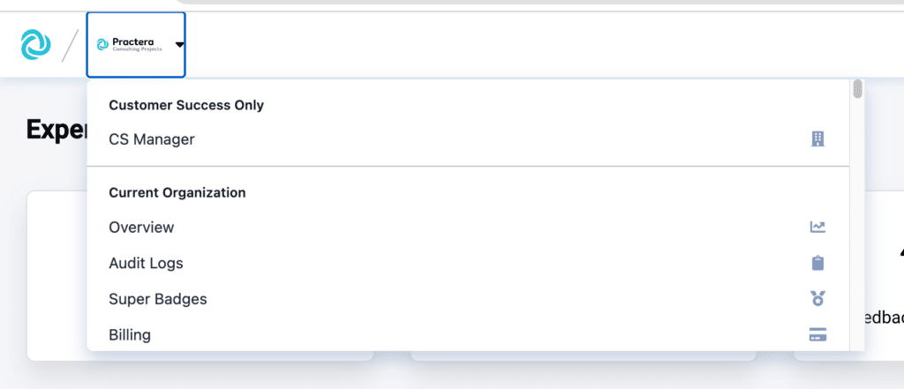
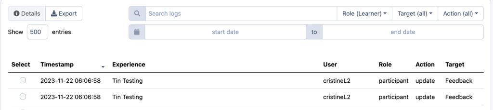
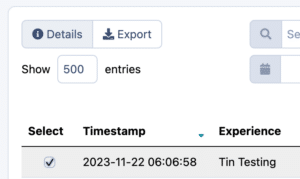
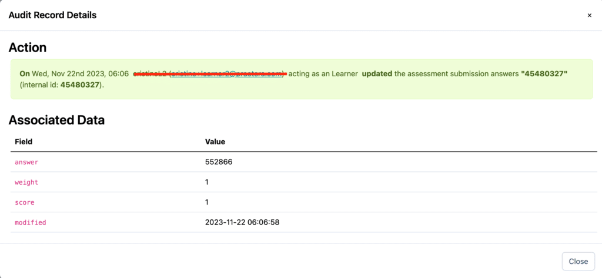
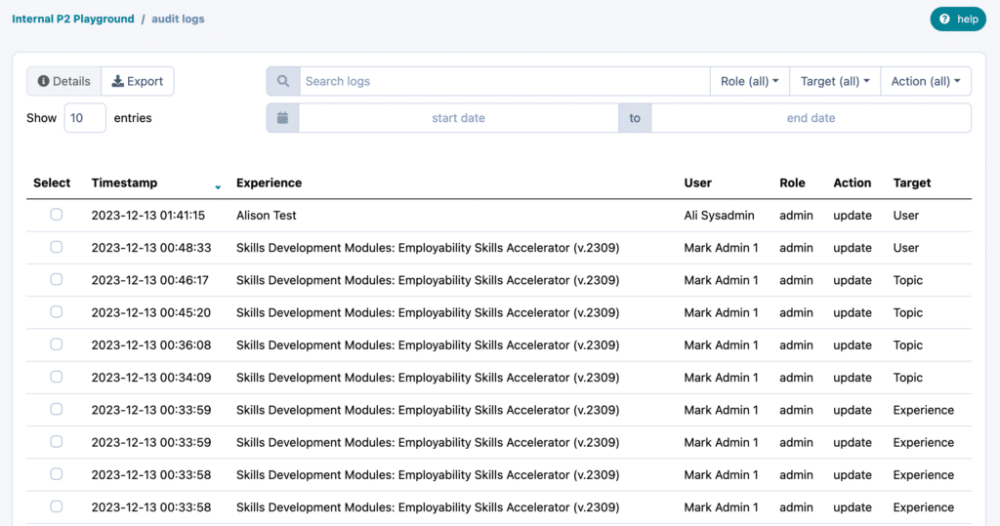
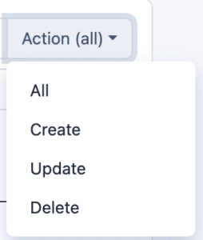
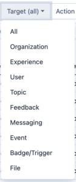

# Audit Log of Admin Activity

Find out about how you can access the audit log information to track changes within your organisation.

---

## Where to locate the Audit log

To open the audit log, you can click on the organisation logo in the top left hand corner. Then select Audit log from the drop down menu.

## What can I find on the Audit Log

### Learner and Expert Logs

The Audit log provides you with details about submissions which have been made by the learners or experts.

If you select a specific learners/experts update you can then click on details to gain full details about the action the learner took.

### Coordinator, Author and Admin Log entries

The Admin Log entries allows you to know when changes have been made to certain aspects within your institution, by whom and when.
### Audit Log headings explained

**Action** – provides information of the type of change which occurred. (Create – new experience or content added, Update – current experience or content edited, Delete – Content or experience removed)

**Target** – This is a clear list of the target item where a change was made.

## What’s Next?

Looking for more support? Check out the rest of the [Institution Set Up](index.md) articles and find the additional help you might need.
