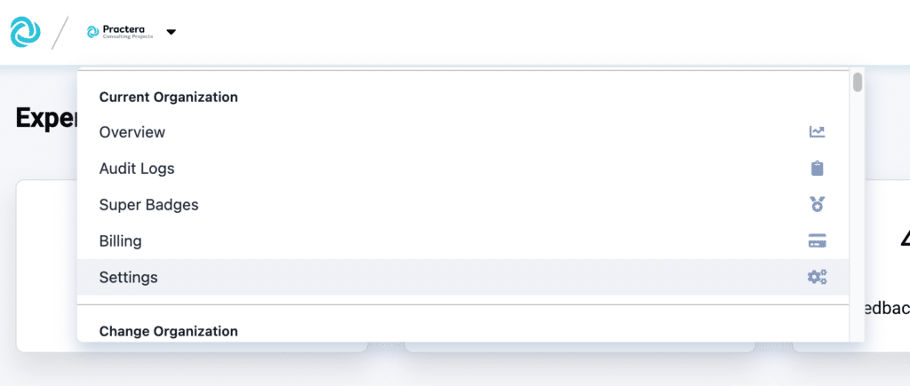
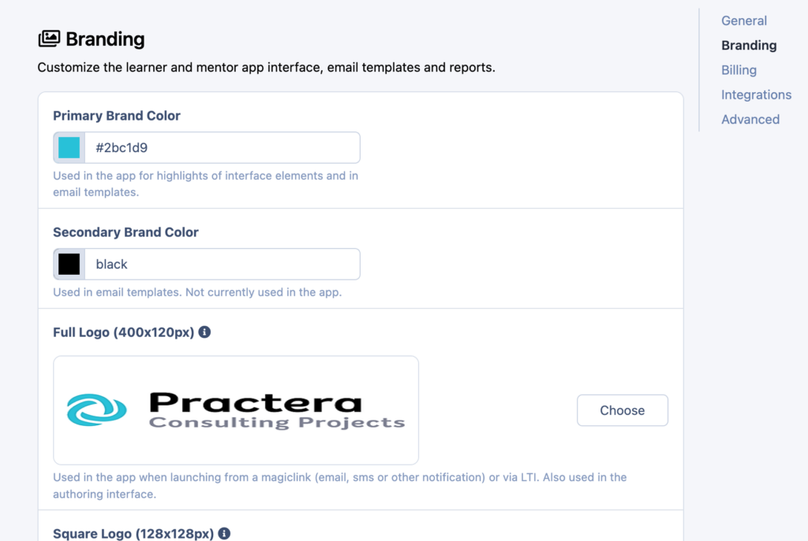
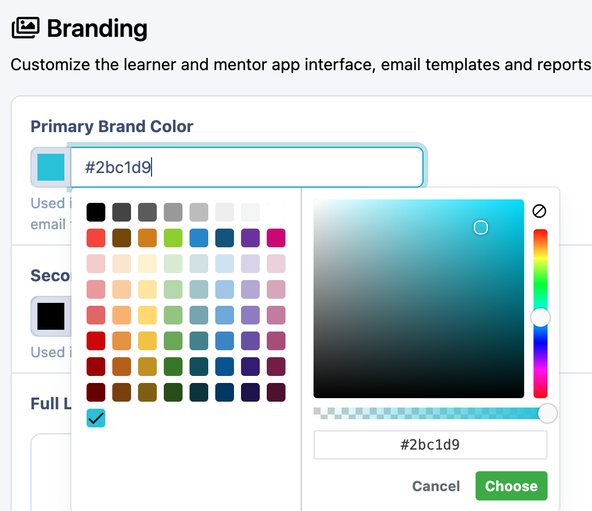
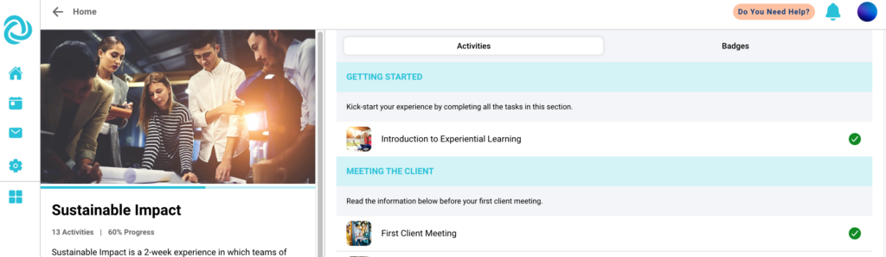
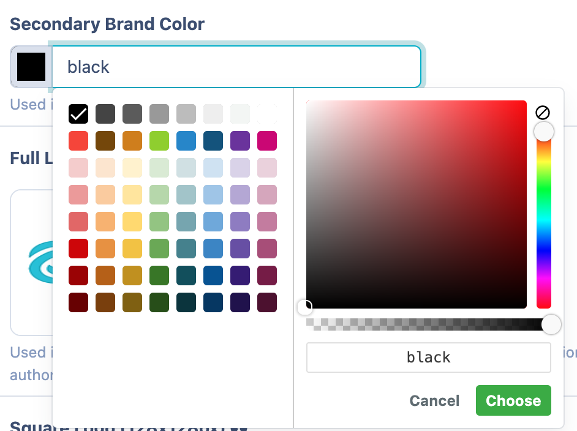
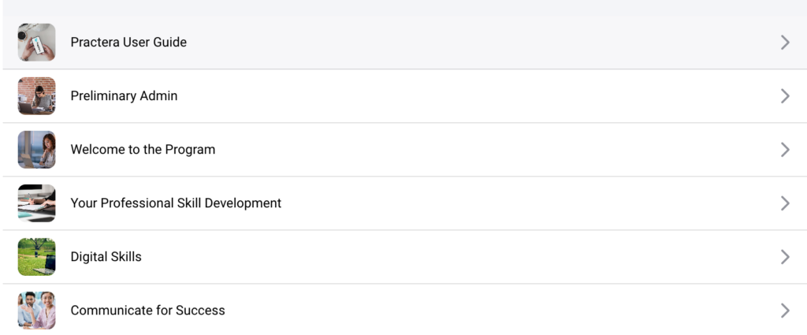
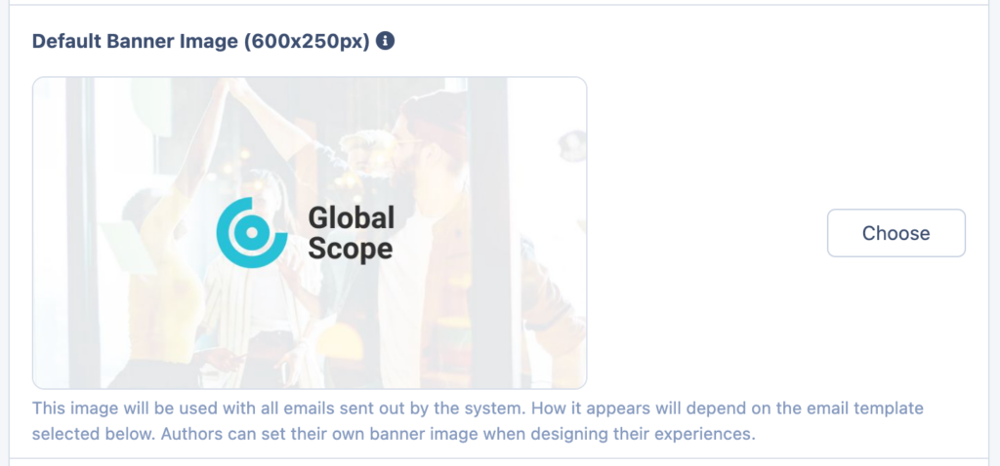
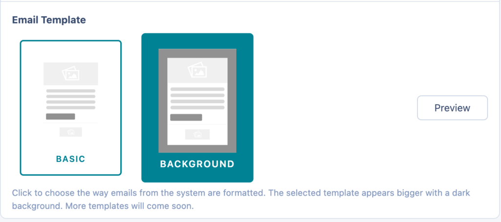

# Branding your Institution

Learn how to set up your organisations default branding settings.

---

## Branding Permissions

Practera allows you to customise areas of your institution to make your experiences look and feel more like your own. However, not everyone is able to change the way an institution is branded. Only [Administrators](./understanding-user-roles/#administrators) can set the branding for entire institutions, whereas [Authors](./understanding-user-roles/#authors) are able to adjust the look of specific experiences.
### Institutional Branding

This means setting the standard branding for the [Author & Coordinator Interface](../onboarding/logging-in/#5-toc-title) for all administrators, authors, and coordinators within an institution. This can only be set or adjusted by Administrators.
### Experience Branding

This means changing the way one specific experience looks on the [Learner & Expert Interface](../onboarding/logging-in/#6-toc-title). This can be set or adjusted by Administrators or Authors of that experience. Please see the [Branding Your Experience](../onboarding/branding-your-experience/) article to learn how to complete experience branding as an administrator or author.

---

## Where to Brand Your Institution

There are a few items that can be adjusted in your Institution to match your branding! First and foremost, navigate to the Institution Settings on your Institution portal:

In this section, you’ll find four key areas of settings for your experience: General, Branding, Billing and Guides. Scroll down slightly to the second section where you will see **Branding** :

Let’s find out what adjustments can be made there!

---

## What Can Be Customised

In this area of institution settings, you’re able to change a few key parts of the Learner & Expert Interface for your experiences. These are:
  * [Primary Brand Colour](./branding-your-institution/#5-toc-title)
  * [Secondary Brand Colour](./branding-your-institution/#6-toc-title)
  * [Default Experience Lead Image](./branding-your-institution/#7-toc-title)
  * [Default Activity Card Image](./branding-your-institution/#8-toc-title)
  * [Default Banner Image](./branding-your-institution/#9-toc-title)
  * [Email Template](./branding-your-institution/#10-toc-title)

### Primary Brand Colour

Setting the primary brand colour for your experiences changes the interactive buttons and elements on the Learner & Expert Interface. In order to change this colour, you can either select from the colour map or input the colour HEX code in the text box. Once you complete this action, it will automatically be saved.

Once you’ve made an adjustment to your primary brand colour, it will display on the Learner & Expert interface in various elements. Below is an example:

### Secondary Brand Colour

Secondary brand colour can be adjusted just like primary brand colour either by using the colour map or by inputting the HEX colour code. The secondary brand colour is used in fewer places than the primary brand colour. You will notice that it is used for some links and text in your email templates.

### Default Experience Lead Image

This is the image that will display for learners and experts on their app interface. It is recommended that this image have the dimensions of 1024 x 576px in order to display clearly.

### Default Activity Card Image

The default activity card image is used whenever you add a new activity to your experiences. You’ll notice that each activity in the Learner & Expert Interface has a card with the option to have an image. The ideal dimensions for the activity card images are 1024 x 576px, just like for the experience lead image.
By adding a default image, you can have an image already uploaded for that activity or you can go in and add a new one. To find out how to do that, please see [Adding Activity Images](../becoming-a-practera-power-user/add-activity-images/).

### Default Banner Image

Adding a default banner image adds a banner to the top of your emails. This banner image is recommended to have the dimensions of 600 x 250px in order to display the best in your branded emails. See more about branding your emails below.

### Email Template

There are two branded email templates to select from: Basic and Background. These two types of branded emails will be the templates for all the emails that your users receive in your experience.
The Basic email template has a white background with your banner image at the top, your institutional logo included at the bottom, and end supporting text in your secondary colour.
The Background email template has your primary colour as a background with your banner image at the top, your institutional logo at the bottom, and end supporting text in your secondary colour.
You can test out both of these options by selecting one and pressing “Preview”:
This will send a Practera Email Branding Preview to your registered Practera email for you to check your branding settings.

## What’s Next?

Looking for more support? Check out the rest of the [Institution Set Up](index.md) articles and find the additional help you might need:
