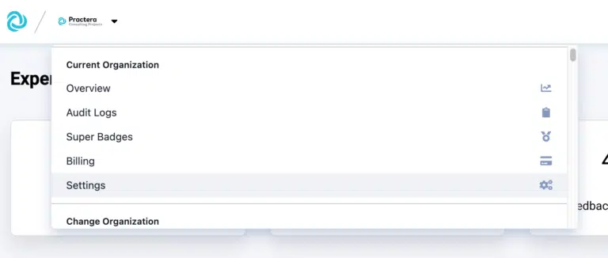
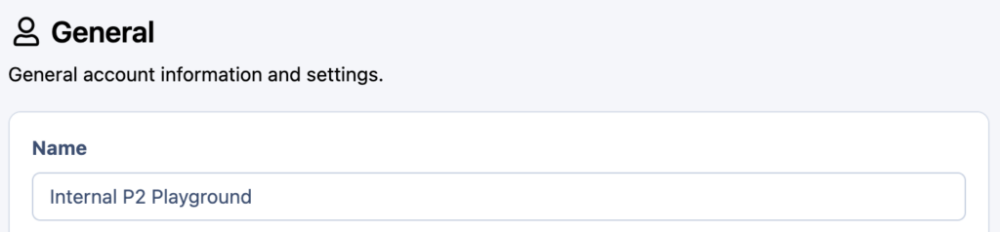
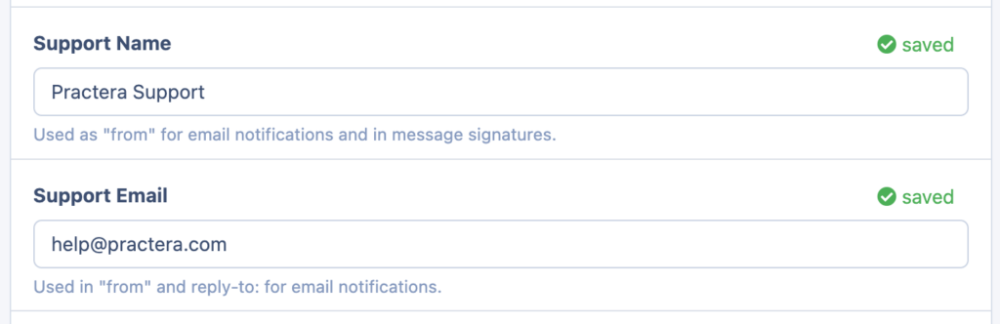
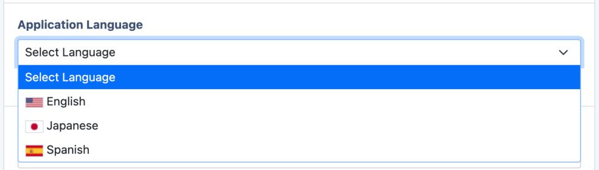
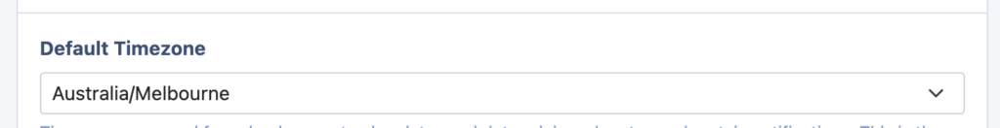
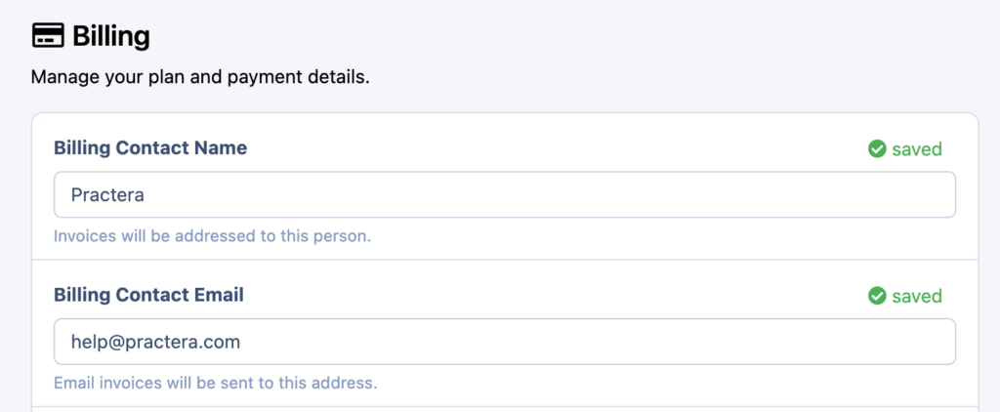
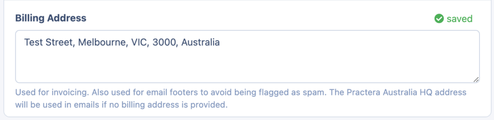
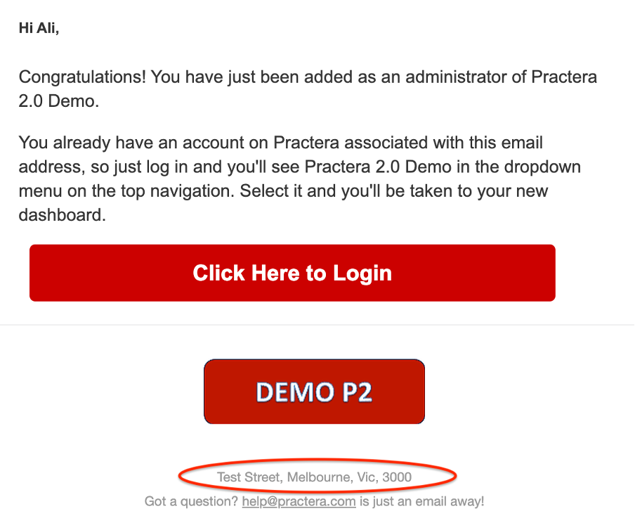

# Changing institution settings

Learn how to configure general institution-wide settings, branding, billing and integrations.

---

## Who can edit the Institutional Settings?

Practera is designed so you are easily able to set and edit all branding and settings related to their institution. Allowing you to make it look and feel more like your own. However, not everyone has access to edit the Institutional Settings. [Administrators](./understanding-user-roles/#administrators) can set the branding for entire institutions.
The Institutional Settings act as the default settings for all experiences created, however, [Authors](./understanding-user-roles/#authors) and Administrators are able to adjust the look of specific experiences if they wish it to differ from the default set Institutional Settings. To edit your experience, click on the relevant experience tile, then select settings on the left hand side.

---

## Where can I update my Institutional Settings?

To edit/set the institutional settings you will click on your organisations logo in the top left hand corner of your institutional portal. Then select "Settings" in the drop down menu.

Once you are on the settings tab there are a couple of steps you will want to take to update your institution.
### Step 1 – General Settings

#### Name:

Here you are able to set the name of the Institution. This will only be visible to Administrators, Authors and Coordinators. Allowing them to switch easily between multiple Institutions if they are a part of more than 1.

#### Reply To Email Set-up:

The next part is to set up the Support name and email address. This works as a reply to function. Meaning learners and experts on the app are able to see emails being sent from you

#### Default Language:

Change the default language users see on the application interface in all your experiences. This change doesn't affect your learning design content.

#### Timezone:

Set up the Timezone. This will allow you to set the timezone for events, due dates and also to ensure automatic notifications are sent out at sensible times to the different users. This will be the default Timezone for new experiences added to the institution.

### Step 2 – Branding

In this area of the institutional settings, you're able to change a few key parts of the Learner & Expert Interface of your experience. Allowing you to make it match your institution's branding guidelines and making it feel more like your own. The Institutional settings will act as the default settings. However, when you set up an experience you are able to edit this on an experience by experience basis.
[_This article provides full details of how to edit and set up your institution brand settings._](./branding-your-institution/)
### Step 3 – Billing

#### Contact Details:

In the billing section you are able to provide the details of who and where the invoices are sent to as relevant for your institution. Simply add in the Billers name and email address in the relevant boxes.

#### Billing Address:

You can also provide the billing address you wish to appear on the invoice. This will also be used in the email footers to avoid any emails from Practera being flagged as spam. If you do not provide an email address the Practera Australia HQ email address will be used instead.

### Step 4 – Integrations

Practera allows you to Integrate with an array of systems. This includes:
  * LTI 1.3 Advantage
  * Badgr
  * Credly
  * Slack
  * Salesforce
  * OpenAI (GPT)
  * TurnItin

That's it, once you have filled in all of these sections your Institutional settings are complete.

---

## What's Next?

Now that you've configured your institution settings, you can:
- Learn about [understanding user roles](understanding-user-roles.md) to manage access
- Explore the [Essentials collection](../essentials/index.md) to manage your programs
- Check out other [Institution Set-up articles](index.md) for related topics
