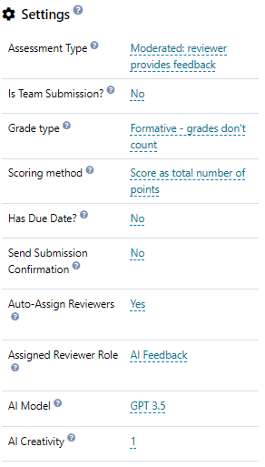
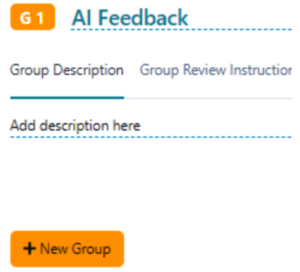
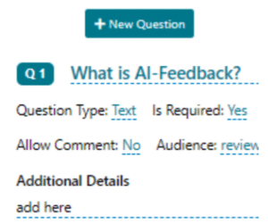
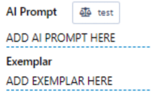
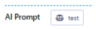
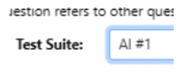
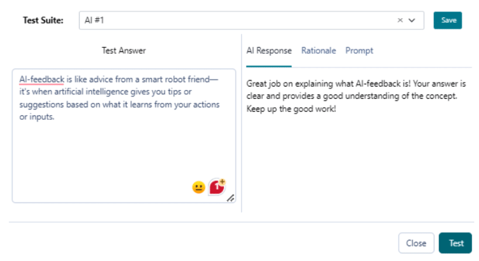

# Creating Assessments with AI feedback

Once you have set up the OpenAI (GPT) on the institution settings, you are then ready to set up your AI assessment. Follow the steps below.

---

## How do I create an assessment so it uses AI feedback?

This video explains the steps to set up the AI Feedback assessment, with step by step details below it to assist you in setting up your AI Feedback.
<https://practera.com/wp-content/uploads/2024/02/How-to-Create-an-assessment-with-AI-Feedback.mp4>
  * Open an experience / program where you want to integrate AI feedback to.
  * In the Design Tab, click the Activity where you want to create an assessment with AI feedback.
  * Add an [assessment by dragging ‘Feedback’](../designing-feedback-loops/preparing-feedback-loops/#1-toc-title) from Activity tasks.
  * Edit the name, descriptions and settings of the assessment.
    * Make sure to follow the settings below:
      1. Assessment Type: Moderated
      2. Auto-Assign Reviewer: Yes
      3. Assigned Reviewer Role: AI Feedback 
         1. You can modify AI Model: 3.5 – 4 (the higher version, the more fine-tuned the feedback will be – BUT it will take sometime to generate)
         2. You can also modify the AI Creativity: A low value means the response for a given input will be more predictable. A high value means the response will be more creative but may be less relevant.

*All other settings can be modified as required, please ensure the AI Model is set to GPT 4

  * Click ‘+ New Group’ and edit the Name and Group Description (as needed)

  * Click ‘+ New Question’, edit the Question, add Additional Details (as needed) and set the Question Type to ‘Text’

*All other settings can be modified as required
  * Add your AI prompt and Exemplar respectively. Make sure to consider this [AI Framework](../designing-feedback-loops/practera-ai-feedback-prompt-framework/)

## Testing Assessments with AI Feedback

Now, technically, once you finished the above steps, your assessment with AI feedback is now ready to go. However, a testing and fine-tuning phase is crucial before deployment. Here’s how we can test it effectively.
  * Click the ‘Test’ icon beside ‘AI Prompt’.

  * Add a ‘Test Suite’ by putting a name for the assessment (ex: CM #1) and click ‘Save’

  * Add your Test answer for the question and click ‘Test’. Wait for the AI Response.

*If the AI response is not satisfactory, you may adjust the AI prompt and Exemplar.  

_Remember:_
  * An AI prompt serves as an instruction for the AI, guiding it on the desired outcome or feedback on the learner’s answer.
  * An Exemplar refers to a model answer that embodies the highest standard of quality for a given question.

