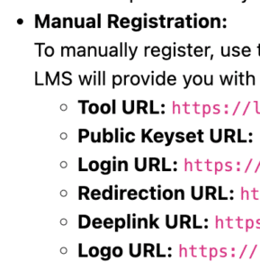
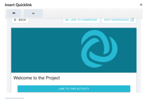

# Embedding Practera with Brightspace – LTI 1.3

Learn how to set up an LTI connection with Single Sign On so that you can seamlessly host your Practera app within your Brightspace course.
This LTI connection allows you to deliver all online course content on your Brightspace LMS, as well as allowing students access your Practera app without needing to:
  1. Enrol students in Practera
  2. Manage student enrolments in Practera
  3. Require students to log into your Practera app in addition to Brightspace

The steps below will help you create an LTI app in Brightspace containing Practera app identifying details.
Once the LTI app is added to your Brightspace course and published, students registered on your Brightspace course will automatically be registered on your Practera program. They will then be able to access your Practera app from a page or assignment in Brightspace.
### Dynamic Registration

Note, dynamic registration is currently not available for embedding Practera with Brightspace. Please use the manual process below.
### Manual Set up

The manual set up requires you to insert all the relevant URL’s from the organisation settings tab on Practera and create the external tool link on Brightspace.
The Brightspace content developer/admin would need to set up a unique external tool, to do this you need to be logged in as an administrator.
  * Navigate to settings – External Learning tools
  * Select New Deployment
  * Click on the help icon next to “Tool”, then select “Register new LTI tool”
  * Click register a tool
  * Select Standard
  * You will then need to insert all the relevant Manual URL details which are located in Practera’s Organisation Settings.

Note, Domain on Brightspace will be the Tool URL
  * Ensure you turn on the relevant extensions. Specifically names and provisioning services, & Deep linking
  * Click register and the Brightspace registration details will pop up and you will need to insert these details into Practera, by clicking on:

  * Select the relevant stack and click on New Registration
  * Copy across all relevant information

You have now registered your new external tool.
  * Go back to the “Deploy tool” page. You may have to refresh the page to ensure the new tool shows up in the drop down list.
  * Ensure you turn on the Security settings for User Information and the configuration setting open as external resource
  * Add the Org Unit you wish for it to be accessible in.
  * Click Create Deployment
  * Now ensure you have created the LTI Tool Link which will be used in your course. Go to External learning Tool, click on the Deployment name.
  * Select “View Links”, click “New Link”
  * Copy the Tool URL from Practera into the URL box.
  * Change the type to Deeplinking Quicklink
  * Save the new link

### Attach your external tool to a course

  * Go to the relevant course
  * Add in the content or assignment you wish to link Practera into
  * In the content or assignment select the link icon, and scroll to the Quicklink list at the bottom. Select the link you have created.
  * Select the relevant experience you wish to link the students to. You can then select whether you wish to direct students to the home page of the Practera experience or to a specific topic/activity on Practera.

### Testing the Embedded Practera Program

Simply log into your Brightspace course with a student account and click on the newly created content or assignment. This should allow you to open up Practera on the relevant page you selected.
