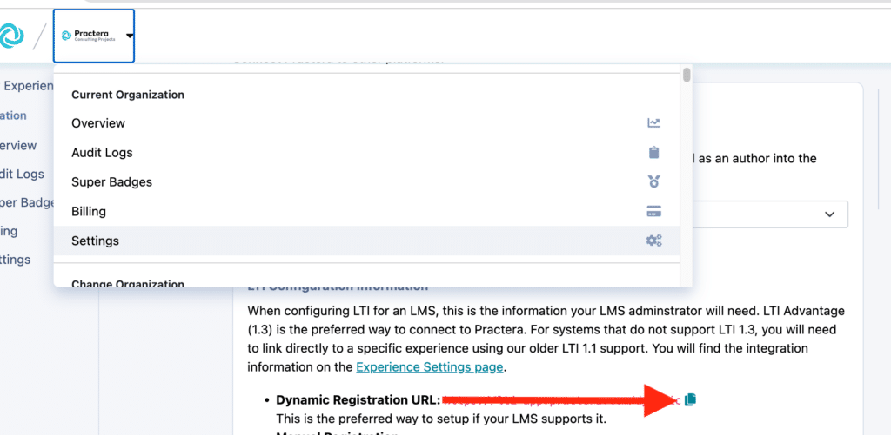
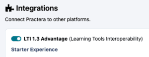
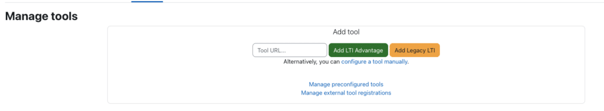
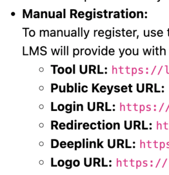
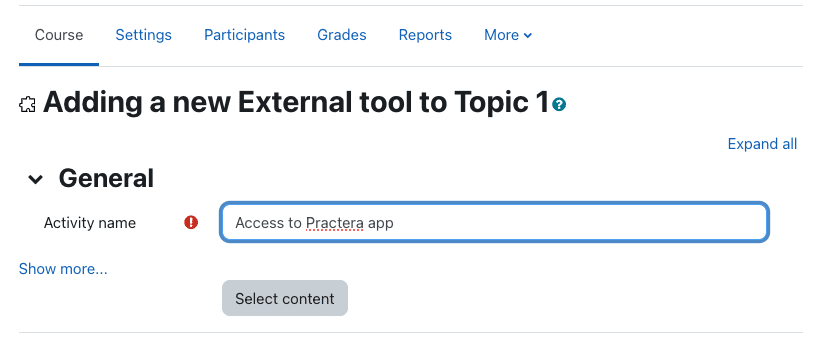
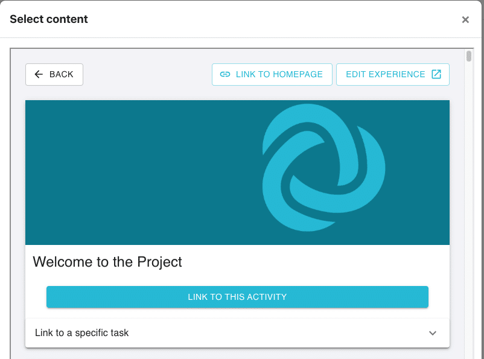

# Embedding Practera with Moodle LTI 1.3

Learn how to set up an LTI connection with Single Sign On so that you can seamlessly host your Practera app within your Moodle course.
You are a Program Admin whose institution delivers all online course content on their Moodle LMS. You would like students to be able to access your Practera app without needing to:
  1. Enrol students in Practera
  2. Manage student enrolments in Practera
  3. Require students to log into your Practera app in addition to Moodle

The steps below will help you create an LTI app in Moodle containing Practera app identifying details.
Once the LTI app is added to your Moodle course and published, students registered on your Moodle course will automatically be registered on your Practera program. They will then be able to access your Practera app from a page in Moodle.
### Dynamic Registration

If your account allows for Dynamic registration you can simply copy the dynamic registration URL from the Practera institution settings page.

To find these details, go to the institution settings, click on integrations on the right hand menu, and ensure you toggle on “LTI 1.3 Advantage”

#### Embedding the LTI App in a Moodle course via dynamic registration

The Moodle Content developer would:
  * Navigate to the course site
  * Turn Editing on
  * Go to Site administration
  * Click on Plugins
  * Choose External Tool
  * Select manage tools, paste in the dynamic registration URL from Practera, then click add LTI Advantage

  * Thje Practera login interface will appear on your screen, log in with the relevant admin account
  * Select the relevant stack and organisation which you wish to link to.

This will then add a new External tool tile on your Moodle page. Click on the relevant tile.
  * Update the Tool name
  * Change the following settings: 
    * Tool configuration usage – Show in activity chooser and as preconfigured tool
    * Default launch container – New Window
    * Tool Settings – Use this service
    * Accept grades from the tool – Always
  * Save your changes

### Manual Set up

In some instances your LMS may not have Dynamic setup. This means you will need to insert all the relevant URL’s from the institution setting tab.
The Moodle Content developer would:
  * Navigate to the course site
  * Turn Editing on
  * Go to Site administration
  * Click on Plugins
  * Choose External Tool
  * Select manage tools, then configure a tool manually
  * Insert in all the relevant Manual URL details located in Practera’s Organisation Settings.

  * Ensure you change the following settings: 
    * Tool configuration usage – Show in activity chooser and as preconfigured tool
    * Default launch container – New Window 
      * Supports Deep Linking
    * Tool Settings – Use this service
    * Privacy 
      * Share Launcher’s name with tool – Always
      * Share launcher’s email with tool – Always
      * Accept grades from the tool – Always

Next you need to add the Tool Configuration details from Moodle into Practera to finalise the configuration of the external tool.
  * Click on the list icon on your tool on Moodle.

  * Go to practera organisation Settings and select “Finish Set up in Practera”, fill in all the required information for the tool.
  * Click save

Your external tool is now set up and you can now attach it to your course.
### Attach your external tool to a course

  * Activate the tool
  * Click on My Courses and locate the relevant course
  * Find the topic it will be located in and click “Add an activity or resource”.
  * Select your tool and type in the activity name

  * Click select content
  * Select the relevant experience 
    * From here you can chose whether you direct learners to a specific activity, topic or direct them to the home page of the experience.

  * Click save and return to course

### Testing the Embedded Practera Program

Simply log into your Moodle module with a student account and click on the newly created page. When the student clicks on the link Practera will load in a new window and they will be logged in.
