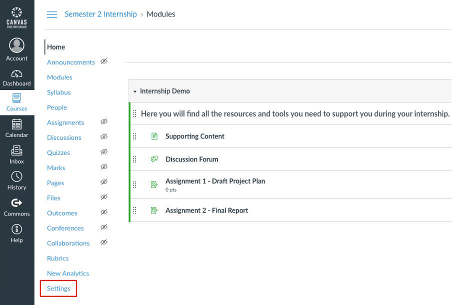
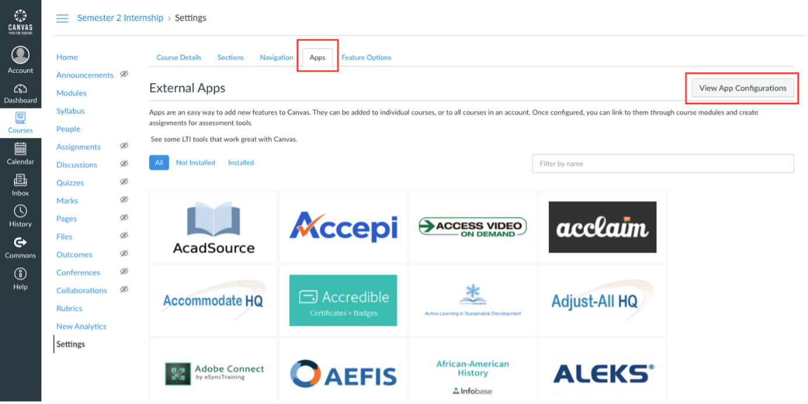
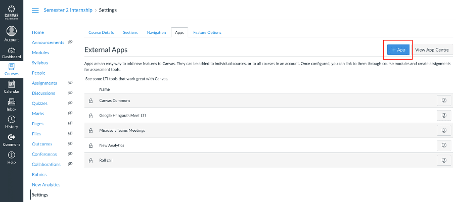
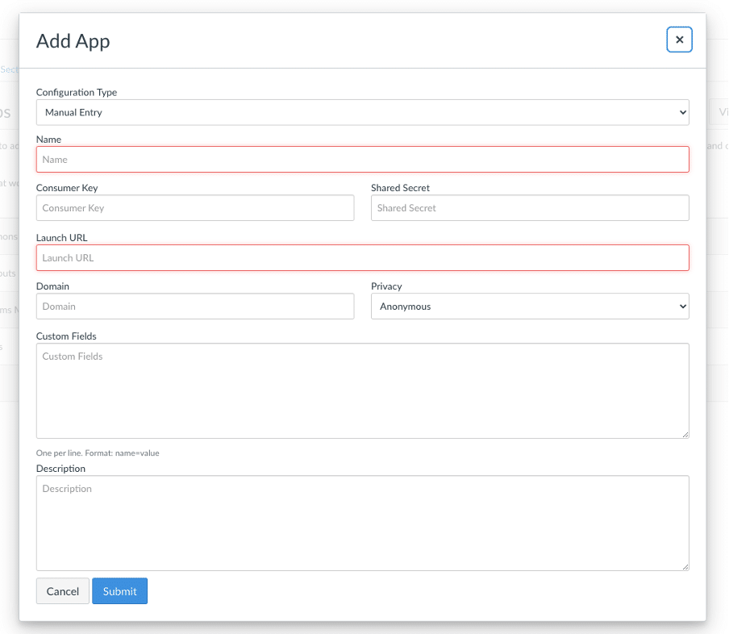
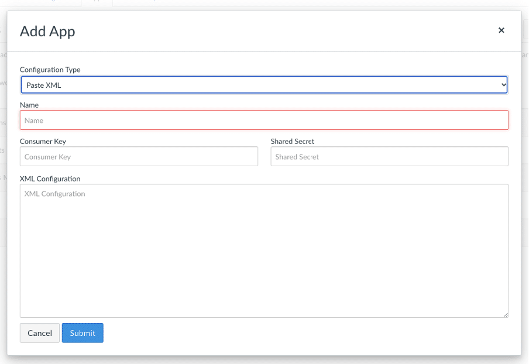
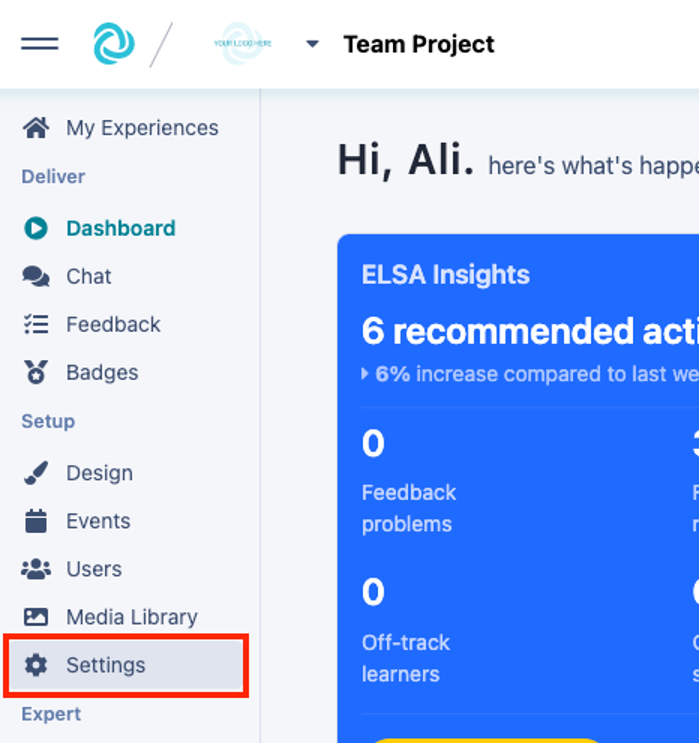
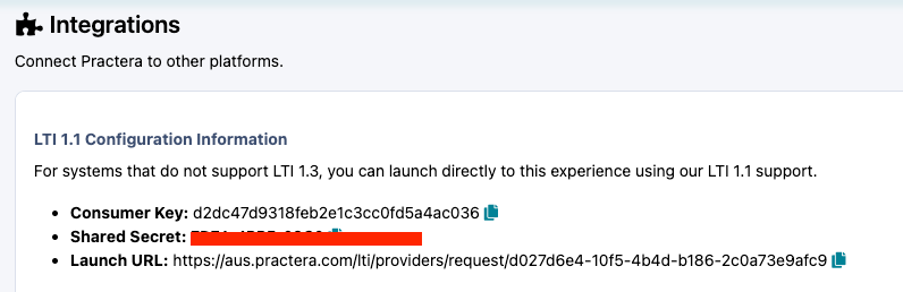
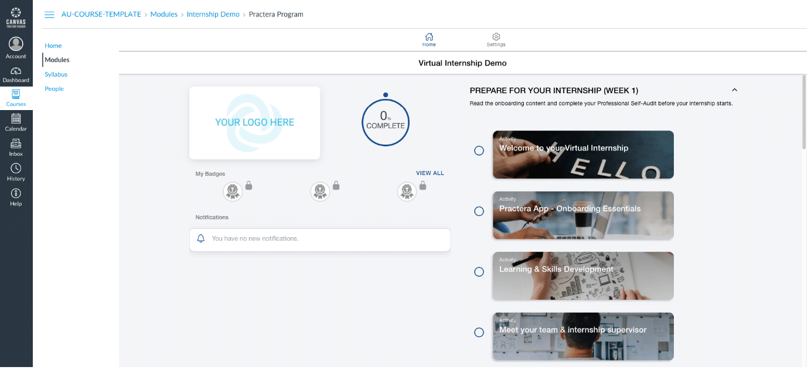

# How to embed Practera into Canvas

Learn how to set up an LTI connection with Single Sign On so that you can seamlessly host your Practera app within your Canvas course.
You are a Program Admin whose institution delivers all online course content on their Canvas LMS. You would like students to be able to access your Practera app without needing to:
  1. Enrol students in Practera
  2. Manage student enrolments in Practera
  3. Require students to log into your Practera app in addition to Canvas

The steps below will help you create an LTI app in Canvas containing Practera app identifying details.
Once the LTI app is added to your Canvas course and published, students registered on your Canvas course will automatically be registered on your Practera program. They will then be able to access your Practera app in a page in Canvas.
### Creating a Canvas LTI app

Log into Canvas as a Teacher or Administrator and click on the **Settings** link at the bottom of the left hand side menu.

In the Settings screen, click on the **Apps** tab at the top of the screen and then click on the **View App Configurations** button

. 

Then, in the App Configurations screen click the **\+ App** button.

The **Add App** window should now be displayed, like the one below.

Click on the **Configuration Type** field and select _Paste XML_.
The window will then change to the one shown below.

In the **Name** field enter in a suitable name for your app.
Set the **Domain** to:
  * aus.practera.com if using the Australian Stack,
  * usa.practera.com if using the USA Stack, or
  * euk.practera.com if using the UK Stack.

Set **Privacy** to Public
**Note** , a Practera Institutional Admin will need to turn on LTI in the[ Institution Settings](https://practera.com/docs/changing-institution-settings/) to enable these details to be viewed. So, open a new browser tab or window, go to [**pra**](http://practera.com)[**ctera.com**](http://practera.com) and log into the Organisation. Click on the Organisations logo in the top left hand corner, then select “settings”. Turn on the LTI 1.3 Advantage toggle. DO NOT use the information from this settings tab, see below for information of where to locate your experience specific details.

The remaining information that is required to be inserted into this window will need to be copied from the[ Experience Settings](../onboarding/changing-experience-settings/) (Scroll down to the last section – Integration).

Scroll down until you find integrations

The information that you need to copy, one value at a time, is as follows:
  * Consumer key
  * Shared secret
  * Configuration XML

For each value above, click the copy button (the one below)next to each value.

Then return to your browser tab or window that has the Canvas **Add App** window displayed and paste the value into the corresponding field. Once done for all three values, click **Submit** and you will see your new app listed in the External Apps screen.
### Embedding the LTI App in a Course

In Canvas click on **Home** or **Modules** to list the contents of the course.
Add a New Item to the Module and in the **Add** dropdown field in the popup window, select **External Tool**.
As per the example below, click on the name of the LTI app to select it, enter in the **Page Name** to be displayed to learners, adjust the **Indentation** setting of the page in the module (if required) and then click the **Add Item** button.
Do not forget to **Publish** the new page.
### Testing the Embedded Practera Program

Simply log into your Canvas module with a student account and click on the newly created page. You will be automatically enrolled on the Practera program and the learning content will be embedded and displayed in the Canvas page.

